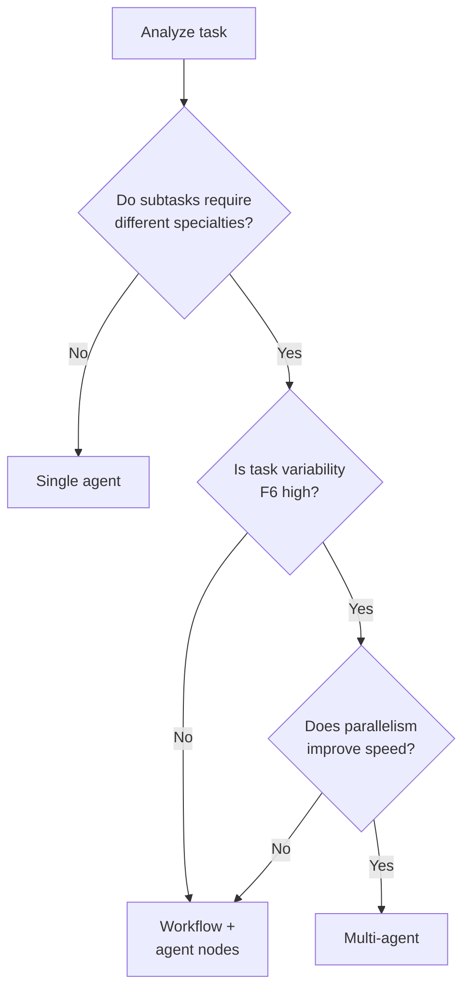

# 8. Universal Multi-Agent

!!! abstract "TL;DR"
    An anti-pattern where a multi-agent architecture is introduced for tasks that a single agent could handle, adding unnecessary complexity, communication costs, and debugging difficulty.

## Common Scenario

A team built an agent to answer customer inquiries. After hearing a multi-agent architecture success story at a tech conference, they decided to adopt it for their system. They split it into four agents: "question classifier," "information retriever," "answer generator," and "quality verifier."

However, 80% of actual inquiries were routine — "password reset," "check billing amount" — and the communication overhead between the four agents dominated latency. Bugs from context loss during inter-agent handoffs occurred frequently, and debugging was several times harder than with a single agent. The team's development velocity dropped significantly, with even simple feature additions taking days.

## Symptoms

- Inter-agent communication latency accounts for over 30% of processing time
- Information loss or distortion occurs during inter-agent context handoffs
- Pinpointing "which agent caused the issue" during incidents takes significant time
- Even simple feature changes require modifications across multiple agents
- LLM costs scale proportionally with agent count (each agent makes its own LLM calls)

## Root Cause

The root cause is seeing only the benefits of multi-agent architecture (specialization separation, parallel processing, scalability) while underestimating the costs (communication overhead, debugging difficulty, operational complexity). For routine tasks with low `[F6]` task variability, multi-agent benefits are small and costs dominate.

Teams sometimes fall prey to the analogy that "microservices are good design." However, inter-agent communication is far more expensive than API calls (it involves token consumption), so the cost structure of decomposition is fundamentally different.

## Detection Methods

- **Communication overhead measurement**: Measure the proportion of total latency consumed by inter-agent communication
- **Single agent comparison**: Compare quality, cost, and latency when the same task is processed by a single agent
- **Task variability assessment**: Analyze what percentage of requests are routine (processable via workflows)
- **Metrics**: `inter_agent_latency`, `context_transfer_loss_rate`, `cost_per_agent_call`

## Countermeasures

### Step 1: Assess autonomy requirements per subtask

For each subtask, evaluate whether "a deterministic workflow is sufficient, or LLM autonomous judgment is required." Implement routine subtasks as workflows (code).

### Step 2: Decompose incrementally

Start with a single agent (or workflow + agent nodes) and only decompose when clear bottlenecks are found.

### Step 3: Define explicit decomposition criteria

Clarify the conditions for decomposing into multi-agent: only when all three conditions are met: (1) clear specialization separation, (2) expected speed improvement from parallel processing, (3) high task variability.



## Examples

### Before (problematic state)

```python
# Split into 4 agents (all agents activated even for routine questions)
classifier = ClassifierAgent(model="gpt-4o")
retriever = RetrieverAgent(model="gpt-4o")
generator = GeneratorAgent(model="gpt-4o")
reviewer = ReviewerAgent(model="gpt-4o")

category = classifier.classify(query)        # LLM call 1
docs = retriever.search(query, category)     # LLM call 2
answer = generator.generate(query, docs)     # LLM call 3
verified = reviewer.verify(query, answer)    # LLM call 4
# Total: 4 LLM calls, 8s latency, $0.04 cost
```

### After (improved)

```python
# Routine tasks via workflow, only complex tasks use agent
category = rule_based_classifier(query)  # Rule-based (no LLM)

if category in TEMPLATE_CATEGORIES:
    # Routine: template response (no LLM)
    answer = template_response(category, query)
else:
    # Non-routine: single agent processing
    docs = vector_search(query)  # Vector search (no LLM)
    answer = agent.run(query, context=docs)  # 1 LLM call
# Routine: 0.1s, $0.00 / Non-routine: 3s, $0.01
```

## Related Anti-Patterns

- [Strongest Model Only](03-strongest-model-only.md) — Using the largest model for each agent multiplies cost increases
- [All Sync / All Async](07-all-sync-or-async.md) — Also relates to communication model selection between multi-agent components

## Related Patterns

- [#59 Workflow-Agent Spectrum Selector](../glossary.md) — Assess autonomy requirements per subtask
- [#3 Workflow Backbone + Agent Node](../glossary.md) — Hybrid of workflow and agent
- [#11 Deterministic Core, Probabilistic Edge](../glossary.md) — Separation of deterministic backbone and probabilistic edges
