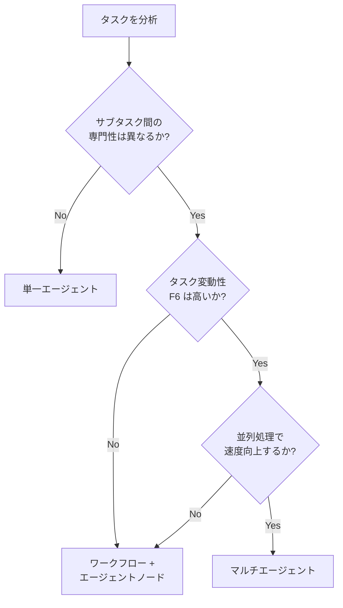

# 8. 万能マルチエージェント

!!! abstract "一言"
    単一エージェントで十分なタスクにマルチエージェント構成を導入し、不要な複雑性・通信コスト・デバッグ困難を招いてしまうアンチパターン。

## よくある場面

あるチームが顧客からの問い合わせに回答するエージェントを構築しました。技術カンファレンスでマルチエージェントアーキテクチャの成功事例を聞き、自分たちのシステムにも導入することに。「質問分類エージェント」「情報検索エージェント」「回答生成エージェント」「品質検証エージェント」の4つに分割しました。

ところが、実際の問い合わせの80%は「パスワードリセット」「請求金額の確認」といった定型的なもので、4エージェント間の通信オーバーヘッドがレイテンシの大部分を占める結果に。エージェント間でコンテキストを受け渡す際に情報が欠落するバグも頻発し、デバッグは単一エージェントの数倍も大変でした。チームの開発速度は大幅に低下し、シンプルな機能追加にも数日かかるようになりました。

## 症状

- エージェント間通信のレイテンシが処理時間の30%以上を占めます
- エージェント間のコンテキスト受け渡しで情報の欠落や変質が発生します
- 障害時に「どのエージェントが原因か」の特定に時間がかかります
- 単純な機能変更でも複数エージェントの修正が必要になります
- エージェント数に比例してLLMコストが増大します（各エージェントがそれぞれLLMを呼ぶため）

## 根本原因

マルチエージェント構成の利点（専門性の分離、並列処理、スケーラビリティ）にばかり目が向き、コスト（通信オーバーヘッド、デバッグの困難さ、運用の複雑化）を過小評価してしまうのが根本的な問題です。`[F6]` タスク変動性が低い定型的なタスクでは、マルチエージェントの利点は小さく、コストの方が上回ります。

「マイクロサービスこそ良い設計だ」というアナロジーに引きずられるケースもあります。しかし、エージェント間通信はAPIコールよりもはるかに高コスト（トークン消費を伴う）で、分割のコスト構造がそもそも異なります。

## 発見方法

- **通信オーバーヘッドの計測**: エージェント間の通信時間が全体のレイテンシに占める割合を測定します
- **単一エージェントとの比較**: 同一タスクを単一エージェントで処理させた場合の品質・コスト・レイテンシと比較します
- **タスク変動性の評価**: リクエストの何%が定型的（ワークフローで処理可能）か分析します
- **メトリクス**: `inter_agent_latency`、`context_transfer_loss_rate`、`cost_per_agent_call`

## 対策

### ステップ1: サブタスクごとに自律性の必要度を判定する

各サブタスクについて「決定論的なワークフローで十分か、LLMの自律的判断が必要か」を評価します。定型的なサブタスクはワークフロー（コード）で実装します。

### ステップ2: 段階的に分割する

最初は単一エージェント（またはワークフロー＋エージェントノード）で実装し、明確なボトルネックが見つかった場合のみ分割します。

### ステップ3: 分割基準を明文化する

マルチエージェントに分割する条件を明確にします: (1) 専門性の分離が明確、(2) 並列処理による速度向上が見込める、(3) タスク変動性が高い、の3条件を満たす場合のみです。



## 具体例

### Before（問題のある状態）

```python
# 4つのエージェントに分割（定型質問にも全エージェントが稼働）
classifier = ClassifierAgent(model="gpt-4o")
retriever = RetrieverAgent(model="gpt-4o")
generator = GeneratorAgent(model="gpt-4o")
reviewer = ReviewerAgent(model="gpt-4o")

category = classifier.classify(query)        # LLM呼び出し1
docs = retriever.search(query, category)     # LLM呼び出し2
answer = generator.generate(query, docs)     # LLM呼び出し3
verified = reviewer.verify(query, answer)    # LLM呼び出し4
# 合計: 4回のLLM呼び出し、レイテンシ8秒、コスト$0.04
```

### After（改善後）

```python
# 定型タスクはワークフロー、複雑なタスクのみエージェント
category = rule_based_classifier(query)  # ルールベース（LLM不要）

if category in TEMPLATE_CATEGORIES:
    # 定型: テンプレート応答（LLM不要）
    answer = template_response(category, query)
else:
    # 非定型: 単一エージェントで処理
    docs = vector_search(query)  # ベクトル検索（LLM不要）
    answer = agent.run(query, context=docs)  # LLM呼び出し1回
# 定型: 0.1秒、$0.00 / 非定型: 3秒、$0.01
```

## 関連するアンチパターン

- [最強モデル一択](03-strongest-model-only.md) — 各エージェントに最大モデルを使うとコスト増が乗算的になります
- [何でも同期 / 何でも非同期](07-all-sync-or-async.md) — マルチエージェント間の通信モデルの選択とも関連します

## 関連パターン

- [#59 Workflow-Agent Spectrum Selector](../glossary.md) — サブタスクごとに自律性の必要度を判定します
- [#3 Workflow Backbone + Agent Node](../glossary.md) — ワークフローとエージェントのハイブリッド
- [#11 Deterministic Core, Probabilistic Edge](../glossary.md) — 決定論的な骨格と確率的な末端の分離
