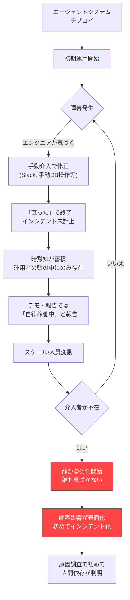

# AP-01: Phantom Autonomy｜幻の自律性

## 一言で（TL;DR）

デモや初期運用では「自律的に動いている」ように見えるが、実際にはドキュメント化されていない人間の介入（手動データ修正、Slack での臨時エスカレーション、エンジニアによるプロセス再起動、運用者によるバッチ再実行）に支えられており、その人間が不在になった瞬間にシステムが静かに劣化・停止する。

## なぜ陥るのか（誘引）

このアンチパターンには複数の強力な誘引がある。

第一に、**デモ駆動の開発サイクル**が引き金になる。経営層やステークホルダーへのデモでは「人間が介入しなくても動く」ことを見せたい。デモが成功するとチームは自律性が確立されたと思い込むが、実際にはデモの裏で開発者がプロンプトを微調整し、入力データをクリーニングし、異常な出力を手動で差し替えている。デモの成功体験が「これでいける」という確信を強化してしまう。

第二に、**暗黙の運用知識**が蓄積しやすい。初期運用を担当するエンジニアは、エージェントが失敗するパターンを経験的に学び、障害発生前に先回りして対処する習慣を身につける。この対処は「ちょっとした手直し」として認識され、正式な運用手順やエスカレーションパスとして文書化されない。本人すら「自分がいなくても大丈夫だろう」と思っている。

第三に、**自律性の定義が曖昧**なまま進行する。「エージェントが自律的に処理する」という表現が、「人間のバックアップなしに100%のケースを処理できる」なのか「80%のケースを処理でき、残り20%は人間にエスカレーションする設計」なのかが区別されていない。HITL（Human-in-the-Loop）の契約が明示されないまま、暗黙のうちに人間が残り20%を吸収している。

## 典型的な症状

- **特定の人が休暇を取ると障害率が跳ね上がる**。SRE やオンコール担当者ではなく、「あの人がいないと回らない」という属人的な依存が存在する。
- **Slack/Teams のチャンネルにエージェント関連の手動対応メッセージが散見される**。「またこのパターンか、手動で直しておいた」「バッチ ID xxx を再実行しておきます」といったメッセージが日常的に流れているが、インシデントとして計上されない。
- **運用ドキュメントと実態が乖離している**。設計書には「エージェントが自動処理」と書かれているが、実際の運用手順書には「異常時は xxx さんに連絡」という非公式な注記がある。
- **スケールアウトすると失敗率が非線形に増加する**。トラフィックが2倍になると失敗率は2倍ではなく5倍になる。人間の介入キャパシティがボトルネックになっているため。
- **モデル更新や API 変更のたびに数日間の「安定化期間」が必要になる**。この期間中、エンジニアがつきっきりで出力を監視・修正している。

## 発生メカニズム



このサイクルの本質は、**人間の介入が「障害対応」ではなく「通常運用の一部」として溶け込んでしまう**ことにある。観測基盤（[G1 二層観測](../patterns/g-observability-ops/g1-tiered-observability.md)）が整備されていなければ、エージェントの成功率メトリクスには「人間が修正した後の結果」が記録され、見かけ上の成功率は高いまま保たれる。

障害が発生しても、エンジニアが素早く対処すればエンドユーザーには影響しない。この「影響なし」がフィードバックループを断ち切る。本来であれば「エージェントが失敗した」という信号をシステムにフィードバックし、プロンプトの改善やフォールバック設計に活かすべきだが、手動修正で問題が消えてしまうため、改善のインセンティブが生まれない。

## 駆動変数による重症度（程度）

| 駆動変数 | 値が高いとき（重症） | 値が低いとき（軽症） |
|---|---|---|
| `failure_cost` | 手動介入の見落としが金銭的損害・データ損失に直結する。人間が不在になった瞬間のリスクが致命的 | 失敗しても影響が限定的で、後から修正可能。人間不在でも被害が小さい |
| `accountability` | 監査や規制対応で「誰が・いつ・何を修正したか」の記録が求められるが、非公式な手動介入は記録されない | 監査要件が緩く、手動介入の記録がなくても問題にならない |
| `reversibility` | 不可逆な操作（メール送信、決済処理、外部 API 呼び出し）を含む場合、手動介入が間に合わないと取り返しがつかない | すべての操作が可逆で、事後修正が容易 |
| `provider_trust` | プロバイダの安定性が低く障害頻度が高い場合、手動介入の頻度が増え、人間の負荷が持続不能になる | プロバイダが安定しており、手動介入の頻度が低く維持できる |
| `task_variability` | タスクの多様性が高いと、手動介入のパターンが多岐にわたり属人化しやすい | タスクが定型的で、手動介入のパターンが少なく引き継ぎやすい |

## 関連する設計力学（forces）

- **[F17 人間との協働が前提](../concepts/design-forces.md)**：エージェントシステムは本質的に人間との協働を前提とするが、このアンチパターンでは協働の境界が曖昧なまま、暗黙の依存が生まれる。
- **[F7 稼働安定性がプロバイダ依存](../concepts/design-forces.md)**：プロバイダ起因の障害が発生するたびに人間が手動で対処するパターンが定着し、プロバイダの不安定さが人間への依存を強化する。
- **[F8 副作用のあるツール/スキル](../concepts/design-forces.md)**：副作用を伴う操作で失敗した場合、エンジニアが手動でロールバック・修正するケースが多く、この介入がドキュメント化されにくい。
- **[F12 レイテンシの分散が大きい](../concepts/design-forces.md)**：ヘビーテールのレイテンシを人間が「タイムアウトしたら再実行」で吸収しており、本来必要なリトライ設計が後回しになる。
- **[F15 再現性の低さ](../concepts/design-forces.md)**：再現性が低い障害ほど「たまに起きるから手動で直す」という対処に流れやすく、根本原因の調査が行われない。

## 具体的シナリオ

ある EC サイトが、顧客からの問い合わせメールに AI エージェントで自動返信するシステムを導入した。エージェントは注文データベースを参照し、返品・交換・配送状況の問い合わせに対して返信ドラフトを生成し、自動送信する設計だった。

初期の3ヶ月間は、開発チームのリーダーである田中さんが毎朝 Slack の `#agent-ops` チャンネルを確認し、エージェントが生成した返信のうち「怪しいもの」を目視チェックしていた。具体的には以下のような介入を日常的に行っていた。

```python
# 田中さんの非公式な朝のルーティン（どこにも文書化されていない）
# 1. 前日の返信ログを確認
# 2. 返品ポリシーの例外ケース（30日超の返品要求等）を検索
# 3. 該当する返信を手動で差し替え
# 4. 外部APIタイムアウトで未送信になった返信を再実行

SELECT r.id, r.customer_email, r.generated_reply, r.status
FROM agent_replies r
WHERE r.created_at > NOW() - INTERVAL '24 hours'
  AND (r.status = 'failed' OR r.confidence_score < 0.7)
ORDER BY r.created_at;

-- 問題のある返信を手動修正
UPDATE agent_replies
SET generated_reply = '手動修正した返信内容...',
    status = 'sent',
    modified_by = 'tanaka'  -- この列は後から追加された非公式なもの
WHERE id = 12345;
```

この運用は田中さんが毎日30分かけて行っていた。チームの週次レポートには「エージェント自動返信率 96%」と報告されていたが、実際には田中さんの介入がなければ自動返信率は 82% 程度だった。

田中さんが2週間の夏季休暇を取得した際、以下の事象が発生した。

- 返品ポリシー例外ケースへの不適切な返信が47件送信された（うち3件が SNS で拡散）。
- 外部 API タイムアウトによる未送信が累積し、72時間以内に返信すべき問い合わせのうち23件が SLA 違反となった。
- 休暇中の田中さんに Slack で連絡が入り、旅行先からリモートで対応する事態になった。

事後のポストモーテムで初めて、チームは「自律稼働」の実態を正確に把握した。

## 処方箋

### 0. 「幻の自律性テスト」を実施する

処方箋の前に、まずこのアンチパターンの有無を定量的に診断する。方法は単純で、**エージェントシステムに関与している全員に1週間の「手を出さない期間」を設定する**ことである。もちろん本番環境でいきなり実施するのはリスクが高いため、以下のいずれかの方法を取る。

- **ステージング環境で本番トラフィックのリプレイ**を流し、人間の介入なしで処理させる。raw_success_rate を計測する。
- **本番環境のカナリア枠**（トラフィックの5-10%）で、手動介入をすべてキューに溜めるだけで実行しない。溜まったキューの量と内容が「幻の自律性」の実態を示す。
- **介入ログの棚卸し**として、過去1ヶ月の Slack / メール / チケットから、エージェント関連の手動操作をすべて抽出・分類する。

この診断で assisted_success_rate と raw_success_rate の差分が5%を超えるなら、このアンチパターンが発生している。

### 1. 人間の介入を明示的な HITL 契約として定義する

暗黙の介入を排除する第一歩は、**人間が何をしているかを可視化し、正式なエスカレーションパスとして設計に組み込む**ことである。

[E1 Risk-based Approval](../patterns/e-safety-hitl/e1-risk-based-approval.md) を導入し、エージェントが自信を持てないケースや高リスク操作を**設計として**人間にルーティングする。「田中さんが気づいて直す」ではなく「confidence < 0.85 の返信は自動的に承認キューに入る」というルールにする。

### 2. 観測基盤で「人間なし」の真の成功率を測定する

[G1 二層観測](../patterns/g-observability-ops/g1-tiered-observability.md) を導入し、以下の2つのメトリクスを分離して計測する。

- **raw_success_rate**：人間の介入なしでエージェントが正しく処理を完了した割合
- **assisted_success_rate**：人間の介入を含めた最終的な成功率

この差分が「幻の自律性」の定量的な指標になる。差分が大きいほど、人間依存が深刻である。

### 3. エスカレーション経路を自動化する

手動で Slack に投稿して誰かが拾う、という運用を、以下のように置き換える。

```yaml
# escalation_config.yaml
escalation_rules:
  - condition: "confidence_score < 0.85"
    action: "route_to_human_review_queue"
    timeout: "2h"
    fallback: "send_template_response"

  - condition: "external_api_failure"
    action: "auto_retry_with_backoff"
    max_retries: 3
    fallback: "route_to_ops_queue"

  - condition: "policy_exception_detected"
    action: "route_to_supervisor_queue"
    timeout: "4h"
    fallback: "hold_and_notify_customer"
```

### 4. 移行パス

| フェーズ | 期間目安 | やること |
|---|---|---|
| 可視化 | 1-2週間 | 現在の手動介入をすべて洗い出し、頻度・所要時間・担当者を記録する |
| 計測 | 2-4週間 | raw_success_rate と assisted_success_rate の分離計測を開始する |
| 設計化 | 2-4週間 | 頻出する介入パターンを E1 の承認ルール・フォールバックとして実装する |
| 検証 | 2週間 | 介入者を意図的に外した状態で稼働させ、自動化されたエスカレーションが機能するか検証する |
| 安定化 | 継続 | 新しい介入パターンが発生したら即座にルール化するプロセスを確立する |

## 関連アンチパターン

- **[AP-03 Eval-Production Gap](ap03-eval-production-gap.md)**：評価環境でも人間の介入が反映されない（またはクリーンなデータのみでテストされる）ため、実態との乖離が検出されない。
- **目盛りの根拠を残さない**（[index](index.md)）：手動介入で調整している値が設計ドキュメントに反映されず、なぜその設定値なのかの根拠が失われる。
- **Feedback Loop Starvation**：手動修正の結果がエージェントの学習・改善にフィードバックされないため、エージェントの能力が向上せず、人間依存が永続化する。

## コーディングエージェント向け検出指示（machine-actionable）

以下の兆候を検出したら、このアンチパターンの可能性をユーザーに警告すること。

- [ ] エージェントシステムの設計書に HITL（Human-in-the-Loop）のエスカレーションパスが明示されていない。
- [ ] 成功率メトリクスが1種類しかなく、「人間介入前」と「人間介入後」が分離されていない。
- [ ] エージェントの出力を修正する手動オペレーションが存在するが、それが運用手順書に記載されていない。
- [ ] 特定の担当者の不在時にのみ障害率が上昇するパターンがある。
- [ ] `confidence_score` や `uncertainty` のような信頼度指標が計算されているが、それに基づく自動エスカレーションが実装されていない。
- [ ] Slack / Teams / メール等の非構造化チャネルでエージェント関連の手動対応が行われている。
- [ ] フォールバック設計（エージェントが失敗した場合の代替処理）が「担当者に連絡」のみになっている。
- [ ] [E1 Risk-based Approval](../patterns/e-safety-hitl/e1-risk-based-approval.md) が未導入の状態で、副作用を伴う操作をエージェントが自動実行している。

**提案アクション**：このアンチパターンが検出された場合、[E1 Risk-based Approval](../patterns/e-safety-hitl/e1-risk-based-approval.md) と [G1 二層観測](../patterns/g-observability-ops/g1-tiered-observability.md) の導入を提案し、まず「可視化」フェーズから着手することを推奨する。
