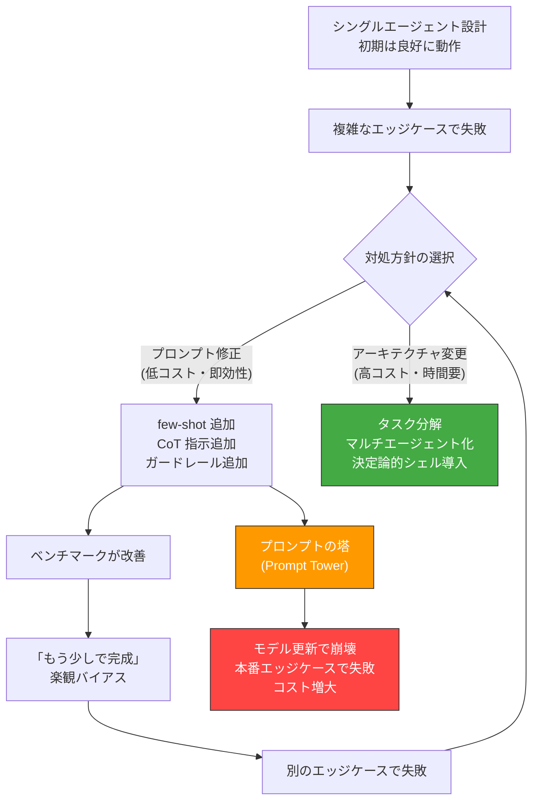

# AP-02: Capability Ceiling Denial｜能力天井の否認

## 一言で（TL;DR）

エージェントが複雑なタスクで信頼性の限界に達したとき、タスク分解やアーキテクチャ変更ではなく、プロンプトエンジニアリングの積み重ね（few-shot 追加、Chain-of-Thought 指示、ガードレール多重化）で対処しようとする。結果として脆弱な「プロンプトの塔」が出来上がり、ベンチマークでは動くが本番のエッジケースで崩壊する。

## なぜ陥るのか（誘引）

このアンチパターンには、技術的・組織的の両面から強い誘引が存在する。

**埋没コストの罠**がもっとも強力な誘引である。チームはすでにシングルエージェント設計に数ヶ月を投資しており、プロンプトの改善履歴も蓄積されている。「あと少しプロンプトを直せば動くはず」という期待が、アーキテクチャレベルの再設計を先送りさせる。プロンプトの修正は数時間で試せるが、タスク分解やマルチエージェント化には数週間かかるため、短期的にはプロンプト修正が合理的に見える。

**LLM の能力への過大評価**も誘引になる。LLM は驚くほど多様なタスクをこなせるため、「十分なプロンプトを与えれば何でもできる」という信念が生まれやすい。特に GPT-4 や Claude のような大規模モデルの登場以降、「モデルが賢ければプロンプトだけで解決できる」という思い込みが強化されている。

**分解思考の欠如**も根本的な要因である。従来のソフトウェアエンジニアリングでは「関心の分離」「単一責任原則」が基本だが、LLM を使った開発では「1つのプロンプトに全部入れる」アプローチが最初の成功体験になりやすい。プロンプトを分割すること自体が新しい設計パターンであり、経験が蓄積されていないチームでは発想に至らない。

**ベンチマークの誤用**も問題を助長する。チームは評価セットを作り、プロンプト改善のたびにスコアが向上することを確認する。しかし評価セットは「よくあるケース」で構成されがちで、本番のロングテール分布を反映していない。ベンチマークの改善が「問題は解決に向かっている」という誤った安心感を与える。

## 典型的な症状

- **プロンプトが数千トークンに膨張している**。few-shot 例、Chain-of-Thought 指示、出力形式の指定、例外ケースの列挙が積み重なり、プロンプト自体が「スパゲッティコード」化している。
- **プロンプトの修正が「もぐらたたき」になっている**。あるエッジケースを修正すると、別のケースが壊れる。修正の連鎖が終わらない。
- **モデルのバージョンアップで性能が不安定になる**。過度にチューニングされたプロンプトは特定モデルバージョンの挙動に過剰適合しており、[F9 モデルドリフト](../concepts/design-forces.md)に対して極めて脆弱になる。
- **「このプロンプト触るの怖い」という発言がチームから出る**。プロンプトの各部分がなぜ必要なのかを完全に把握している人がいなくなり、変更のリスク評価ができない。
- **同一タスクの処理時間とコストが単調増加している**。プロンプトの肥大化に伴い、入力トークン数が増え続け、[F11 コストが長さに依存](../concepts/design-forces.md)の力学で費用が膨らむ。

## 発生メカニズム



このサイクルの核心は、**プロンプト修正の即効性がアーキテクチャ改善の必要性を覆い隠す**点にある。プロンプト修正は「実験→結果確認」のサイクルが数分〜数時間で回るため、短期的には生産性が高く見える。しかし、LLM の確率的性質（[F3](../concepts/design-forces.md)）により、プロンプトの複雑化は予測困難な副作用を生み、修正の限界効用は逓減する。

特に危険なのは、**プロンプトが「仕様書」と「実装」の両方を兼ねてしまう**ことである。従来のソフトウェアでは仕様とコードは分離されるが、プロンプト駆動の開発ではプロンプト自体がロジックの実装になる。プロンプトが肥大化すると、LLM の注意機構が重要な指示を見落とす確率が上がり（"lost in the middle" 問題）、信頼性がかえって低下する。

## 駆動変数による重症度（程度）

| 駆動変数 | 値が高いとき（重症） | 値が低いとき（軽症） |
|---|---|---|
| `task_variability` | 入力パターンが多様で、プロンプトでカバーすべき例外が爆発的に増える。few-shot で網羅することが原理的に不可能 | タスクが定型的で、限られた few-shot 例でほぼ全ケースをカバーできる |
| `failure_cost` | プロンプトの塔が崩壊したときの影響が甚大。「もぐらたたき」修正で見落としたケースが致命的な損害を招く | 失敗しても影響が限定的で、プロンプト修正のサイクルを回す余裕がある |
| `cost_sensitivity` | プロンプトの肥大化によるトークンコスト増が予算を圧迫する。few-shot 例の追加ごとにリクエストあたりコストが上昇 | コストに余裕があり、プロンプトの肥大化が予算制約に当たらない |
| `input_trust` | 入力の品質が低い場合、プロンプトで吸収すべきバリエーションが増え、プロンプトの塔が不安定化する | 入力が構造化されており品質が安定しているため、プロンプトの負荷が低い |
| `provider_trust` | モデル更新が頻繁で、過剰適合したプロンプトが頻繁に壊れる。モデルドリフト耐性が低い | プロバイダが安定しており、プロンプトの過剰適合が問題になりにくい |

## 関連する設計力学（forces）

- **[F3 確率的（非決定的）](../concepts/design-forces.md)**：LLM の出力が確率的であるため、プロンプトの微修正が予測困難な副作用を生む。プロンプトの複雑化に伴い、この不確実性が指数的に増大する。
- **[F4 ハルシネーション](../concepts/design-forces.md)**：プロンプトが複雑になるほど、LLM が指示の一部を誤解釈する確率が上がり、ハルシネーションの発生パターンが多様化する。
- **[F9 モデルドリフト](../concepts/design-forces.md)**：特定モデルバージョンに過剰適合したプロンプトは、モデル更新で急激に性能劣化する。プロンプトが複雑なほどドリフトの影響を受けやすい。
- **[F11 コストが長さに依存](../concepts/design-forces.md)**：プロンプトの肥大化は入力トークン数の増加に直結し、リクエストあたりコストが単調増加する。
- **[F13 自己ループ（計画・反省・再帰）](../concepts/design-forces.md)**：プロンプト内で「自分の出力を検証して修正せよ」という自己ループ指示を追加するが、ループの制御が不十分で暴走するリスクがある。

## 具体的シナリオ

ある SaaS 企業が、顧客の自然言語リクエストを SQL クエリに変換する AI エージェントを開発した。初期バージョンは単純な SELECT 文に対して90%の精度で動作し、チームは自信を持っていた。

しかし本番投入後、以下のような複雑なクエリで失敗が続発した。

```
「先月の売上が前年同月比で20%以上減少した顧客のうち、
 直近3ヶ月でサポートチケットを5件以上出しているものを、
 契約更新日が近い順に一覧してほしい」
```

チームはプロンプトの改善で対処を試みた。

```python
# バージョン1: シンプル（動作: 単純クエリのみ）
SYSTEM_PROMPT_V1 = """
あなたはSQLエキスパートです。ユーザーの質問をSQLに変換してください。
スキーマ: {schema}
"""

# バージョン5: few-shot追加（3ヶ月後）
SYSTEM_PROMPT_V5 = """
あなたはSQLエキスパートです。ユーザーの質問をSQLに変換してください。
スキーマ: {schema}

重要な注意事項:
- 日付の比較にはDATE_TRUNC関数を使用すること
- 前年同月比はLAG関数で計算すること
- NULLの処理にはCOALESCEを必ず使用すること
- サブクエリよりCTEを優先すること
- LIMIT句がない場合は必ずLIMIT 1000を追加すること

以下の例を参考にしてください:
{15個のfew-shot例、合計3000トークン}

よくある間違いとその修正:
{10個の間違いパターン、合計2000トークン}

出力形式:
- まずクエリの解釈を<thinking>タグで説明
- 次にSQLを<sql>タグで出力
- 最後に注意点を<caveats>タグで説明
"""

# バージョン12: ガードレール多重化（6ヶ月後、プロンプト合計8000トークン）
SYSTEM_PROMPT_V12 = """
{上記に加えて}
- 生成したSQLが以下のルールに違反していないか自己チェックしてください:
  1. DELETE/UPDATE/INSERTを含まないこと
  2. LIMIT句があること
  3. テーブル名がスキーマに存在すること
  {さらに20個のルール}
- 自信度を1-10で自己評価してください
- 自信度が7未満の場合、代替クエリも提示してください
"""
```

バージョン12のプロンプトは評価セット（200問）で92%の精度を達成したが、以下の問題が発生した。

- リクエストあたりの入力トークンが8,000を超え、月額コストが初期の4倍に膨らんだ。
- GPT-4 のマイナーバージョン更新で精度が92%から78%に低下し、2週間のプロンプト再調整が必要になった。
- プロンプト内の「自己チェック」指示が時折ループし、タイムアウトするケースが月に数十件発生した。
- プロンプトの各部分がどの障害を修正するために追加されたかを把握している人が退職し、メンテナンス不能になった。

本来必要だったのは、アーキテクチャレベルの分解だった。分解後の設計では以下のようになる。

```python
# 分解後のアーキテクチャ（概念的な実装）
class SQLGenerationPipeline:
    def __init__(self):
        self.intent_parser = LLMStep(
            model="lightweight",  # 意図解析は軽量モデルで十分
            prompt="ユーザーの質問から意図・フィルタ・集計・ソートを抽出",
            output_schema=QueryIntent  # 構造化出力で確実にパース
        )
        self.sql_builder = DeterministicStep(
            # SQL組み立ては決定論的コードで処理
            # スキーマ照合、JOIN戦略、LIMIT強制はここで確実に実行
        )
        self.validator = DeterministicStep(
            # SQLパース、実行計画確認、禁止パターン検出はコードで処理
        )

    def execute(self, user_query: str) -> SQLResult:
        intent = self.intent_parser.run(user_query)    # LLM: 意図解析のみ
        sql = self.sql_builder.build(intent)            # コード: SQL組み立て
        validation = self.validator.validate(sql)       # コード: バリデーション
        return SQLResult(sql=sql, validation=validation)
```

この設計では、LLM が担当する範囲は「自然言語から構造化された意図表現への変換」のみに限定され、SQL の構文ルールやスキーマ整合性はコードが保証する。プロンプトは200トークン程度に収まり、モデルドリフトへの耐性も大幅に向上する。

## 処方箋

### 1. タスクを分解する（B4 Planner-Executor-Verifier）

単一プロンプトで複雑なタスク全体を処理するのではなく、[B4 Planner-Executor-Verifier](../patterns/b-orchestration/b4-planner-executor-verifier.md) を導入してタスクを段階に分解する。上記の SQL 変換の例では以下のように分解できる。

- **Planner**：自然言語クエリを構造化された中間表現（意図、フィルタ条件、集計、ソート）に変換する。
- **Executor**：中間表現を SQL に変換する（テーブル結合やスキーママッピングはコードで処理）。
- **Verifier**：生成された SQL をパース・実行計画確認・サンドボックス実行で検証する。

### 2. 決定論的に処理できる部分を LLM から切り出す（B1 Deterministic Shell）

[B1 Deterministic Shell](../patterns/b-orchestration/b1-deterministic-shell.md) により、プロンプト内の「ルール」を決定論的なコードに移行する。SQL のバリデーション、スキーマ照合、LIMIT 句の強制挿入などは LLM に任せず、コードで確実に処理する。

### 3. モデルを使い分ける（B7 Model Router）

[B7 Model Router](../patterns/b-orchestration/b7-model-router-adaptive-effort.md) により、単純なクエリには軽量モデル、複雑なクエリには高性能モデルを振り分ける。すべてのリクエストに巨大プロンプト＋最上位モデルを使う必要はない。

### 4. 移行パス

| フェーズ | 期間目安 | やること |
|---|---|---|
| 診断 | 1週間 | 現在のプロンプトを「LLM でしか処理できない部分」と「コードで処理できる部分」に分類する |
| 切り出し | 2-3週間 | 決定論的ルール（バリデーション、フォーマット強制、スキーマ照合）をコードに移行する |
| 分解 | 2-4週間 | タスクを Planner-Executor-Verifier に分解し、各段階のプロンプトを単純化する |
| ルーティング | 1-2週間 | 複雑度に応じたモデル振り分けを導入する |
| 評価再構築 | 1-2週間 | 各段階ごとの評価セットを構築し、E2E 評価と段階別評価の両方を運用する |

## 関連アンチパターン

- **[AP-03 Eval-Production Gap](ap03-eval-production-gap.md)**：プロンプトの塔がベンチマークで高スコアを出すことが、本番での実態を覆い隠す。この2つのアンチパターンは相互に強化し合う。
- **[AP-01 Phantom Autonomy](ap01-phantom-autonomy.md)**：プロンプトの塔で解決しきれないケースを人間が暗黙に補完しているパターン。能力天井を人間が吸収している状態。
- **最強モデル一択**（[index](index.md)）：能力天井を「もっと強いモデルで解決する」と考え、コストを度外視して最上位モデルに依存する。能力天井の否認の変種。
- **過剰ガードレール**（[index](index.md)）：プロンプトの塔にガードレールを追加し続けた結果、誤検知で正当な出力まで弾いてしまう状態。

## コーディングエージェント向け検出指示（machine-actionable）

以下の兆候を検出したら、このアンチパターンの可能性をユーザーに警告すること。

- [ ] システムプロンプトが 3,000 トークンを超えており、few-shot 例が5個以上含まれている。
- [ ] プロンプト内に「以下の間違いをしないでください」「以下のルールを守ってください」といった否定的指示が10個以上ある。
- [ ] プロンプトの変更履歴（Git ログ等）が頻繁で、同一ファイルへの修正が月10回以上ある。
- [ ] プロンプト内に自己検証ループの指示（「生成した結果を自分でチェックしてください」等）が含まれている。
- [ ] 単一の LLM 呼び出しで処理しているタスクに、3つ以上の独立した判断ステップが含まれている。
- [ ] バリデーションルール、フォーマット変換、スキーマ照合などの決定論的処理がプロンプト内に記述されている（コードに移行すべき）。
- [ ] モデルバージョン更新のたびにプロンプトの再調整が必要になっている。
- [ ] [B1 Deterministic Shell](../patterns/b-orchestration/b1-deterministic-shell.md) や [B4 Planner-Executor-Verifier](../patterns/b-orchestration/b4-planner-executor-verifier.md) が検討されないまま、プロンプト修正が繰り返されている。

**提案アクション**：このアンチパターンが検出された場合、まず「診断」フェーズとしてプロンプトの各部分を「LLM 必須」「コード移行可能」「タスク分解で単純化可能」に分類し、[B1](../patterns/b-orchestration/b1-deterministic-shell.md) による決定論的処理の切り出しから着手することを推奨する。
