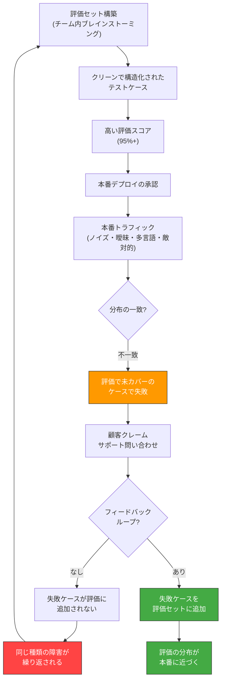
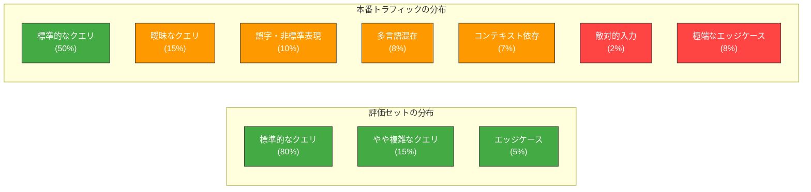
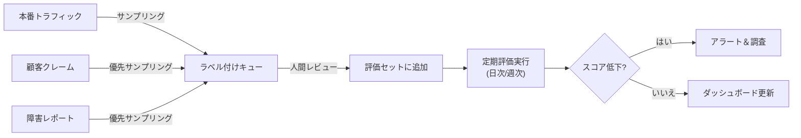

# AP-03: Eval-Production Gap｜評価・本番キャズム

## 一言で（TL;DR）

評価セットが本番トラフィックとは根本的に異なる分布をテストしているため、評価上は高精度（95%以上）でも本番ではクレームが絶えない。AI システムは分布シフトに対して予測困難な壊れ方をするため、評価の偽りの安心感がシステマティックな盲点を隠蔽する。

## なぜ陥るのか（誘引）

このアンチパターンは、評価セット構築のプロセス自体に構造的な偏りが存在するために発生する。

**チーム内ブレインストーミングによる評価セット構築**がもっとも一般的な誘引である。開発チームが「ユーザーはこういう入力をするだろう」と想像してテストケースを作る。しかしチームメンバーは全員が同じコンテキスト（ドメイン知識、語彙、表現パターン）を共有しているため、作成されるテストケースは自然と「開発者が想像できる範囲」に収束する。本番ユーザーの多様性、曖昧さ、誤字脱字、非標準的な表現は反映されない。

**クリーンデータ偏向**も強い誘引である。評価セットの入力は構造化され、明確で、一意に解釈可能であることが多い。これは評価の「正解」を定義しやすくするためだが、本番の入力はそうではない。曖昧なリクエスト、文脈に依存する表現、複数言語の混在、コピペ由来の不要な文字列など、ノイズに満ちた入力が日常的に流入する。

**評価メトリクスの単純化**も問題を助長する。精度（accuracy）や F1 スコアのような単一指標に集約すると、「どの種類のケースで失敗しているか」が見えなくなる。全体の精度が95%でも、特定のサブカテゴリで50%しかない場合、そのサブカテゴリのユーザーにとっては使い物にならない。

**本番フィードバックの未接続**が根本原因を永続化させる。本番で失敗したケースが評価セットに追加されるフィードバックループがなければ、評価セットは永遠に初期構築時の偏りを持ち続ける。本番で発見された新しい失敗パターンが評価に反映されず、同じ種類の障害が繰り返される。

**静的な評価セットへの過信**も危険である。本番トラフィックの分布は時間とともに変化する（季節性、新機能リリース、ユーザー層の変化）が、評価セットは作成時点の分布を固定的に反映するのみで、この変化に追従しない。

## 典型的な症状

- **評価メトリクスと顧客満足度の乖離**。ダッシュボード上の精度は95%だが、カスタマーサポートへの「AI の回答がおかしい」という問い合わせが週に何十件も来る。
- **「再現できない」障害が多発する**。顧客が報告する問題を開発環境で再現しようとしても、クリーンな入力では再現しない。本番の入力ノイズが原因だが、そのノイズが評価セットに含まれていないため検出できない。
- **特定のユーザーセグメントからの不満が集中する**。非ネイティブ話者、特定の業界用語を使うユーザー、モバイルからの短文入力ユーザーなど、評価セットが想定していないセグメントで障害率が高い。
- **モデル更新後の評価パスと本番劣化の不一致**。新モデルに切り替えた際、評価セットではスコアが維持または向上しているのに、本番では劣化が報告される。
- **プロンプトインジェクションや敵対的入力への無防備**。評価セットに悪意のある入力が含まれていないため、攻撃耐性が一切テストされていない。

## 発生メカニズム





上の2つの図が示すように、評価セットと本番トラフィックの分布には根本的なずれがある。評価セットでは「標準的なクエリ」が支配的だが、本番では「曖昧」「非標準」「多言語」「コンテキスト依存」「敵対的」といった、評価セットに含まれないカテゴリが合計で50%近くを占める。AI システムの特性上、分布内のデータに対する高精度は分布外のデータに対する高精度を保証しない（[F3 確率的](../concepts/design-forces.md)）。

## 駆動変数による重症度（程度）

| 駆動変数 | 値が高いとき（重症） | 値が低いとき（軽症） |
|---|---|---|
| `input_trust` が低い | 本番入力にノイズ・悪意・曖昧さが多く、クリーンな評価セットとの乖離が大きい。評価スコアと本番性能の差が顕著になる | 入力が構造化 API 経由で品質が保証されており、評価セットとの分布差が小さい |
| `task_variability` | タスクの多様性が高く、評価セットで網羅すべきパターンが膨大。評価カバレッジの不足が深刻になる | タスクが定型的で、少数のテストケースで高いカバレッジを達成できる |
| `failure_cost` | 評価で見落としたケースでの失敗が重大な損害（金銭、レピュテーション、法的リスク）を招く | 失敗の影響が限定的で、本番での試行錯誤が許容される |
| `accountability` | 監査や規制対応で「なぜこの出力が正しいと判断したか」の説明が求められるが、評価カバレッジの穴が説明責任を果たせない根拠になる | 説明責任の要件が緩く、一定の失敗率が許容される |
| `cost_sensitivity` | 評価の不備による本番障害の対応コスト（サポート、手動修正、レピュテーション損害）が大きく、「評価を改善する方が安い」状態 | 障害対応コストが低く、事後対応で吸収できる |

## 関連する設計力学（forces）

- **[F3 確率的（非決定的）](../concepts/design-forces.md)**：LLM の出力が確率的であるため、同じ入力でも異なる出力が得られる。評価時と本番時で同じ入力に対する出力が異なりうることを評価設計で考慮する必要がある。
- **[F5 自然言語インターフェース（曖昧性）](../concepts/design-forces.md)**：自然言語入力の曖昧性が、評価セットでは人工的に排除されがちだが、本番では排除できない。曖昧さへの対処能力が評価されない。
- **[F14 自然言語が攻撃面](../concepts/design-forces.md)**：プロンプトインジェクションや敵対的入力が評価セットに含まれていなければ、攻撃耐性は一切テストされない。本番での攻撃に対して無防備になる。
- **[F15 再現性の低さ](../concepts/design-forces.md)**：LLM の非決定性により、評価で「パス」した入力が本番で「フェイル」することがある。単一回の評価実行では信頼性を保証できない。
- **[F9 モデルドリフト](../concepts/design-forces.md)**：モデル更新により、評価セットでの性能が維持されても、評価セットがカバーしていない領域で性能が変化する可能性がある。

## 具体的シナリオ

ある法律テック企業が、契約書のレビューを支援する AI エージェントを開発した。エージェントは契約書のテキストを解析し、リスク条項の特定、不利な条件の警告、修正案の提示を行う。

開発チームは100件の契約書サンプルから評価セットを構築した。サンプルは社内の法務チームが提供した「典型的な契約書」であり、以下の特徴を持っていた。

- すべて英語で、フォーマルな法律英語で記述されている
- PDF から正確にテキスト抽出済み（OCR エラーなし）
- 標準的な条項構成（NDA、業務委託、ライセンス契約の3種類）
- 長さは概ね10-30ページ

評価セットでのスコアは以下の通りだった。

```
# 評価結果 (2024-Q1)
リスク条項検出: Precision 94%, Recall 91%
不利条件警告:   Precision 89%, Recall 87%
修正案の適切性: 人間評価で 4.2/5.0
```

チームはこの結果に自信を持ち、β版を法律事務所10社にリリースした。3ヶ月後、以下のフィードバックが殺到した。

```yaml
# 本番で発生した問題のカテゴリ（評価セット未カバー）
ocr_errors:
  description: "スキャンPDFからのOCR抽出で文字化け・誤認識が多発"
  frequency: "全入力の15%"
  eval_coverage: "0%（評価セットは正確なテキストのみ）"
  impact: "リスク条項の見落とし"

multilingual_contracts:
  description: "日英バイリンガル契約書、中国語の付属書類"
  frequency: "全入力の12%"
  eval_coverage: "0%（評価セットは英語のみ）"
  impact: "非英語部分が完全に無視される"

non_standard_structure:
  description: "メールのやり取りで成立した口頭合意の文書化、手書きメモの追記"
  frequency: "全入力の8%"
  eval_coverage: "0%"
  impact: "パーサーがクラッシュ、または誤解析"

adversarial_clauses:
  description: "意図的に曖昧に書かれた条項（相手方弁護士が有利に解釈できるよう設計）"
  frequency: "全入力の20%"
  eval_coverage: "5%（評価セットの契約書は概ね公正なもの）"
  impact: "最も危険な条項を見逃す"

extremely_long:
  description: "100ページ超のM&A契約書"
  frequency: "全入力の5%"
  eval_coverage: "0%（評価セットは最大30ページ）"
  impact: "コンテキストウィンドウ超過、後半部分の解析品質低下"
```

本番での実効精度は、リスク条項検出で推定72%、不利条件警告で推定65%まで低下していた。しかしチームのダッシュボードには依然として「評価精度94%」が表示されており、2ヶ月間にわたり問題の深刻さが過小評価された。

## 処方箋

### 1. 本番トラフィックから評価セットを構築する（G4 Eval Harness）

[G4 Eval Harness](../patterns/g-observability-ops/g4-eval-harness.md) を導入し、評価セットの構築プロセスを以下のように変更する。

- **本番トラフィックのサンプリング**：定期的に本番入力をサンプリングし、人間がラベル付けして評価セットに追加する。サンプリングは一様ランダムではなく、失敗ケースを重点的にサンプリングする（stratified sampling）。
- **カテゴリ別カバレッジの管理**：入力をカテゴリ（言語、フォーマット、長さ、複雑度）に分類し、各カテゴリの評価カバレッジを明示的に管理する。カバレッジが低いカテゴリを優先的に拡充する。
- **敵対的テストの組み込み**：プロンプトインジェクション、意図的に曖昧な入力、極端に長い/短い入力を評価セットに含める。

### 2. シャドーモードで本番分布を観測する

新モデルや新プロンプトを本番投入する前に、本番トラフィックに対してシャドーモードで並行実行し、評価セットとの分布差を定量化する。

```python
# シャドーモード実行の概念的な構成
shadow_config = {
    "mode": "shadow",
    "traffic_sample_rate": 0.1,  # 本番の10%をシャドー実行
    "comparison_metrics": [
        "confidence_distribution",  # 信頼度の分布比較
        "failure_category_breakdown",  # 失敗カテゴリの内訳
        "latency_distribution",  # レイテンシ分布比較
        "output_length_distribution",  # 出力長分布比較
    ],
    "alert_on_distribution_shift": {
        "kl_divergence_threshold": 0.1,
        "notify": ["#agent-ops"]
    }
}
```

### 3. 継続的な評価更新パイプラインを構築する



### 4. 観測基盤と組み合わせる（G1 二層観測）

[G1 二層観測](../patterns/g-observability-ops/g1-tiered-observability.md) を導入し、本番での失敗を即座に検出する。評価セットに頼らず、本番メトリクス（信頼度スコアの分布、フォールバック率、ユーザーフィードバック）をリアルタイムで監視する。評価スコアと本番メトリクスの乖離自体をアラート条件にする。

### 5. 移行パス

| フェーズ | 期間目安 | やること |
|---|---|---|
| 現状把握 | 1週間 | 現在の評価セットのカテゴリ別カバレッジを分析し、本番トラフィックの分布と比較する |
| サンプリング基盤 | 1-2週間 | 本番トラフィックのサンプリングとラベル付けのパイプラインを構築する |
| 評価拡充 | 2-4週間 | 本番サンプルを評価セットに追加し、カテゴリ別カバレッジを改善する。特に失敗ケースを重点的に追加 |
| シャドーモード | 1-2週間 | モデル/プロンプト変更時のシャドーモード実行を標準プロセスに組み込む |
| 継続運用 | 継続 | 週次で本番サンプルを評価セットに追加し、評価スコアと本番メトリクスの乖離を監視する |

## 関連アンチパターン

- **[AP-01 Phantom Autonomy](ap01-phantom-autonomy.md)**：評価と本番のギャップを人間が暗黙に埋めている場合、このアンチパターンと AP-01 が同時に発生する。評価スコアは高いが、実際には人間の介入で本番品質を維持しており、両方の問題が隠蔽される。
- **[AP-02 Capability Ceiling Denial](ap02-capability-ceiling-denial.md)**：評価セットでのスコア改善がプロンプトの積み重ねを正当化する材料になる。評価が本番を反映していなければ、プロンプトの塔は「評価のための最適化」に過ぎず、本番の能力天井は放置される。
- **Feedback Loop Starvation**：本番の失敗が評価セットにフィードバックされない状態は、まさにフィードバックループの飢餓である。この2つのアンチパターンは表裏一体。

## コーディングエージェント向け検出指示（machine-actionable）

以下の兆候を検出したら、このアンチパターンの可能性をユーザーに警告すること。

- [ ] 評価セットがチームのブレインストーミングのみから構築されており、本番トラフィックからのサンプリングが含まれていない。
- [ ] 評価セットの入力がすべてクリーンで構造化されている（誤字、曖昧表現、多言語混在、極端な長さのケースが含まれていない）。
- [ ] 評価メトリクスが単一の集約値（全体精度等）のみで、カテゴリ別の内訳が報告されていない。
- [ ] 評価セットが静的で、最終更新日が3ヶ月以上前である。
- [ ] 本番の失敗ケースを評価セットに追加するフィードバックループが存在しない。
- [ ] プロンプトインジェクションや敵対的入力のテストケースが評価セットに含まれていない（[F14](../concepts/design-forces.md)）。
- [ ] モデル更新時の評価で「パス」したが、本番で劣化が報告された事例がある。
- [ ] 評価スコアと顧客満足度（NPS、サポート問い合わせ率等）の間に相関が見られない。
- [ ] シャドーモード（本番トラフィックでの並行評価）の仕組みが存在しない。
- [ ] [G4 Eval Harness](../patterns/g-observability-ops/g4-eval-harness.md) や [G1 二層観測](../patterns/g-observability-ops/g1-tiered-observability.md) が未導入である。

**提案アクション**：このアンチパターンが検出された場合、まず「現状把握」として評価セットのカテゴリ別カバレッジと本番トラフィック分布の比較を行い、ギャップが大きいカテゴリの特定から着手することを推奨する。並行して [G4 Eval Harness](../patterns/g-observability-ops/g4-eval-harness.md) の導入を検討し、本番サンプリングに基づく継続的な評価更新パイプラインを構築する。
