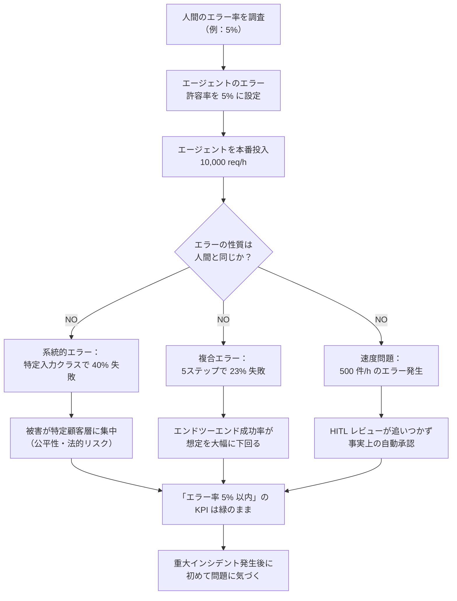

# AP-04: Anthropomorphic Error Budget（擬人化エラーバジェット）

## 一言で（TL;DR）

「人間も 5% は間違える。だからエージェントの 5% エラーも許容範囲だ」という比喩は、スケール・速度・系統性を無視した危険な類推であり、実際の被害額はエラー率ではなく **failure_cost x request_volume** で決まる。

## なぜ陥るのか（誘引）

このアンチパターンには強力な心理的誘引がある。

第一に、人間はもともと「人間と比べる」ことで未知のシステムを理解しようとする認知バイアスを持つ。LLM は自然言語を話し、推論らしき振る舞いをするため、「人間の同僚」というメンタルモデルが自然に成立してしまう。「人間のオペレーターでもミスはある。エージェントも同程度なら問題ない」という論理は直感的に正しく聞こえる。

第二に、プロダクトマネージャーや経営層への説明として「人間並みの精度」は非常に通りやすい。定量的なリスク分析を省略して合意形成できるため、ローンチを急ぐチームほどこの論法に飛びつく。

第三に、エージェント導入前の業務には人間のエラー率データが存在する場合が多い。「現状の人間エラー率をベースラインにする」というアプローチは一見合理的に見え、データドリブンな意思決定をしている錯覚を生む。

しかし、この類推には根本的な欠陥がある。人間と機械ではエラーの性質がまったく異なる。

## 典型的な症状

- **エラー率は目標内なのに重大インシデントが頻発する**。5% のエラーが特定の入力クラス（例：金額が大きい注文、特定言語の入力）に集中し、被害が偏る。
- **「人間でも間違える」が免罪符として機能し、根本原因分析が行われない**。エラーが許容範囲内と見なされ、改善サイクルが回らない。
- **マルチステップ処理で複合エラーが発生する**。各ステップ 95% の精度でも 5 ステップ連鎖すれば成功率は約 77% まで低下するが、ステップ単位の指標しか見ていないため気づかない。
- **エラーの発生速度が人間の対処能力を超える**。毎時 500 件のエラーが生じても、HITL レビューキューが処理しきれず、事実上の自動承認になる。
- **同一の系統的エラーが大量に繰り返される**。人間は「おかしい」と気づいて止まるが、エージェントは同じ失敗パターンを黙々と繰り返す。

## 発生メカニズム



このメカニズムの核心は、**エラー率という単一指標が「被害の分布・連鎖・速度」を隠蔽する**点にある。

人間のエラーはランダムに分散し、1 件あたりの処理速度が遅いため自然にレート制限がかかる。さらに人間は文脈を理解しているため、「この注文は金額が大きいから慎重にやろう」という適応的な注意配分ができる。

一方、エージェントのエラーには以下の特性がある：

1. **系統性**：同じモデル・同じプロンプトが同じ弱点を持つ。ある入力クラスでエラー率が 40% でも、別のクラスで 1% なら、全体では 5% に見える。
2. **速度**：毎時数千件を処理するため、エラーの絶対数が巨大になる。
3. **複合性**：マルチステップ処理ではエラーが乗算的に効く。
4. **無自覚性**：人間は「自信がない」とき速度を落とすが、エージェントは確信度に関係なく同じ速度で処理し続ける（明示的な閾値を設けない限り）。

## 駆動変数による重症度（程度）

| 駆動変数 | 値が高いとき（重症） | 値が低いとき（軽症） |
|---|---|---|
| `failure_cost` | 1 件のエラーが数百万円の損害や法的責任を生む場合、「5% は許容範囲」という判断が致命的になる | エラーの影響が軽微なら（例：レコメンドの外れ）、人間比較でも実害は小さい |
| `request_value` | 高額取引や重要な意思決定を扱う場合、エラー 1 件あたりの期待損失が巨大になる | 低価値リクエストなら被害総額が抑えられる |
| `reversibility` | 不可逆な操作（送金、データ削除、契約締結）では、エラー発生後の回復コストが桁違いに高い | 可逆な操作なら事後修正で対処可能 |
| `cost_sensitivity` | エラー対応コスト（人的対応、補償、信頼喪失）がサービス収益を圧迫する | コスト余裕があれば多少のエラー対応は吸収できる |

特に危険な組み合わせは **`failure_cost` が高い x `reversibility` が低い**（例：医療判断、金融取引）場合である。この領域では人間比較のエラーバジェットは絶対に使ってはならない。

## 関連する設計力学（forces）

- **F3（確率的）**：LLM の出力は本質的に確率的であり、エラーの発生パターンは人間のそれとは根本的に異なる。同一入力でも異なる出力が生じるが、その分布は人間のミスの分布とは相関しない。
- **F8（副作用のあるツール）**：エラーが副作用を伴う場合（API 呼び出し、DB 書き込み）、エラー 1 件あたりの被害が増幅される。人間は副作用の重大さを直感的に判断して慎重になるが、エージェントにはその機構がデフォルトでは備わっていない。
- **F15（再現性の低さ）**：同じ入力でも異なる結果が出るため、「5% のエラーがどの入力で起きるか」の予測が困難。テスト時に見えなかったエラーパターンが本番で顕在化する。

## 具体的シナリオ

ある EC プラットフォームが、カスタマーサポートの返金処理をエージェントに委譲した。導入前の調査で、人間オペレーターの誤返金率は約 3%（金額間違い、対象外の返金承認など）だった。チームは「エージェントの誤返金率を 5% 以下に抑えれば、人間より若干劣る程度で許容範囲」と判断した。

```python
# エラーバジェット設定（アンチパターン）
ERROR_BUDGET = {
    "refund_error_rate": 0.05,  # 「人間並み」の 5%
    "alert_threshold": 0.07,    # 7% を超えたらアラート
}
```

ローンチ後 1 週間、全体のエラー率は 4.2% で目標内だった。しかし、実際には以下が起きていた。

エージェントは「返品理由が曖昧な日本語で書かれた高額商品の返金リクエスト」に対して系統的に弱く、この入力クラスでは誤返金率が 28% に達していた。高額商品（5 万円以上）の返金リクエストは全体の 8% だが、誤返金の被害額は全体の 62% を占めていた。一方、明確な理由が書かれた低額商品の返金では誤返金率は 0.5% と極めて低く、全体平均を引き下げていた。

さらに、人間オペレーターは 1 日約 200 件を処理していたが、エージェントは 1 日 8,000 件を処理する。エラー率 4.2% は 1 日 336 件の誤返金を意味する。人間時代の 1 日 6 件（200 x 3%）とは桁が違う。

```python
# 実際の被害計算
human_daily_errors = 200 * 0.03        # = 6 件/日
agent_daily_errors = 8000 * 0.042      # = 336 件/日
# エラー率は「人間並み」でも、被害件数は 56 倍

# さらに高額商品に偏るため
avg_error_cost_human = 2000    # 人間のミスは金額帯に偏りなし
avg_error_cost_agent = 12000   # エージェントのミスは高額帯に集中
daily_loss_human = 6 * 2000    # = 12,000 円/日
daily_loss_agent = 336 * 12000 # = 4,032,000 円/日  ← 336 倍
```

3 週間後、月次の返金損失が前月比 15 倍になっていることが経理部門の指摘で発覚した。「エラー率 5% 以内」のダッシュボードはずっと緑色だった。

このシナリオが示すのは、エラー率という指標が 3 つの次元を隠蔽するということである。第一に**分布の偏り**（高額商品に集中）、第二に**絶対数のスケール**（毎日 336 件）、第三に**状況認識の欠如**（人間なら「これは高額だから慎重に」と適応するが、エージェントはデフォルトでは金額に応じた注意配分をしない）。これら 3 つの次元を無視して「人間並みのエラー率」を設定することは、被害を「率」で測るべき場面と「額」で測るべき場面の混同に他ならない。

## 処方箋

### 1. エラーバジェットを failure_cost x volume で設計する

人間比較を捨て、**許容可能な被害総額**から逆算する。

```python
# 正しいエラーバジェット設計
MAX_DAILY_LOSS = 50000  # 1日あたり許容損失額（円）
AVG_ERROR_COST = 12000  # エラー1件あたり平均損失（入力クラス別に重み付け）
DAILY_VOLUME = 8000

max_errors_per_day = MAX_DAILY_LOSS / AVG_ERROR_COST  # ≈ 4.2 件
required_error_rate = max_errors_per_day / DAILY_VOLUME  # ≈ 0.05%
# → 人間の 3% ではなく 0.05% が真の許容エラー率
```

### 2. 入力クラス別にエラーバジェットを設定する

全体平均ではなく、**リスクの高い入力クラスごとに**許容率を設ける。

```python
ERROR_BUDGETS_BY_CLASS = {
    "high_value_ambiguous": 0.005,   # 高額 x 曖昧 → 0.5%
    "high_value_clear": 0.02,        # 高額 x 明確 → 2%
    "low_value_ambiguous": 0.05,     # 低額 x 曖昧 → 5%
    "low_value_clear": 0.10,         # 低額 x 明確 → 10%
}
```

### 3. [E1 リスクベース承認](../patterns/e-safety-hitl/e1-risk-based-approval.md) で被害半径を制御する

エラー率を下げるだけでなく、**エラーが起きたときの被害を抑える**。高リスク操作には人間承認を挟み、低リスク操作は自動処理する。`failure_cost` が高い入力クラスほど承認閾値を下げる。

### 4. [B6 Critic-Judge](../patterns/b-orchestration/b6-critic-judge-sampling.md) で系統的エラーを検出する

エージェントの出力を別モデルや決定的ルールで検証し、特定入力クラスへの偏りを検出する。全数検証が不要な場合でも、高リスク入力クラスは全数検証する。

### 5. 複合エラー率を計算する

マルチステップ処理では、エンドツーエンドの成功率を明示的に計算し監視する。

```python
step_success_rates = [0.95, 0.97, 0.93, 0.98, 0.96]
e2e_success_rate = 1.0
for rate in step_success_rates:
    e2e_success_rate *= rate
# e2e_success_rate ≈ 0.804 → エンドツーエンドでは約 20% 失敗
```

### マイグレーションパス

1. 現在の「人間比較エラーバジェット」の横に、**failure_cost x volume ベースのバジェット**を追加で計算する。
2. 入力クラス別のエラー率を計測するモニタリングを導入する（[G1 二層観測](../patterns/g-observability-ops/g1-tiered-observability.md)）。
3. 乖離が大きい入力クラスを特定し、そのクラスに対して [E1 リスクベース承認](../patterns/e-safety-hitl/e1-risk-based-approval.md) を適用する。
4. 段階的に、全体平均のエラーバジェットを入力クラス別バジェットに置き換える。

## 関連アンチパターン

- **Eval-Production Gap（AP-03 相当）**：評価環境では均一なテストデータを使うため、入力クラス別のエラー偏りが見えない。本アンチパターンと組み合わさると「テストでは人間並み、本番では大惨事」になる。
- **[コンテキスト詰め込みすぎ](index.md)**：コンテキストが過剰だと判断精度が下がり、擬人化エラーバジェットの前提である「平均的な精度」自体が崩れる。
- **[目盛りの根拠を残さない](index.md)**：エラーバジェットの根拠が「人間並み」としか記録されていないため、見直しの起点がない。

## コーディングエージェント向け検出指示（machine-actionable）

以下のシグナルが検出された場合、このアンチパターンの可能性を人間に警告すること。

- [ ] エラーバジェットや許容率の設定根拠に「人間のエラー率」「human error rate」「人間並み」「human-level」などの表現が含まれている。
- [ ] エラー率の閾値が入力クラスやリスクレベルで分けられておらず、単一の全体平均値のみで管理されている。
- [ ] マルチステップ処理でステップ単位のエラー率のみが監視され、エンドツーエンドの成功率が計測されていない。
- [ ] エラー率の閾値が `failure_cost` や `request_value` と紐づいておらず、固定値である。
- [ ] エラー発生件数（rate x volume）の監視がなく、エラー率のみがダッシュボードに表示されている。
- [ ] 高リスク操作（不可逆、高額、法的影響）に対して、低リスク操作と同じエラーバジェットが適用されている。

検出した場合の推奨アクション：

1. `failure_cost x daily_volume` を計算し、許容損失額と比較するよう提案する。
2. 入力クラス別のエラー率分析を推奨する。
3. [E1 リスクベース承認](../patterns/e-safety-hitl/e1-risk-based-approval.md) の導入を提案する。
4. エラーバジェットの根拠を `[failure_cost]` と `[request_value]` の関数として再定義するよう求める。
