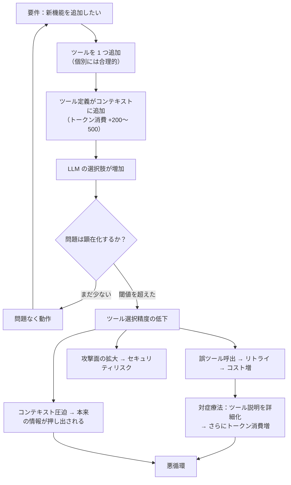

# AP-05: Tool Sprawl（ツール過剰装備）

## 一言で（TL;DR）

「柔軟性のために」ツールを増やし続けると、ツール選択精度の低下・攻撃面の拡大・コンテキストコストの膨張・テストの組合せ爆発が同時に起き、**全タスクの品質がまとめて劣化する**。

## なぜ陥るのか（誘引）

ツール過剰装備は、個々の追加が合理的に見えるからこそ危険なアンチパターンである。

最も典型的なのは「ついでに追加」の積み重ねである。プロダクトチームが「この API も呼べると便利」「将来この機能が必要になるかもしれない」とツールを追加していく。1 つ 1 つの追加は小さなコストに見えるが、効果は加算ではなく乗算的に悪化する。ツールが 10 個から 50 個に増えると、選択肢の組合せは爆発的に増え、LLM がコンテキスト内で正しいツールを選ぶ確率は非線形に低下する。

もう 1 つの誘引は「汎用エージェント」への憧れである。「何でもできるエージェント」は魅力的に聞こえるが、実際には「何もうまくできないエージェント」になる。スイスアーミーナイフは便利だが、料理人はスイスアーミーナイフで魚をさばかない。

さらに、ツール削除には追加よりも高い心理的障壁がある。「誰かが使っているかもしれない」「消したら困る場面が来るかもしれない」という不安から、一度追加されたツールはほぼ永続化する。ツールのライフサイクル管理が存在しないチームでは、ツール数は単調増加する。

## 典型的な症状

- **ツール選択ミスが増加する**。ユーザーが「ファイルを読んで」と言ったとき、`read_file`、`search_file`、`get_content`、`fetch_document` のどれを使うべきか LLM が迷い、誤選択や不要なツール呼び出しが発生する。
- **1 リクエストあたりのトークン消費が膨張する**。ツール定義（名前、説明、パラメータスキーマ）がシステムプロンプトに含まれるため、50 ツールで数千トークンを常時消費する。
- **レイテンシが増大する**。プロンプトが長くなることで推論時間が延び、さらにツール選択の試行錯誤で余分なラウンドトリップが発生する。
- **プロンプトインジェクションの攻撃面が広がる**。各ツールの入力パラメータがインジェクションのベクターになる。ツールが 50 個あれば攻撃面は 50 倍。
- **テストカバレッジが崩壊する**。ツールの組合せテストが現実的でなくなり、「テストされていないツール組合せ」が本番で初めて実行される。

## 発生メカニズム



問題の核心は **「1 ツール追加のコスト」が直感的に過小評価される** ことにある。ツール追加のコストは以下の 4 つの軸で乗算的に効く。

1. **選択コスト**：N 個のツールから正しい 1 つを選ぶ難易度は O(N) ではなく、類似ツールがあると急激に悪化する。
2. **コンテキストコスト**：ツール定義は毎リクエストで消費される固定費。N ツール x 平均 300 トークン = 15,000 トークンの常時消費。
3. **セキュリティコスト**：攻撃面はツール数に比例。特に副作用のあるツール（書込み、送信、削除）は 1 つ増えるごとにリスクが跳ね上がる。
4. **テストコスト**：ツール間の相互作用の組合せは O(N^2) で増加。

## 駆動変数による重症度（程度）

| 駆動変数 | 値が高いとき（重症） | 値が低いとき（軽症） |
|---|---|---|
| `cost_sensitivity` | トークンコストが収益に対して大きい場合、ツール定義の常時消費が直接的に利益を圧迫する | コストに余裕があれば、トークン消費の増加は吸収できる |
| `input_trust` | 信頼できない入力を扱う場合、各ツールがインジェクションベクターになる。ツール数が多いほど防御が困難 | 信頼できる内部システムからの入力のみなら、攻撃面の拡大は脅威にならない |
| `task_variability` | タスクの種類が多い場合、「全タスクに対応するため」にツールが増えがち。しかし真の解は特化エージェントへの分割 | タスクが限定的なら、必要なツールも自然に限定される |
| `failure_cost` | ツール誤選択が高コストな副作用を引き起こす場合（誤送金、誤削除）、被害が甚大 | ツール誤選択の結果が軽微なら（間違った検索結果を返す程度）、実害は小さい |

## 関連する設計力学（forces）

- **F2（高コスト）**：ツール定義がコンテキストを占有し、毎リクエストのトークンコストを押し上げる。ツールが 50 個あると、ツール定義だけで入力トークンの 10-20% を消費することがある。
- **F5（NL の曖昧性）**：ユーザーの自然言語指示が曖昧な場合、類似ツールが多いほど LLM の解釈が分散する。「ファイルを確認して」は read_file か check_file か verify_file か。
- **F8（副作用のあるツール）**：副作用ツールが多いほど、誤選択時の被害が拡大する。10 個の読取りツールと 1 個の書込みツールなら被害は限定的だが、10 個の書込みツールがあると誤選択の期待被害が桁違いに大きい。
- **F11（コストが長さに依存）**：ツール定義はリクエストのたびに送信される固定費。ツール数の増加はリクエスト数に比例してコストを積み上げる。
- **F14（攻撃面）**：各ツールのパラメータがインジェクションの入口になる。特にユーザー入力がツールパラメータに流れ込む場合、ツール数 = 攻撃ベクター数。

## 具体的シナリオ

ある社内業務支援エージェントが、最初は 8 つのツール（メール検索、カレンダー確認、文書検索、文書要約、翻訳、タスク作成、タスク更新、チャット送信）で稼働を開始した。この段階ではツール選択精度は 96% で、ユーザー満足度も高かった。

半年後、各部門からの要望でツールが 47 個に膨れ上がっていた。

```yaml
# tools.yaml（抜粋）— 47 ツールのうち一部
tools:
  - name: search_email
    description: "メールを検索する"
  - name: search_email_advanced
    description: "詳細条件でメールを検索する"
  - name: find_email_by_sender
    description: "送信者でメールを検索する"
  - name: get_email_thread
    description: "メールスレッドを取得する"
  - name: search_documents
    description: "文書を検索する"
  - name: search_documents_by_date
    description: "日付で文書を検索する"
  - name: search_documents_by_author
    description: "著者で文書を検索する"
  - name: get_document_content
    description: "文書の内容を取得する"
  - name: read_document
    description: "文書を読む"  # ← get_document_content とほぼ同じ
  # ... 残り 38 ツール
```

問題は複数の形で顕在化した。

第一に、メール関連だけで 4 つの類似ツールがあり、「先週の田中さんからのメールを探して」というリクエストに対して `search_email`、`search_email_advanced`、`find_email_by_sender` のどれを使うか LLM が安定しなくなった。30% のケースで最適でないツールが選ばれ、結果が不完全になるか、リトライが発生した。

第二に、47 ツールの定義で約 14,000 トークンがシステムプロンプトに常駐するようになった。月間 50 万リクエストで、ツール定義だけで月額約 30 万円のトークンコストが発生していた。

```python
# コスト計算
tool_tokens_per_request = 14000
monthly_requests = 500000
cost_per_1k_input_tokens = 0.003  # USD (例)
usd_jpy = 150

monthly_tool_cost_usd = (tool_tokens_per_request / 1000) * cost_per_1k_input_tokens * monthly_requests
# = 14 * 0.003 * 500000 = 21,000 USD
monthly_tool_cost_jpy = monthly_tool_cost_usd * usd_jpy
# = 3,150,000 円/月 ← ツール定義だけで
```

第三に、`delete_task`、`archive_document`、`send_chat_message` などの副作用ツールが 15 個あり、インジェクション監査で「攻撃者がユーザー入力経由で意図しないツールを呼び出せる経路が 11 個ある」と報告された。

## 処方箋

### 1. ツール棚卸しと統廃合

まず現在のツール一覧を精査し、以下を実行する。

- **重複ツールの統合**：`search_email` と `search_email_advanced` と `find_email_by_sender` を、パラメータで分岐する 1 つの `search_email` に統合する。
- **未使用ツールの削除**：直近 30 日間の呼出しログを分析し、使用率が 1% 未満のツールを削除候補にする。
- **目標ツール数の設定**：目盛り「[露出ツール数](../degrees/exposed-tool-count.md)」を参照し、`task_variability` と `cost_sensitivity` から適切な上限を設定する。概ね 10-15 が多くの用途で実用的な上限。

### 2. [C1 Tool Gateway](../patterns/c-tools-security/c1-tool-gateway-mcp-broker.md) で動的ツールローディングを実装する

全ツールを常時ロードするのではなく、リクエストの意図に基づいて必要なツールだけを動的にロードする。

```python
# 動的ツールローディングの概念
def select_tools(user_intent: str, available_tools: list) -> list:
    """意図に基づいて 5-8 個のツールだけをロードする"""
    intent_category = classify_intent(user_intent)  # 軽量分類器
    tool_set = INTENT_TOOL_MAP[intent_category]      # 事前定義のマッピング
    return [t for t in available_tools if t.name in tool_set]
```

### 3. [B7 Model Router](../patterns/b-orchestration/b7-model-router-adaptive-effort.md) で特化エージェントに分割する

47 ツールの万能エージェントを、「メールエージェント（5 ツール）」「文書エージェント（4 ツール）」「タスクエージェント（3 ツール）」に分割し、ルーターが適切なエージェントに振り分ける。各エージェントは少数のツールに特化するため、選択精度が回復する。

```python
# ルーターによる特化エージェント分割
AGENT_TOOL_SETS = {
    "email_agent": ["search_email", "send_email", "get_email_thread",
                     "create_draft", "list_labels"],
    "document_agent": ["search_documents", "get_document_content",
                        "summarize_document", "translate_text"],
    "task_agent": ["create_task", "update_task", "list_tasks"],
    "calendar_agent": ["check_calendar", "create_event", "update_event"],
}

def route_request(user_input: str) -> str:
    """軽量な意図分類でエージェントを選択"""
    intent = classify_intent(user_input)  # keyword or small model
    return INTENT_AGENT_MAP.get(intent, "general_agent")
```

この分割により、各エージェントが見るツール数は 3-5 個に収まり、選択精度は 96% 以上に回復する。さらに、各エージェントのプロンプトをタスク固有に最適化でき、汎用プロンプトよりも高い品質が得られる。

### 4. ツールライフサイクル管理を導入する

```yaml
# tool-registry.yaml
tools:
  - name: search_email
    owner: platform-team
    added: 2025-01-15
    last_used: 2025-06-01
    monthly_calls: 45000
    review_date: 2025-09-15    # 3ヶ月ごとにレビュー
    side_effects: false
  - name: delete_task
    owner: task-team
    added: 2025-03-01
    last_used: 2025-05-20
    monthly_calls: 120
    review_date: 2025-06-01    # 副作用ツールは短いサイクルでレビュー
    side_effects: true
```

### マイグレーションパス

1. 全ツールの呼出しログを 30 日間収集する。
2. 使用頻度、誤選択率、類似ツール群を分析する。
3. 重複ツールを統合し、未使用ツールを deprecate する（即削除ではなく、まず警告ログ）。
4. ツール数が 15 を超える場合、意図分類による動的ローディングまたは特化エージェントへの分割を実装する。
5. ツールライフサイクル管理（定期レビュー、オーナー制、使用率監視）を導入する。

## 関連アンチパターン

- **[コンテキスト詰め込みすぎ](index.md)**：ツール定義がコンテキストを圧迫するという点で、RAG の詰め込みすぎと同根。ツール定義も「コンテキスト予算」の一部として管理すべき。
- **[万能マルチエージェント](index.md)**：ツール過剰装備の「解決策」としてマルチエージェントに飛びつくと、今度はエージェント間の調整コストが問題になる。まずツール統廃合を試み、それでも不足なら分割を検討する。
- **AP-06 Latent Integration Coupling（[潜在的統合カップリング](ap06-latent-integration-coupling.md)）**：ツールが多いほど、ツール間の暗黙的な依存関係（あるツールの出力を別のツールの入力に使う前提）が増え、潜在的カップリングが深刻化する。
- **[Excessive Agency](index.md)**：ツール数の多さは Excessive Agency の前提条件。副作用ツールが多いほど、エージェントに過剰な権限を与えているリスクが高い。

## コーディングエージェント向け検出指示（machine-actionable）

以下のシグナルが検出された場合、このアンチパターンの可能性を人間に警告すること。

- [ ] エージェントに登録されているツール数が 15 を超えている。20 を超える場合は強く警告する。
- [ ] 名前や説明が類似するツールが複数存在する（例：`search_X` と `find_X` と `get_X`）。
- [ ] ツール定義のトークン数がシステムプロンプト全体の 20% を超えている。
- [ ] ツール呼出しログで、同一リクエスト内でのツール選択リトライ（別ツールでやり直し）が 10% 以上発生している。
- [ ] 副作用のあるツール（write/delete/send/create/update）が 10 個以上登録されている。
- [ ] ツールの使用頻度に極端な偏りがある（上位 20% のツールで呼出しの 80% 以上を占め、残りはほとんど使われていない）。
- [ ] ツールの追加日時や最終使用日時が管理されていない。

検出した場合の推奨アクション：

1. 目盛り「[露出ツール数](../degrees/exposed-tool-count.md)」の推奨値を `[task_variability]` と `[cost_sensitivity]` から算出して提示する。
2. [C1 Tool Gateway](../patterns/c-tools-security/c1-tool-gateway-mcp-broker.md) による動的ツールローディングの導入を提案する。
3. `task_variability` が高い場合は [B7 Model Router](../patterns/b-orchestration/b7-model-router-adaptive-effort.md) による特化エージェント分割を提案する。
4. 副作用ツールが多い場合は [C2 Read-Free Write-Gated](../patterns/c-tools-security/c2-read-free-write-gated.md) による権限分離を提案する。
