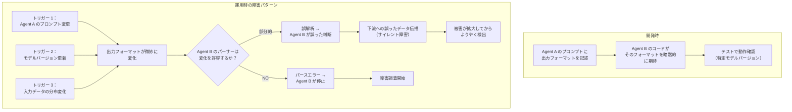

# AP-06: Latent Integration Coupling（潜在的統合カップリング）

## 一言で（TL;DR）

マルチエージェント／エージェント＋サービス構成で、コンポーネント間の契約が自然言語プロンプト内の暗黙的規約に依存していると、モデル更新・プロンプト変更・チーム変更のたびに**予告なく連鎖障害が発生する**。

## なぜ陥るのか（誘引）

このアンチパターンの根源は「自然言語の柔軟性」に対する過信である。

従来のマイクロサービス開発では、サービス間は API スキーマ（OpenAPI、protobuf など）で明示的に契約を定義する。しかし、エージェント間のやり取りは自然言語で行われることが多く、「スキーマなしでも通じる」という感覚が生まれる。Agent A が「承認済み」と返せば Agent B は次の処理に進む。これは動く。しばらくは。

プロトタイピング段階ではこのアプローチは高速に動作する。スキーマ定義やバリデーション実装を省略できるため、開発速度が上がる。しかし、プロトタイプが本番にそのまま昇格する（これもまた頻出するアンチパターン）と、暗黙的契約がそのまま本番の基盤になる。

さらに危険なのは、暗黙的契約が**コードに現れない**ことである。Agent A のプロンプトに「結果を JSON で返すこと」と書いてあり、Agent B のパーサーが JSON を期待しているが、この依存関係はどこにも明示的にドキュメント化されていない。Agent A のプロンプトを変更する開発者は、Agent B への影響を知る手段がない。

モデルドリフト（F9）もこの問題を増幅する。同じプロンプトでも、モデルのバージョンアップで出力スタイルが微妙に変化する。「承認済み」が「承認しました」になる。「```json」で囲まれていた出力が囲まれなくなる。これらの変化は明示的な契約がない限り検出されない。

## 典型的な症状

- **モデル更新後に無関係に見えるコンポーネントが壊れる**。Agent A のモデルを更新したら、Agent C（Agent B を介して間接的に依存）が動かなくなる。
- **プロンプト変更の影響範囲が予測できない**。「このプロンプトを改善しよう」という変更が、下流の複数コンポーネントに予期しない影響を与える。
- **同じシステムで「時々動かない」という不安定な症状が出る**。LLM の出力が確率的に揺れるため、暗黙的契約が「だいたい守られる」状態になり、散発的な障害として顕在化する。
- **新メンバーがシステムの依存関係を理解できない**。コードを読んでもエージェント間の契約がどこにも書かれていないため、「なぜこのフォーマットで出力しているのか」が分からない。
- **エージェント間のやり取りのデバッグに異常な時間がかかる**。ログを見ても自然言語のやり取りしか残っておらず、「どの時点で契約が破られたか」の特定が困難。

## 発生メカニズム



暗黙的カップリングには 3 つの層がある。

**フォーマットカップリング**：Agent A の出力フォーマット（JSON の構造、フィールド名、値の型）を Agent B が暗黙的に前提にしている。プロンプトの「JSON で返してください」という指示は契約ではない。LLM はフィールド名を変えたり、ネストを変えたり、余分なフィールドを追加したりする自由がある。

**セマンティックカップリング**：Agent A が返す「承認」「却下」「保留」などのキーワードの意味を Agent B が解釈しているが、その意味の定義が暗黙的。「条件付き承認」は「承認」に含まれるのか？ モデルが変わると判断基準が微妙にずれる。

**タイミングカップリング**：「Agent A は 5 秒以内に応答する」「Agent B は Agent A の後に実行される」などの暗黙的な順序・時間仮定。負荷が増えたりモデルの推論時間が変わったりすると破綻する。

## 駆動変数による重症度（程度）

| 駆動変数 | 値が高いとき（重症） | 値が低いとき（軽症） |
|---|---|---|
| `task_variability` | タスクの種類が多いと、エージェント間のやり取りパターンが多岐にわたり、暗黙的契約の数が爆発する。すべてを把握しきれなくなる | タスクが限定的なら暗黙的契約も少数で、頭の中で管理できる範囲に収まる |
| `accountability` | 監査・説明責任が求められる場合、「なぜこの判断に至ったか」をエージェント間のやり取りから再構成する必要があるが、暗黙的契約では追跡が困難 | 監査要件がなければ、動けばよいという判断も許容される |
| `provider_trust` | プロバイダへの信頼が低い（モデル更新が頻繁、API 仕様変更が多い）場合、暗黙的契約が壊れる頻度が高い | プロバイダが安定しており、モデル更新も慎重に行われる場合はリスクが低い |
| `failure_cost` | エージェント間の連鎖障害が高コストな結果（誤発注、データ不整合）を生む場合、暗黙的契約の破綻が致命的 | 障害の影響が軽微なら、散発的な契約破綻も許容できる |

## 関連する設計力学（forces）

- **F3（確率的）**：LLM の出力は確率的であるため、「ほぼ同じだが微妙に異なる」出力が生成される。明示的なスキーマがなければ、この揺れが下流に伝播する。
- **F5（NL の曖昧性）**：自然言語で定義された「契約」は本質的に曖昧。「簡潔に要約して」の「簡潔」は 1 行か 3 行か 1 段落か。下流がどの長さを期待しているかは暗黙的。
- **F9（モデルドリフト）**：モデルのバージョンアップで出力スタイル・語彙・判断基準が変化する。暗黙的契約に依存していると、モデル更新のたびに連鎖障害のリスクがある。
- **F10（出力スキーマ不遵守）**：プロンプトでスキーマを指定しても LLM が完全に遵守するとは限らない。暗黙的契約は「遵守されている前提」で書かれているため、不遵守時のフォールバックがない。
- **F15（再現性の低さ）**：同じ入力でも出力が揺れるため、テスト時に通った暗黙的契約が本番で破れることがある。

## 具体的シナリオ

ある企業の採用支援システムは、3 つのエージェントで構成されていた。

- **Agent A（書類選考）**：履歴書を分析し、評価結果を返す。
- **Agent B（面接調整）**：Agent A の評価結果に基づいて面接スケジュールを調整する。
- **Agent C（レポート生成）**：Agent A の評価と Agent B の調整結果を統合してレポートを生成する。

Agent A のプロンプトには以下のような指示があった。

```
応募者の評価結果を以下の形式で返してください：
- 評価: A/B/C/D のいずれか
- 理由: 評価の根拠を3行以内で
- 推奨アクション: "面接設定" / "不採用通知" / "保留"
```

Agent B のコードは Agent A の出力をパースしていた。

```python
# Agent B のパーサー（暗黙的契約に依存）
def parse_screening_result(agent_a_output: str) -> dict:
    lines = agent_a_output.strip().split("\n")
    result = {}
    for line in lines:
        if line.startswith("- 評価:"):
            result["grade"] = line.split(":")[1].strip()
        elif line.startswith("- 推奨アクション:"):
            action = line.split(":")[1].strip().strip('"')
            result["action"] = action
    return result
```

このシステムは 3 ヶ月間問題なく動作した。しかし、以下の 3 つの変更が連鎖障害を引き起こした。

**第一の変更**：Agent A のプロンプトを改善する際、チームメンバーが「推奨アクション」のフォーマットを微修正した。

```
# 変更前
- 推奨アクション: "面接設定"
# 変更後（改善のつもり）
- 推奨アクション: 面接設定（1次面接を推奨）
```

ダブルクォートが消え、括弧付きのコメントが追加された。Agent B のパーサーは `"面接設定"` を期待していたため、`strip('"')` で引用符を除去した結果が `面接設定（1次面接を推奨）` となり、アクションの一致判定が失敗した。面接が設定されない応募者が 1 週間で 23 人溜まった。

**第二の変更**：モデルのバージョンアップにより、Agent A が評価に「B+」を返すようになった。Agent B は A/B/C/D の 4 値しか想定しておらず、「B+」は未知の値として処理された。

**第三の変更**：Agent C は Agent A の出力が「- 評価:」「- 理由:」「- 推奨アクション:」の 3 行構成であることを前提にしていたが、モデル更新後に Agent A が「- 総合コメント:」という 4 行目を追加するようになり、レポートのレイアウトが崩れた。

```python
# 障害の連鎖
# 1. Agent A のプロンプト変更 → Agent B のパース失敗
# 2. モデル更新 → Agent A の出力値変化 → Agent B の判定失敗
# 3. モデル更新 → Agent A の出力構造変化 → Agent C のレイアウト崩れ
# いずれも Agent A の変更者は Agent B/C への影響を知る手段がなかった
```

## 処方箋

### 1. [E4 Verified Structured Output](../patterns/e-safety-hitl/e4-verified-structured-output.md) で出力スキーマを明示的に定義する

エージェント間のやり取りを自然言語ではなく、スキーマ付き構造化出力にする。

```python
from pydantic import BaseModel, Literal

class ScreeningResult(BaseModel):
    """Agent A → Agent B/C の明示的契約"""
    grade: Literal["A", "B", "C", "D"]
    reason: str  # max 200 chars
    recommended_action: Literal["interview", "reject", "hold"]

# Agent A の出力を構造化出力で強制
result = llm.generate(
    prompt=screening_prompt,
    response_format=ScreeningResult,
)
# → スキーマに合わない出力はバリデーションエラーで即座に検出
```

### 2. [E2 Policy-as-Code](../patterns/e-safety-hitl/e2-policy-as-code.md) でセマンティック契約をコード化する

「承認とは何か」「どの条件で面接を設定するか」をプロンプトではなくコードで定義する。

```python
# セマンティック契約のコード化
class HiringPolicy:
    INTERVIEW_GRADES = {"A", "B"}
    REJECT_GRADES = {"D"}
    HOLD_GRADES = {"C"}

    @staticmethod
    def should_schedule_interview(result: ScreeningResult) -> bool:
        return result.grade in HiringPolicy.INTERVIEW_GRADES

    @staticmethod
    def validate_consistency(result: ScreeningResult) -> bool:
        """契約の一貫性を検証"""
        if result.grade in HiringPolicy.INTERVIEW_GRADES:
            return result.recommended_action == "interview"
        return True  # 他のケースは別途検証
```

### 3. [B1 Deterministic Shell](../patterns/b-orchestration/b1-deterministic-shell.md) でエージェント間の接続を決定的コードに落とす

エージェント間のデータフローを自然言語の受け渡しではなく、決定的なコード（オーケストレーター）が仲介する。

```python
# Deterministic Shell がエージェント間を仲介
class RecruitmentOrchestrator:
    def process_application(self, resume: str):
        # Agent A を呼び出し、構造化出力で受け取る
        screening = self.agent_a.screen(resume, response_format=ScreeningResult)

        # 決定的コードで次のアクションを判定（Agent B に暗黙的に委ねない）
        if HiringPolicy.should_schedule_interview(screening):
            schedule = self.agent_b.schedule_interview(
                candidate=resume,
                priority=screening.grade,  # 型安全な値の受け渡し
            )
        else:
            schedule = None

        # Agent C にも構造化データを渡す
        report = self.agent_c.generate_report(
            screening=screening,  # ScreeningResult 型
            schedule=schedule,     # InterviewSchedule | None 型
        )
        return report
```

### 4. 契約テストを導入する

エージェント間の契約を自動テストで検証する。Consumer-Driven Contract Testing の考え方を適用する。

```python
# Agent B が期待する契約のテスト
def test_agent_a_output_satisfies_agent_b_contract():
    """Agent A の出力が Agent B の期待するスキーマに適合することを検証"""
    sample_inputs = load_test_resumes()
    for resume in sample_inputs:
        result = agent_a.screen(resume, response_format=ScreeningResult)
        # スキーマバリデーション（Pydantic が自動で行う）
        assert isinstance(result, ScreeningResult)
        # 値の範囲チェック
        assert result.grade in {"A", "B", "C", "D"}
        assert result.recommended_action in {"interview", "reject", "hold"}
        assert len(result.reason) <= 200
```

### マイグレーションパス

1. **可視化**：現在のエージェント間のデータフローを図示し、暗黙的契約を洗い出す。各矢印（データの流れ）に「何が期待されているか」を明記する。
2. **スキーマ定義**：最もクリティカルなインターフェース（`failure_cost` が高いもの）から順に、Pydantic/JSON Schema で明示的なスキーマを定義する。
3. **バリデーション追加**：スキーマに対するバリデーションを各エージェントの出力に追加する。最初は警告ログのみ、安定したら reject に切り替える。
4. **契約テスト追加**：CI に契約テストを組み込み、プロンプト変更やモデル更新時に自動実行する。
5. **決定的シェルの導入**：エージェント間の接続を徐々に Deterministic Shell に移行し、自然言語の直接受け渡しを排除する。

## 関連アンチパターン

- **[プロンプトをセキュリティ境界にする](index.md)**：プロンプトによるフォーマット指定を「契約」と見なすのは、プロンプトを「セキュリティ境界」と見なすのと同根の誤り。プロンプトは意図の表明であり、強制力を持たない。
- **AP-05 Tool Sprawl（[ツール過剰装備](ap05-tool-sprawl.md)）**：ツールが多いほど、ツール間の暗黙的なデータ受け渡しパターンが増え、潜在的カップリングが複雑化する。
- **[目盛りの根拠を残さない](index.md)**：エージェント間の契約が暗黙的だと、パラメータ（タイムアウト値、リトライ回数など）の根拠も暗黙的になり、変更時の影響評価ができない。

## コーディングエージェント向け検出指示（machine-actionable）

以下のシグナルが検出された場合、このアンチパターンの可能性を人間に警告すること。

- [ ] エージェントの出力を `split()`、正規表現、`startswith()` などでパースしているコードがある（構造化出力ではなくテキストパースに依存している）。
- [ ] エージェント間のデータ受け渡しに Pydantic モデルや JSON Schema などの明示的なスキーマが定義されていない。
- [ ] プロンプト内に「以下の形式で返してください」「必ず JSON で」などの出力フォーマット指示があるが、対応するバリデーションコードがない。
- [ ] 複数のエージェントが関わるシステムで、エージェント間のインターフェース定義ドキュメントが存在しない。
- [ ] モデル更新やプロンプト変更の影響範囲を特定するための依存関係グラフが存在しない。
- [ ] エージェントの出力に含まれるキーワード（「承認」「却下」など）を文字列一致で判定しているコードがある。
- [ ] エージェント間のタイムアウト値がハードコードされており、根拠が記述されていない。

検出した場合の推奨アクション：

1. エージェント間のデータフローを図示し、暗黙的契約の一覧を作成するよう提案する。
2. [E4 Verified Structured Output](../patterns/e-safety-hitl/e4-verified-structured-output.md) の導入を、`failure_cost` が高いインターフェースから優先的に提案する。
3. [B1 Deterministic Shell](../patterns/b-orchestration/b1-deterministic-shell.md) でエージェント間接続を決定的コードに移行することを提案する。
4. 契約テストの導入を提案し、CI パイプラインへの組み込みを推奨する。
5. モデル更新時の影響範囲チェックリストを `[provider_trust]` の関数として設計するよう求める。
