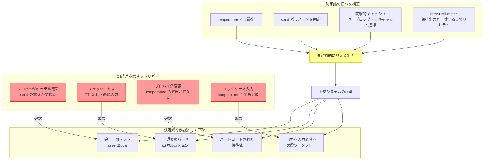

# AP-08: Determinism Theater｜決定論の演劇

## 一言で（TL;DR）

temperature=0、seed固定、攻撃的キャッシュ、retry-until-same-output ロジックなどを駆使して「決定論的に動いている」という錯覚を作り出し、その幻想の上に下流システムやテストを構築するアンチパターンです。モデル更新・キャッシュミス・プロバイダ変更・エッジケースのいずれかで幻想が崩れ、広範囲に障害が波及します。

## なぜ陥るのか（誘引）

ソフトウェアエンジニアリングの基盤は決定論です。同じ入力には同じ出力、同じテストには同じ結果。この前提の上にCI/CD、回帰テスト、コードレビュー、障害分析の全てが構築されています。LLMを導入する際に、エンジニアがこの前提を維持しようとするのは自然な反応です。

temperature=0に設定すれば同じ出力が得られると信じるのは合理的に見えます。実際、短期間・同一モデルバージョン・同一プロバイダという条件下では高い再現性が得られることがあります。この「ほぼ動く」状態が危険です。テストは通り、デモは成功し、チームは決定論を前提とした設計を進めます。

ステークホルダーからの圧力も大きな要因です。「毎回違う回答が出るシステムは信頼できない」「同じ質問に違う答えを返すのはバグだ」という要求は自然です。チームはこの要求に応えるために、表面的な決定論を実装します。

テストフレームワークの制約もあります。従来の `assertEqual(expected, actual)` は決定論を前提としています。確率的出力をテストする仕組み（セマンティック等価性チェック、統計的合格基準）は追加の設計と実装が必要であり、「temperature=0にすれば既存のテストフレームワークがそのまま使える」という誘惑は強力です。

## 典型的な症状

- テストが「たまに落ちる」（flaky test）。同じテストが10回中9回は通るが1回落ちる。チームは落ちたテストを「再実行すれば通る」として無視する文化が根づいている。
- モデルバージョンの更新後に大量のテストが一斉に失敗し、全て `expected output` の文字列を手動で書き換える作業が発生する。
- キャッシュヒット率が異常に重要な指標になっており、キャッシュミスが「障害」として扱われている。
- 出力の完全一致を前提とした正規表現パーサやJSON抽出ロジックが存在し、出力の微妙な表現変化（「できます」→「可能です」）で後段が壊れる。
- retry-until-match のロジックがあり、同じプロンプトを最大5回再実行して「期待される出力」に一致するまで繰り返している。コストが5倍に膨らんでいるが「品質のため」と正当化されている。

## 発生メカニズム



核心的な問題は、LLMの出力は本質的に確率的（F3）であるという事実を、表面的な対策で隠蔽していることです。temperature=0は「最も確率の高いトークンを選択する」ことを意味しますが、(1) 確率が僅差のトークンが複数あるとき浮動小数点の丸めで結果が変わる、(2) バッチ処理とオンライン処理でGPU上の計算順序が異なる、(3) モデル更新で確率分布自体が変わる、といった理由により、同一出力は保証されません。

## 駆動変数による重症度（程度）

| 駆動変数 | 値が高いとき（重症） | 値が低いとき（軽症） |
|---|---|---|
| `provider_trust` | 逆説的に、プロバイダ信頼度が**低い**ほど重症。プロバイダがモデルを頻繁に更新し、seed の挙動も変わるため、決定論の幻想がすぐ崩壊する。マルチプロバイダ構成ではプロバイダ間で temperature の解釈が異なり、さらに脆い | 単一の安定したプロバイダを使用し、モデルバージョンをピン留めしている場合は幻想が長く持続する（ただし根本的な問題は残る） |
| `failure_cost` | 決定論の前提が崩れたときの下流への影響が大きい。金融計算、法的文書、医療判断など、出力の「ブレ」が実害に直結する領域では致命的 | 出力が参考情報程度で、人間が最終確認する場合はブレの影響が限定的 |
| `accountability` | 「なぜ前回と違う回答なのか」を説明する義務がある場合、決定論の幻想に依存していた事実が発覚すると信頼問題になる | 説明責任が低い用途では、出力のブレが問題視されにくい |
| `task_variability` | 入力のバリエーションが多いほどキャッシュヒット率が下がり、キャッシュに依存した決定論が機能しない。エッジケースも増える | 定型入力が中心であればキャッシュヒット率が高く、実質的に決定論が維持される（ただしキャッシュが崩壊するとき被害が大きい） |

## 関連する設計力学（forces）

- **F3（確率的）**：このアンチパターンの根本原因。LLMが確率的であるという事実を受け入れず、決定論的に見せかけようとする試みがすべての問題の起点です。
- **F9（モデルドリフト）**：プロバイダ側のモデル更新により、temperature=0やseed固定の「契約」が暗黙に破られます。APIの仕様上、同一出力は保証されていません。
- **F15（再現性の低さ）**：再現性を「同一出力」と定義すると達成不能ですが、「意味的に等価な出力」と定義すれば達成可能です。定義の問題です。
- **F7（プロバイダ依存）**：プロバイダごとに temperature、seed、サンプリングの実装が異なるため、マルチプロバイダ構成では決定論の前提がさらに脆くなります。
- **F10（出力スキーマ不遵守）**：出力形式の完全一致を前提とすると、スキーマに従っているが表現が異なる正常な出力を異常として扱ってしまいます。

## 具体的シナリオ

ある金融テック企業が、顧客の問い合わせを分類し適切な部署にルーティングするエージェントを構築しました。出力は `{"category": "...", "priority": "...", "summary": "..."}` のJSON形式です。

チームは temperature=0、seed=42 を設定し、100件のテストケースで完全一致テストを作成しました。

```python
# テストコード（アンチパターン）
def test_classify_refund_request():
    response = agent.classify(
        "先月の引き落としが二重になっています。返金してください。"
    )
    # 完全一致で検証 -- 脆い
    assert response == {
        "category": "billing_dispute",
        "priority": "high",
        "summary": "二重引き落としに対する返金リクエスト"
    }
```

3か月間、テストは安定して通り続けました。チームは自信を深め、このJSONをそのまま後段のルーティングシステムに渡す設計にしました。`summary` フィールドは顧客対応テンプレートに埋め込まれ、オペレーターの画面に表示されます。

ある日、プロバイダがモデルを更新しました。`summary` の出力が「二重引き落としに対する返金リクエスト」から「二重請求の返金要求」に変わりました。意味は同一ですが、完全一致テストが100件中37件で失敗しました。

チームの最初の反応は「テストの期待値を更新する」でした。37件のテストを手動で書き換えます。しかし翌月にもモデル更新があり、また23件が失敗しました。この繰り返しが「テストメンテナンス地獄」となり、チームはテストの実行頻度を下げ始めます。

さらに深刻な問題が発生しました。後段のルーティングシステムは `summary` フィールドの特定のキーワード（「返金」「解約」「障害」）を正規表現で抽出してルーティング先を決定していました。`summary` の表現が変わったことで、一部の問い合わせが誤った部署にルーティングされ、対応遅延が発生しました。

```python
# 後段のルーティング（アンチパターン -- LLM出力の文字列に依存）
def route_ticket(classification):
    summary = classification["summary"]
    if re.search(r"返金|払い戻し", summary):
        return "billing_team"
    elif re.search(r"解約|退会", summary):
        return "retention_team"
    # ... "返金要求" は "返金リクエスト" とマッチするが、
    # 将来 "二重請求の是正" と表現されたら billing_team に届かない
```

## 処方箋

### 1. [B1 Deterministic Shell](../patterns/b-orchestration/b1-deterministic-shell.md) を適用する

決定論を求める場所を正しく配置します。状態遷移・ルーティング・権限チェック・予算管理はコードで決定論的に実装し、LLMには「曖昧さの解消」だけを委ねます。上記シナリオでは、ルーティングはLLMが出力する `category` フィールド（統制語彙）で決定し、`summary` の自由形式テキストには依存しません。

### 2. [E4 Verified Structured Output](../patterns/e-safety-hitl/e4-verified-structured-output.md) で構造を強制する

LLMの出力をスキーマ検証し、構造的な正しさを保証します。完全一致ではなく、「スキーマに適合し、ビジネスルールを満たす」ことを検証します。

```python
# 改善後のテストコード
def test_classify_refund_request():
    response = agent.classify(
        "先月の引き落としが二重になっています。返金してください。"
    )
    # 構造検証
    assert response["category"] in VALID_CATEGORIES
    assert response["priority"] in ["low", "medium", "high"]
    assert len(response["summary"]) > 0
    # 意味的検証（決定論的なコードで）
    assert response["category"] == "billing_dispute"
    assert response["priority"] == "high"
    # summary は自由形式 -- 完全一致ではなくセマンティック検証
    assert semantic_similarity(
        response["summary"],
        "二重引き落としの返金リクエスト"
    ) > 0.85
```

### 3. セマンティック等価性チェックに移行する

完全一致テストをセマンティック等価性テストに置き換えます。埋め込みベクトルのコサイン類似度、LLM-as-Judge、キーワードの包含チェックなど、「意味が同じか」を検証する手法を採用します。

### 4. 出力の「安定部分」と「変動部分」を分離する

LLMの出力のうち、下流システムが依存する部分（カテゴリ、フラグ、数値）は enum や統制語彙で制約し、変動を許容する部分（要約、説明文）は下流で文字列一致に依存しない設計にします。

### 5. マイグレーションパス

1. **即座に**：完全一致テストを「構造検証 + 意味検証」に書き換える。`assertEqual` を `assertSchemaValid` + `assertSemanticallyEquivalent` に置換。
2. **1-2週間**：下流システムでLLM出力の自由形式テキストに文字列一致で依存している箇所を洗い出し、構造化フィールド（enum、統制語彙）への依存に切り替える。
3. **2-4週間**：retry-until-match ロジックを削除。代わりに「出力がスキーマに適合するまでリトライ」に変更（完全一致ではなくスキーマ適合）。
4. **1-2か月**：[B1 Deterministic Shell](../patterns/b-orchestration/b1-deterministic-shell.md) の原則でシステム全体を再設計。決定論的に解ける部分をコードに押し出し、LLMの確率的な出力が影響する範囲を最小化する。

## 関連アンチパターン

- **AP-07 Feedback Loop Starvation（[フィードバックループの飢餓](ap07-feedback-loop-starvation.md)）**：決定論の幻想により「テストが通っているから品質は問題ない」と誤認し、本番フィードバックに基づく改善ループを構築しない。
- [プロンプトをセキュリティ境界にする](index.md)：プロンプトで決定論を「指示」しようとする試み（「必ず同じ形式で回答してください」）は、セキュリティ境界と同様に確率的に破れます。
- [コンテキスト詰め込みすぎ](index.md)：決定論を維持するために大量のfew-shot例をコンテキストに詰め込み、「この例と同じ形式で」と指示する。コンテキスト長とコストが膨らみます。

## コーディングエージェント向け検出指示（machine-actionable）

以下のチェックリストでこのアンチパターンの兆候を検出してください。

- [ ] テストコードに LLM 出力の完全一致比較（`assertEqual`、`expect(...).toBe(...)`、`== "期待文字列"`）が存在する。
- [ ] LLM呼び出しのパラメータに `temperature: 0` と `seed` の両方が設定されており、コメントに「決定論のため」「再現性のため」と書かれている。
- [ ] retry ロジックが「出力が期待値と一致するまで」の条件で実装されている（スキーマ適合ではなく文字列一致）。
- [ ] 下流のコードが LLM の自由形式出力（summary、description、explanation）に対して正規表現マッチや部分文字列検索を行っている。
- [ ] テストの flaky rate（不安定率）が5%以上あり、「再実行すれば通る」という運用が常態化している。
- [ ] モデルバージョン更新後にテストの期待値を一括書き換えるスクリプトやプルリクエストの履歴がある。
- [ ] キャッシュミス時の挙動に関するテストやドキュメントが存在しない。

検出した場合の提案順序：

1. [B1 Deterministic Shell](../patterns/b-orchestration/b1-deterministic-shell.md) の原則を説明し、決定論を配置すべき場所（コード）と確率的な出力を許容すべき場所（LLM）の分離を提案する。
2. [E4 Verified Structured Output](../patterns/e-safety-hitl/e4-verified-structured-output.md) で出力のスキーマ検証を導入する。
3. 完全一致テストをセマンティック等価性テストに書き換える具体的な手順を提示する。
4. 下流システムの LLM 出力依存箇所を洗い出し、構造化フィールドへの依存に切り替える計画を提案する。
