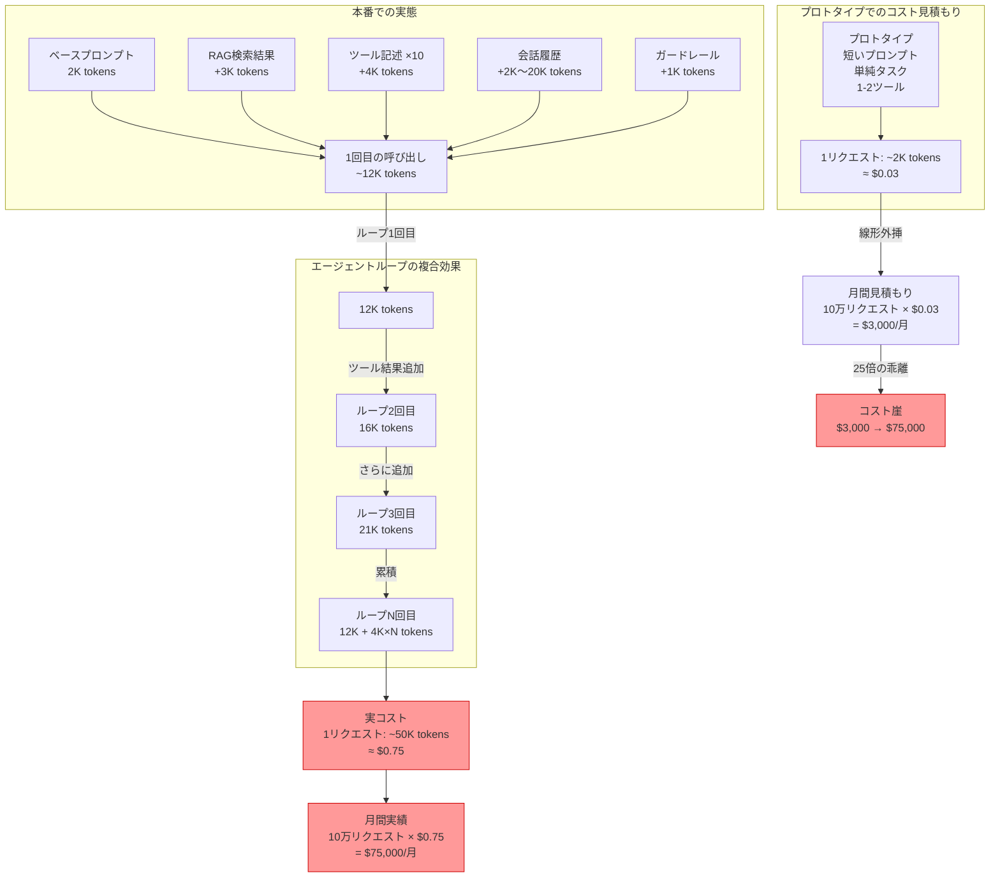

# AP-09: Cost Cliff Ignorance｜コスト崖への無知

## 一言で（TL;DR）

プロトタイプの単純なタスク・短いコンテキストから本番のコストを線形外挿し、実際にはコンテキスト長の二次的増大・エージェントループの反復・ツール記述の累積・マルチターン履歴の膨張が複合して10x-100xのコスト急騰（コスト崖）が発生するアンチパターンです。請求書が届いて初めて気づきます。

## なぜ陥るのか（誘引）

LLMの課金モデルは従来のクラウドサービスとは根本的に異なります。コンピュートインスタンスはCPU/メモリの単位で時間課金されるため、コストは処理量に概ね比例します。しかしLLMはトークン課金であり、入力トークン数はコンテキスト長に、出力トークン数は応答の複雑さに依存します。この非線形性を直感的に把握するのは困難です。

プロトタイプ段階では、開発者は短いプロンプト、少数のfew-shot例、単純なタスクでエージェントを評価します。「1リクエストあたり$0.03なら月10万リクエストで$3,000」と計算します。しかし本番では、コンテキストにRAGの検索結果が追加され、マルチターンの会話履歴が蓄積し、ツールの呼び出し結果がコンテキストに入り、ガードレールのシステムプロンプトが加わります。1リクエストのトークン数がプロトタイプの10倍になれば、コストも10倍です。

さらにエージェントループ（F13）が加わると複合効果が発生します。各ループ反復でコンテキストが成長し、反復回数自体もタスクの複雑さに依存します。3回のループで済むタスクと15回かかるタスクでは、単純な5倍ではなく、コンテキスト成長の累積で15-30倍の差が生じます。

チームがコスト可視化を導入するのは通常ローンチ後です。プロトタイプ段階では個人のAPIキーで試行錯誤し、月数十ドルの請求を「開発費」として処理します。本番環境のコストダッシュボードは「あれば嬉しい」機能としてバックログに入り、構築されるのはコスト問題が顕在化した後です。

## 典型的な症状

- 月初の請求額が前月の3-10倍に急増し、原因調査に数日かかる。特定の顧客やユースケースが不釣り合いに大きなコストを占めていることが判明する。
- エージェントループの反復回数に上限が設定されておらず、特定のタスクで20-50回ループしてタイムアウトまで走り続ける。
- マルチターン会話で古い発言を含む全履歴をLLMに送信しており、20ターン目の会話のコストが1ターン目の20倍以上になっている。
- ツール記述（tool description）が詳細に書かれた10個以上のツールが全リクエストで送信され、ツール選択のためだけに数千トークンが消費されている。
- コスト異常を検知する仕組みがなく、月末の請求書レビューが唯一のコスト監視手段になっている。

## 発生メカニズム



コスト崖のメカニズムは3層の複合効果で説明できます。

**第1層：コンテキストの膨張**。プロトタイプでは省略されていたRAG結果、ツール記述、会話履歴、ガードレールが本番では全て含まれます。これだけで5-10倍のトークン増加になりえます。

**第2層：ループの累積**。エージェントループの各反復では前回までのコンテキストに新しい情報（ツール実行結果、中間推論）が追加されます。N回のループでは、単純にN倍ではなく、等差級数的にトークンが増加します（初項a、公差dとして N×a + N(N-1)d/2）。

**第3層：タスク複雑度の分散**。プロトタイプでは「平均的な」タスクで検証しますが、本番ではタスクの複雑度に大きな分散があります。上位10%の複雑なタスクが全体コストの50%以上を占めることは珍しくありません。コストの「ヘビーテール」は平均値からの見積もりを大幅に狂わせます。

## 駆動変数による重症度（程度）

| 駆動変数 | 値が高いとき（重症） | 値が低いとき（軽症） |
|---|---|---|
| `cost_sensitivity` | コスト制約が厳しい環境でコスト崖に気づかず運用すると、予算超過が直接的な事業リスクになる。スタートアップや社内ツールで月間予算が固定されている場合に致命的 | 予算に十分な余裕がある場合、コスト崖は「最適化の余地」として扱える。ただし放置すれば最終的には問題になる |
| `latency_budget` | レイテンシ予算が短い場合、コスト崖は同時にレイテンシ崖でもある。長いコンテキスト＝長い処理時間であり、タイムアウトとコスト超過が同時に発生する | レイテンシ制約が緩い（バッチ処理など）場合、コストだけが問題となり、パフォーマンス障害にはならない |
| `task_variability` | タスクの複雑度に大きな分散があると、コスト崖を踏むリクエストの頻度が予測困難。「平均コスト」と「最大コスト」の差が100倍以上になりうる | 定型タスクではリクエストあたりのコストが安定しており、見積もりが容易 |
| `request_value` | 1リクエストの価値が高い場合（例：高額商品の購入支援）、コスト崖を踏んでもROIが成立する可能性がある。ただしコスト意識の欠如は別の問題を生む | リクエストの価値が低い場合（例：FAQ応答）、コスト崖はROIを即座に破壊する |

## 関連する設計力学（forces）

- **F2（高コスト）**：LLMの1リクエストは従来のAPIと比較して桁違いに高コスト。この基本特性がコスト崖の前提条件です。
- **F11（コストが長さに依存）**：コストがリクエスト回数ではなくコンテキスト長に依存するため、コンテキストの膨張が直接的にコスト増加に繋がります。従来の「QPSベースのコスト見積もり」が通用しない根本原因です。
- **F13（自己ループ）**：エージェントの自律ループは各反復でコンテキストを成長させるため、ループ回数の増加がコストを二次的に増大させます。
- **F1（長い処理時間）**：コスト崖はレイテンシ崖と表裏一体。長いコンテキスト＝長い推論時間であり、ユーザー体験とコストが同時に劣化します。
- **F12（レイテンシの分散が大きい）**：コストの分散も大きくなり、平均値での見積もりが危険になります。P99コストはP50の10倍以上になりえます。

## 具体的シナリオ

あるSaaS企業が、カスタマーサポートのチケット自動解決エージェントを構築しました。プロトタイプ段階のコスト見積もりは以下の通りです。

```python
# プロトタイプのコスト計算（楽観的）
PROTOTYPE_ESTIMATE = {
    "system_prompt": 500,        # tokens
    "user_message": 200,         # tokens（平均的な問い合わせ）
    "output": 300,               # tokens
    "total_per_request": 1000,   # tokens
    "cost_per_request": 0.01,    # USD（GPT-4o概算）
    "monthly_requests": 50000,
    "monthly_cost": 500,         # USD
}
```

本番環境では以下が追加されました。

```python
# 本番の実態
PRODUCTION_REALITY = {
    "system_prompt": 800,         # ガードレール・ポリシー追加
    "tool_descriptions": 3500,    # 12個のツール記述（FAQ検索、注文照会、
                                  # 返金処理、配送追跡、アカウント変更...）
    "rag_context": 2500,          # 関連FAQのtop-5
    "conversation_history": 4000, # 平均8ターンの会話（ターンごとに成長）
    "user_message": 200,
    # --- ここまでが1回のLLM呼び出しの入力 ---
    "input_per_call": 11000,      # tokens（プロトタイプの11倍）
    "output_per_call": 500,

    # エージェントループ：平均3回、P95で8回
    "avg_loops": 3,
    "p95_loops": 8,

    # ループ2回目以降はツール結果が追加（+2000 tokens/回）
    # ループ3回の場合: 11000 + 13000 + 15000 = 39000 input tokens
    "avg_total_input": 39000,     # tokens
    "avg_total_output": 1500,     # tokens
    "avg_cost_per_request": 0.45, # USD
    "monthly_cost": 22500,        # USD（見積もりの45倍）

    # P95ケース（8ループ、複雑な問い合わせ）
    "p95_total_input": 120000,    # tokens
    "p95_cost_per_request": 1.50, # USD
    # 上位5%のリクエストが全体コストの35%を占める
}
```

ローンチ初月、チームは$500の予算で$22,500の請求を受け取りました。緊急対応として以下の場当たり的な対策が取られましたが、根本的な設計は変わりません。

```python
# 場当たり的な対策（アンチパターンの継続）
MAX_LOOPS = 5  # ← 急場しのぎのハードコード上限
MAX_HISTORY_TURNS = 5  # ← 古い会話を切り捨て（文脈が失われる）
# ツール数を削減 → 機能低下
# 安いモデルに切り替え → 品質低下
```

根本的な問題は、コストモデルが設計に組み込まれていないことです。コンテキスト長、ループ回数、ツール数はそれぞれ独立に見えますが、複合するとコストは超線形に増大します。

## 処方箋

### 1. [A7 Deadline Budget Cascade](../patterns/a-execution/a7-deadline-budget-cascade.md) でトークン予算を設定する

リクエストレベル、セッションレベル、ユーザーレベルの3層でトークン予算を設定します。予算を超過した場合の縮退戦略（軽量モデルへの切り替え、コンテキスト圧縮、人間へのエスカレーション）を事前に設計します。

```python
# 予算カスケードの例
BUDGET_CASCADE = {
    "per_request": {
        "max_input_tokens": 30000,
        "max_output_tokens": 2000,
        "max_loops": 5,
        "on_exceed": "compress_context_and_retry"
    },
    "per_session": {
        "max_total_tokens": 100000,
        "on_exceed": "summarize_history_and_continue"
    },
    "per_user_per_day": {
        "max_cost_usd": 5.0,
        "on_exceed": "escalate_to_human"
    },
}
```

### 2. [D2 Context Budget Allocator](../patterns/d-memory-context/d2-context-budget-allocator.md) でコンテキストを管理する

コンテキストウィンドウを区画に分け、各区画にトークン予算を割り当てます。会話履歴が長くなったら要約で圧縮し、RAG結果はリランキングでtop-kを絞り、ツール記述は必要なものだけを動的に選択します。

### 3. [B3 Agentic Loop Budget](../patterns/b-orchestration/b3-agentic-loop-budget.md) でループコストを制御する

エージェントループの各反復でトークン消費を計測し、予算残量に基づいてループの継続・中断を判断します。「何回ループしたか」ではなく「何トークン消費したか」で制御することが重要です。同じ5回のループでも、コンテキストの成長次第でコストは大きく異なります。

### 4. [G1 Tiered Observability](../patterns/g-observability-ops/g1-tiered-observability.md) でコスト可視化を導入する

リクエストごとのトークン消費と推定コストをリアルタイムで可視化します。P50/P95/P99のコスト分布を追跡し、コスト異常を自動検知するアラートを設定します。

### 5. デプロイ前にコストモデリングを行う

本番環境のコンテキスト構成（システムプロンプト + ツール記述 + RAG結果 + 会話履歴 + ガードレール）を再現した状態で、代表的なタスクのP50/P95コストを計測します。プロトタイプの計測値ではなく、本番相当の計測値で見積もりを行います。

```python
# コストモデリングのチェックリスト
def estimate_production_cost(task_sample):
    """本番相当の条件でコストを見積もる"""
    costs = []
    for task in task_sample:
        total_tokens = 0
        context = build_full_context(
            system_prompt=PRODUCTION_SYSTEM_PROMPT,
            tools=ALL_PRODUCTION_TOOLS,  # 全ツール記述を含める
            rag_results=retrieve_top_k(task, k=5),
            history=simulate_conversation_history(task),
            guardrails=PRODUCTION_GUARDRAILS,
        )
        # ループをシミュレーション
        for loop_i in range(MAX_EXPECTED_LOOPS):
            total_tokens += count_tokens(context)
            response = llm.generate(context)
            total_tokens += count_tokens(response)
            context = append_to_context(context, response)
            if task_complete(response):
                break
        costs.append(estimate_cost(total_tokens))

    return {
        "p50": percentile(costs, 50),
        "p95": percentile(costs, 95),
        "p99": percentile(costs, 99),
        "max": max(costs),
        "monthly_estimate_p50": percentile(costs, 50) * MONTHLY_REQUESTS,
        "monthly_estimate_p95": percentile(costs, 95) * MONTHLY_REQUESTS,
    }
```

### 6. マイグレーションパス

コスト崖に気づいた後の段階的な改善：

1. **即座に（消火活動）**：[B3 Agentic Loop Budget](../patterns/b-orchestration/b3-agentic-loop-budget.md) の最小構成としてループ上限とリクエストあたりのトークン上限を設定。縮退時は人間にエスカレーション。
2. **1-2週間**：[G1 Tiered Observability](../patterns/g-observability-ops/g1-tiered-observability.md) でリクエストごとのコスト計測とダッシュボードを構築。P95コストのアラートを設定。
3. **2-4週間**：[D2 Context Budget Allocator](../patterns/d-memory-context/d2-context-budget-allocator.md) でコンテキスト管理を導入。会話履歴の要約圧縮、ツール記述の動的選択、RAG結果のリランキングを実装。
4. **1-2か月**：[B7 Model Router](../patterns/b-orchestration/b7-model-router-adaptive-effort.md) で単純なタスクを軽量モデルにルーティング。コスト削減と品質維持のバランスを [G4 Eval Harness](../patterns/g-observability-ops/g4-eval-harness.md) で検証。
5. **2-3か月**：[A7 Deadline Budget Cascade](../patterns/a-execution/a7-deadline-budget-cascade.md) の3層予算を完全実装。リクエスト・セッション・ユーザーレベルの予算管理と縮退戦略を運用。

## 関連アンチパターン

- [最強モデル一択](index.md)：コスト崖の最も単純な形態。全てのリクエストに最高性能（最高コスト）モデルを使用し、タスクの複雑さに応じたルーティングを行わない。
- [コンテキスト詰め込みすぎ](index.md)：コスト崖の第1層（コンテキスト膨張）を直接的に引き起こす。「念のため」で追加されたコンテキストがコストを押し上げる。
- **AP-07 Feedback Loop Starvation（[フィードバックループの飢餓](ap07-feedback-loop-starvation.md)）**：コストデータが収集されていてもアクションに変換されない場合、コスト最適化のフィードバックループが回らない。
- [無限/過大タイムアウト](index.md)：タイムアウトなしのエージェントループはコスト崖の第2層（ループの累積）を制限なく拡大させます。

## コーディングエージェント向け検出指示（machine-actionable）

以下のチェックリストでこのアンチパターンの兆候を検出してください。

- [ ] エージェントループに反復回数の上限が設定されていない、または上限が20回以上の過大な値に設定されている。
- [ ] リクエストあたりのトークン予算（入力+出力）が設定されていない。
- [ ] マルチターン会話で全履歴をそのままコンテキストに含めており、要約・圧縮・切り捨ての仕組みがない。
- [ ] ツール記述が10個以上あり、全リクエストで全ツールの記述が送信されている（動的選択なし）。
- [ ] コスト見積もりがプロトタイプの計測値に基づいており、本番相当のコンテキスト構成での計測が行われていない。
- [ ] リクエストごとのトークン消費や推定コストを記録・可視化する仕組みが存在しない。
- [ ] コスト異常を検知するアラートが設定されていない（月末の請求書レビューが唯一の検知手段）。
- [ ] セッションレベル・ユーザーレベルのコスト上限が設定されていない。

検出した場合の提案順序：

1. まず [B3 Agentic Loop Budget](../patterns/b-orchestration/b3-agentic-loop-budget.md) でループ上限とトークン予算を設定する（即効性が高い）。
2. [D2 Context Budget Allocator](../patterns/d-memory-context/d2-context-budget-allocator.md) でコンテキスト管理を導入する。
3. [G1 Tiered Observability](../patterns/g-observability-ops/g1-tiered-observability.md) でコスト可視化とアラートを構築する。
4. [A7 Deadline Budget Cascade](../patterns/a-execution/a7-deadline-budget-cascade.md) で3層の予算カスケードを設計する。
5. [B7 Model Router](../patterns/b-orchestration/b7-model-router-adaptive-effort.md) でタスク複雑度に基づくモデルルーティングを検討する。
