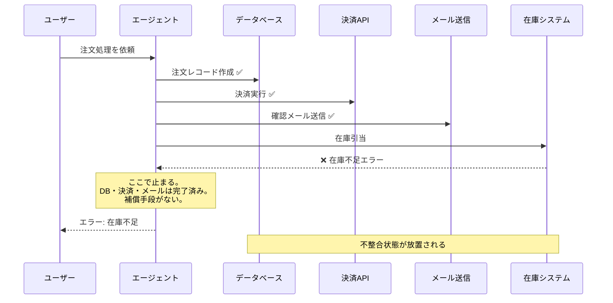

# AP-10: Rollback Amnesia｜ロールバック健忘症

## 一言で（TL;DR）

複数の外部システムに副作用を生じさせるエージェントが、途中失敗時の補償（ロールバック）戦略を持たず、中途半端な状態が放置される。

## なぜ陥るのか（誘引）

このアンチパターンに陥るチームには、いくつかの共通した背景があります。

第一に、**従来の Saga パターンの知識がそのまま通用すると思い込む**ことです。決定的ワークフロー（Temporal、Step Functions など）では補償ステップを静的に定義できます。「ステップ1が成功したらステップ2を実行、ステップ2が失敗したらステップ1の補償を実行」という分岐は事前にすべて列挙可能です。しかしエージェントの実行パスは確率的です（F3）。同じプロンプトでもツール呼び出しの順序・回数・組み合わせが毎回異なる可能性があり、静的な補償シーケンスでは網羅できません。

第二に、**「まず動くものを」の文化**です。PoC やハッカソンで副作用なしの読取専用エージェントを作った経験がそのまま本番に持ち込まれ、書込操作を追加する際にロールバック設計が後回しにされます。読取専用であれば途中失敗しても害はありませんが、書込が入った瞬間に問題の性質が根本から変わることが見落とされます。

第三に、**ツール呼び出しを「関数呼び出し」の感覚で扱ってしまう**ことです。プログラミング言語の関数はトランザクション内で例外を投げればロールバックされますが、エージェントのツール呼び出しは HTTP API コール、メール送信、外部 SaaS の操作など、呼び出し元のトランザクション境界の外にある副作用です。この違いに気づかないまま fire-and-forget で呼び出すと、ロールバック健忘症に陥ります。

第四に、**LLM の「推論能力」への過信**です。「エージェントが賢いので失敗時に自分でロールバックしてくれるだろう」と期待するケースがありますが、LLM はハルシネーションする（F4）上、過去に実行した副作用を正確に覚えているとは限りません。コンテキストウィンドウから溢れた操作は文字通り忘却されます。

## 典型的な症状

- **データベースに中途半端なレコードが残る** — 注文は作成されたが在庫引当が未完了、顧客には請求メールが届いたが決済は未処理、といった不整合状態が散発する。
- **外部サービスとの状態不一致** — Stripe に課金レコードがあるが自社 DB に注文がない、Slack に通知が送られたが処理は失敗している、など。
- **手動のデータ修正作業が常態化** — エンジニアが毎週「壊れたデータの修復スクリプト」を手動実行している。これが当たり前になり、運用コストが静かに膨らむ。
- **リトライが状況を悪化させる** — 部分失敗後にエージェントを再実行すると、既に完了したステップが二重実行され、二重課金や重複通知が発生する。
- **障害の影響範囲が特定できない** — どのステップまで成功しどこで失敗したか、ログから追えない。副作用の実行記録が体系的に残されていないため、障害対応が「まず何が起きたか調べる」ところから始まる。

## 発生メカニズム



上図の問題の本質は、エージェントが「ステップ4で失敗した」ことは認識できても、「ステップ1〜3で何を実行したか」の記録を構造的に持っておらず、それらを取り消す手段も登録していない点にあります。

決定的ワークフローであれば補償シーケンスを事前定義できますが、エージェントの場合は実行パスが毎回異なる可能性があります。ある実行では「DB → 決済 → メール → 在庫」の順で呼ばれ、別の実行では「在庫確認 → DB → 決済 → メール」の順になるかもしれません。LLM の推論結果次第で分岐するため、静的な補償定義では対応しきれません。

## 駆動変数による重症度（程度）

| 駆動変数 | 値が高いとき（重症） | 値が低いとき（軽症） |
|---|---|---|
| `reversibility` | — | 不可逆な操作（決済、外部API書込、メール送信）を含む場合、部分失敗の被害が取り返しのつかないものになる。最も危険 |
| `failure_cost` | 失敗1件の金銭的・法的コストが大きい場合、中途半端な状態の放置が直接的な損害になる | 失敗しても再実行で済む低コスト操作なら許容範囲 |
| `accountability` | 監査義務がある場合、不整合状態の放置はコンプライアンス違反になりうる | 内部ツール等、監査不要なら影響は限定的 |
| `task_variability` | タスクのバリエーションが多いほどエージェントの実行パスが多様になり、静的補償の網羅が困難 | 定型タスクなら実行パスが予測可能で、決定的 Saga で対処しやすい |
| `cost_sensitivity` | — | 直接は影響しないが、手動修復の運用コストが積み上がることで間接的に効いてくる |

`reversibility` が低く `failure_cost` が高い組み合わせは最も危険な領域です。この領域でロールバック戦略なしにエージェントを運用することは、障害が起きるたびに人間が手動で不整合を修復する運用を受け入れることと同義です。

## 関連する設計力学（forces）

- **F8（副作用のあるツール/スキル）** — このアンチパターンの直接的原因。副作用がなければロールバックは不要。
- **F3（確率的・非決定的）** — 実行パスが毎回異なるため、静的な補償シーケンスでは対応できない根本原因。
- **F4（ハルシネーション）** — エージェントが誤ったパラメータでツールを呼び出し、意図しない副作用を生むリスクを増幅する。
- **F15（再現性の低さ）** — 障害の再現が難しく、「どの実行パスで何が壊れたか」の調査が困難になる。
- **F6（コンテキスト/メモリでの状態受渡し）** — 実行済み副作用の記録がコンテキストウィンドウに依存しており、溢れると文字通り「忘れる」。
- **F13（自己ループ）** — 失敗後にエージェントが自己修正を試みるが、既に実行した副作用を正確に把握できず、状況を悪化させることがある。

## 具体的シナリオ

### EC サイトの注文エージェント

あるスタートアップが、顧客の自然言語リクエストから注文処理を行うエージェントを構築しました。エージェントは以下のツールを持っています：`create_order`（DB）、`charge_payment`（Stripe）、`send_confirmation_email`（SendGrid）、`reserve_inventory`（在庫マイクロサービス）、`create_shipping_label`（配送API）。

開発チームは各ツールを個別にテストし、正常系はすべて動作確認しました。しかしロールバック戦略は「あとで考える」としてバックログに入れたまま、本番リリースされました。

ある日、配送 API が 30 分間ダウンしました。その間に入った 47 件の注文は、DB レコード作成・決済・メール送信・在庫引当まで成功したものの、配送ラベル作成で失敗しました。顧客には「注文確認」メールが届いていますが、配送ラベルがないため発送できません。

エンジニアが手動で対応しようとしましたが、47 件それぞれの状態が微妙に異なります。一部は在庫引当まで成功、一部は決済まで成功して在庫引当が失敗（在庫 API も一時的に不安定だった）、一部は DB 作成後にエージェントが想定外の順序でツールを呼び出しメール送信を先に行っていました。不整合パターンが 4 種類あり、それぞれ異なる修復手順が必要でした。

以下は、このアンチパターンに陥っているコードの典型例です。

```python
# ❌ アンチパターン: fire-and-forget のツール呼び出し
async def handle_order(agent, user_request: str):
    result = await agent.run(
        prompt=f"以下の注文を処理してください: {user_request}",
        tools=[
            create_order,
            charge_payment,
            send_confirmation_email,
            reserve_inventory,
            create_shipping_label,
        ],
    )
    # エージェントがどの順序でツールを呼んだか不明
    # どこまで成功したか不明
    # 失敗時の補償手段なし
    return result
```

この実装では、エージェントがツールをどの順序で呼んだか、どこまで成功したかの構造的な記録がありません。LLM のコンテキストウィンドウ内には会話として残りますが、それは機械的に解析可能な形式ではなく、コンテキストが長くなれば溢れて消えます。

## 処方箋

ロールバック健忘症の根本的な対策は、**副作用の実行と補償アクションの登録を一体化する**ことです。以下の3層で対処します。

### 層1: 副作用の実行を構造化する

各ツール呼び出しの結果と、対応する補償アクションを動的に登録します。

```python
# ✅ 処方箋: 動的補償スタックによる Saga
from dataclasses import dataclass, field
from typing import Callable, Any

@dataclass
class CompensationEntry:
    step_name: str
    compensate_fn: Callable
    compensate_args: dict
    executed_at: str
    idempotency_key: str

@dataclass
class SagaContext:
    saga_id: str
    entries: list[CompensationEntry] = field(default_factory=list)

    def register(self, entry: CompensationEntry):
        """副作用が成功するたびに補償アクションを登録"""
        self.entries.append(entry)
        # 永続ストアにも書き込む（コンテキスト溢れ対策）
        persist_to_store(self.saga_id, entry)

    async def compensate_all(self):
        """登録済みの補償を逆順に実行"""
        for entry in reversed(self.entries):
            try:
                await entry.compensate_fn(**entry.compensate_args)
            except Exception as e:
                # 補償失敗はアラート＋手動対応キューへ
                alert_compensation_failure(self.saga_id, entry, e)
```

### 層2: ツールラッパーで自動登録する

各ツールを「実行＋補償登録」のラッパーで包みます。エージェントがどの順序でツールを呼んでも、呼ばれた順に補償が登録されます。

```python
def saga_aware_tool(saga: SagaContext):
    """ツールをSaga対応にするデコレータ"""
    def decorator(execute_fn, compensate_fn):
        async def wrapper(**kwargs):
            key = generate_idempotency_key(execute_fn.__name__, kwargs)
            # 冪等チェック（C4 パターン）
            if already_executed(key):
                return cached_result(key)

            result = await execute_fn(**kwargs)

            saga.register(CompensationEntry(
                step_name=execute_fn.__name__,
                compensate_fn=compensate_fn,
                compensate_args=derive_compensate_args(result, kwargs),
                executed_at=now_iso(),
                idempotency_key=key,
            ))
            return result
        return wrapper
    return decorator

# 使用例
saga = SagaContext(saga_id="order-saga-abc123")

@saga_aware_tool(saga)
async def charge_payment(order_id, amount, currency):
    return await stripe.charges.create(amount=amount, currency=currency)

# 補償関数
async def refund_payment(charge_id, amount):
    return await stripe.refunds.create(charge=charge_id, amount=amount)
```

### 層3: Dry-Run で事前検証する

[C3 Dry-Run/Commit](../patterns/c-tools-security/c3-dry-run-commit.md) を併用し、副作用の実行前に計画を可視化します。特に `[reversibility]` が低い操作が含まれる場合は、計画段階で人間の承認を挟むことで、そもそも不整合が発生するリスクを下げます。

### マイグレーションパス（段階的な導入）

既存のロールバック未対応システムから移行する場合、以下の順序で段階的に導入します。

1. **副作用ログの追加**（即座に着手可能） — まず全ツール呼び出しの入出力を構造化ログに記録します。これだけで障害調査が劇的に改善します。
2. **冪等キーの導入** — [C4 Idempotent Command Envelope](../patterns/c-tools-security/c4-idempotent-command-envelope.md) を適用し、リトライ時の二重実行を防ぎます。
3. **Write-Gate の導入** — [C2 Read-Free / Write-Gated](../patterns/c-tools-security/c2-read-free-write-gated.md) で書込操作にゲートを設け、無制限な副作用実行を構造的に制限します。
4. **動的補償スタックの実装** — 上記の `SagaContext` パターンを導入し、副作用の実行と補償登録を一体化します。
5. **Dry-Run の追加** — `[failure_cost]` が高い操作フローに対して [C3 Dry-Run/Commit](../patterns/c-tools-security/c3-dry-run-commit.md) を適用します。

重要なのは、ステップ1（ログ）だけでも大きな改善になることです。「何が起きたか分からない」状態から「何が起きたか分かるが手動修復が必要」への遷移は、運用品質を一段引き上げます。

### 対応パターンへのリンク

| パターン | 役割 |
|---|---|
| [C4 Idempotent Command Envelope](../patterns/c-tools-security/c4-idempotent-command-envelope.md) | リトライ・再開時の二重実行を防ぐ |
| [C3 Dry-Run/Commit](../patterns/c-tools-security/c3-dry-run-commit.md) | 副作用の実行前に計画を可視化し承認を得る |
| [C2 Read-Free / Write-Gated](../patterns/c-tools-security/c2-read-free-write-gated.md) | 書込操作にゲートを設け無制限な副作用を防ぐ |
| [F1 Short-TX Long-Session](../patterns/f-data-integrity/f1-short-tx-long-session.md) | トランザクション境界を適切に管理する |
| [E1 Risk-based Approval](../patterns/e-safety-hitl/e1-risk-based-approval.md) | 高リスク操作に人間承認を挟む |

## 関連アンチパターン

- **リトライストーム** — ロールバック健忘症と併発しやすい。部分失敗後のリトライが二重実行を引き起こし、不整合を増幅する。
- **Excessive Agency** — 過剰な権限を持つエージェントが補償なしに広範な副作用を実行すると、被害半径が拡大する。権限制限（[C2](../patterns/c-tools-security/c2-read-free-write-gated.md)）とロールバック戦略は相補的な防御層。
- **万能マルチエージェント** — 複数エージェントが別々の外部システムに副作用を生じさせ、全体の補償を統括する Saga コーディネータが不在のケース。単一エージェントのロールバック健忘症がマルチエージェントでさらに悪化した形態。

## コーディングエージェント向け検出指示（machine-actionable）

以下のチェックリストを用いて、対象システムにロールバック健忘症の兆候がないか検出してください。

- [ ] エージェントのツール定義に**書込操作**（DB変更、外部API呼び出し、メール送信、ファイル変更等）が含まれるか確認する。含まれる場合、次項以降を検査する。
- [ ] 各書込ツールに対応する**補償関数**（取消、返金、削除等）が定義されているか確認する。定義がなければ本アンチパターンの疑いが強い。
- [ ] ツール呼び出しの結果（成功/失敗・返却値）を**永続ストア**に記録しているか確認する。LLM のコンテキストウィンドウのみに依存している場合は危険。
- [ ] 部分失敗時に**補償を逆順実行する仕組み**（Saga コーディネータ、補償スタック等）が存在するか確認する。
- [ ] 各書込ツールに**冪等キー**（[C4](../patterns/c-tools-security/c4-idempotent-command-envelope.md)）が付与されているか確認する。なければリトライ時の二重実行リスクがある。
- [ ] `[reversibility]` が低い操作（決済、外部API書込等）に対して **Dry-Run**（[C3](../patterns/c-tools-security/c3-dry-run-commit.md)）または**人間承認**（[E1](../patterns/e-safety-hitl/e1-risk-based-approval.md)）が設定されているか確認する。
- [ ] 運用ログ・チケットに「手動でデータ修復した」「不整合を修正した」という記録が繰り返し出現していないか確認する。出現していれば本アンチパターンが本番で発現している証拠。

検出した場合は、上記「処方箋」のマイグレーションパスを提案してください。特にステップ1（副作用ログ）は即座に着手可能であり、提案の出発点として適切です。
