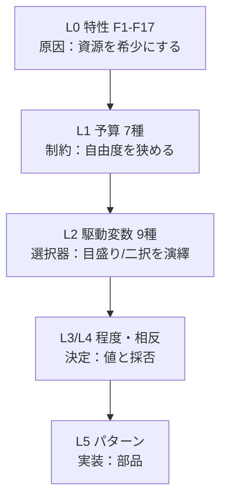

# 5層モデル（設計判断の背骨）

AIエージェント設計の難しさは、**従来は固定値や既定の作法で済んだ判断が、ことごとく「目盛りを合わせる判断（程度）」か「二択を解く判断（相反）」に変わる**点にあります。本ドキュメントではこれを5層で扱います。

| 層 | 問い | 道具 | 置き場所 |
|---|------|------|----------|
| L0 なぜ難しいか | 普通のソフトと何が違うか | 設計力学 F1–F17 | [design-forces](design-forces.md) |
| L1 何を配分するか | 何をどれだけ使えるか | 7つの予算 | [budgets](budgets.md) |
| L2 どう決めるか | 目盛り/二択を何が左右するか | 9つの駆動変数 | [driving-variables](driving-variables.md) |
| L3 どこまで回すか | 各設計変数のちょうど | 程度（ダイヤル） | [degrees](../degrees/index.md) |
| L4 どちらを採るか | 排他的な仕組みのどちら | 相反（フォーク） | [forks](../forks/index.md) |
| L5 何を組むか | 実装する再利用部品 | パターン A–G | [patterns](../patterns/index.md) |

## 層は因果でつながっています

**貫通例**：F1（長時間）＋F7（不安定）が時間・状態予算を希少にする → 駆動変数が「可逆性=低・説明責任=高・レイテンシ予算=寛容」 → 程度は「チェックポイント高頻度・タイムアウト寛容」、相反は「非同期・状態外部化」 → パターンは [A2](../patterns/a-execution/a2-durable-async-agent.md)＋[F1](../patterns/f-data-integrity/f1-short-tx-long-session.md)＋[G1](../patterns/g-observability-ops/g1-tiered-observability.md)。

## 根本原則

**確率的な核（LLM）を、決定論的な殻（コード）で包みます。** ルーティング・検証・権限・冪等性・予算・状態遷移はコードで固め、曖昧で必要な部分だけLLMに任せます。最終成果物は「値」ではなく「**なぜその値か＝どの駆動変数がどの力学に効いたか**」の記録です。
