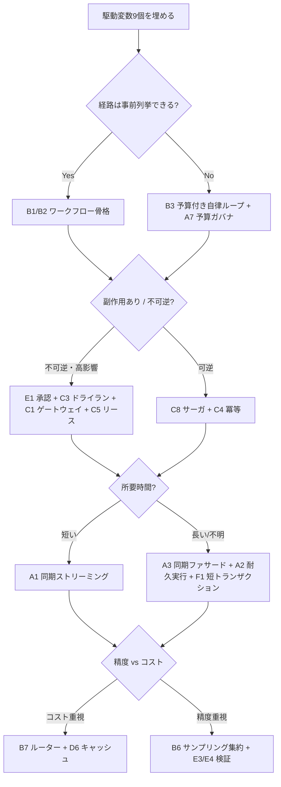

# 意思決定フロー — 駆動変数から実装へ

設計セッションは以下の順で進めてください。各分岐で「どの [駆動変数](../concepts/driving-variables.md) が効いたか」を必ず書き残してください。コーディングエージェントは [設計提案プロトコル](../for-agents/decision-protocol.md) と併せてお使いください。

1. **駆動変数表を埋めます**（可逆性・失敗コスト・レイテンシ予算…）。
2. **経路は事前列挙できますか？** `[task_variability]`
   - Yes → [B1](../patterns/b-orchestration/b1-deterministic-shell.md)/[B2](../patterns/b-orchestration/b2-workflow-backbone.md) ワークフロー骨格を使います（多くの本番要件はここに当てはまります。安く安定します）。
   - No → [B3](../patterns/b-orchestration/b3-agentic-loop-budget.md) 予算付き自律ループを使います（[A7](../patterns/a-execution/a7-deadline-budget-cascade.md) 予算ガバナが必須です）。
3. **副作用はありますか？不可逆ですか？** `[reversibility, failure_cost]`
   - 不可逆・高影響 → [E1](../patterns/e-safety-hitl/e1-risk-based-approval.md) 承認 ＋ [C3](../patterns/c-tools-security/c3-dry-run-commit.md) ドライラン ＋ [C1](../patterns/c-tools-security/c1-tool-gateway-mcp-broker.md) ゲートウェイ ＋ [C5](../patterns/c-tools-security/c5-capability-lease.md) リースを組み合わせます。
   - 可逆 → [C8](../patterns/c-tools-security/c8-saga-compensation.md) サーガ ＋ [C4](../patterns/c-tools-security/c4-idempotent-command-envelope.md) 冪等を適用します。
4. **所要時間はどのくらいですか？** `[latency_budget]`
   - 短い → [A1](../patterns/a-execution/a1-sync-edge-agent.md) を使います。長い/不明 → [A3](../patterns/a-execution/a3-sync-facade-async-core.md) ＋ [A2](../patterns/a-execution/a2-durable-async-agent.md) ＋ [F1](../patterns/f-data-integrity/f1-short-tx-long-session.md) を組み合わせます。
5. **精度とコストのどちらを重視しますか？** `[request_value, cost_sensitivity]`
   - コスト重視 → [B7](../patterns/b-orchestration/b7-model-router-adaptive-effort.md) ＋ [D6](../patterns/d-memory-context/d6-semantic-cache-nocache-zones.md) を使います。
   - 精度重視 → [B6](../patterns/b-orchestration/b6-critic-judge-sampling.md) ＋ [E3](../patterns/e-safety-hitl/e3-guardrail-sandwich.md)/[E4](../patterns/e-safety-hitl/e4-verified-structured-output.md) を使います。
6. **入力は信頼できますか？** `[input_trust]`
   - 低い → [C6](../patterns/c-tools-security/c6-confused-deputy-defense.md) ＋ [C7](../patterns/c-tools-security/c7-sandboxed-execution.md) ＋ [E2](../patterns/e-safety-hitl/e2-policy-as-code.md) を適用します。
7. **観測・再現** `[accountability]` → 常に [G1](../patterns/g-observability-ops/g1-tiered-observability.md) ＋ [G2](../patterns/g-observability-ops/g2-end-to-end-tracing.md) ＋ [F2](../patterns/f-data-integrity/f2-event-sourced-replayable.md) を導入します。
8. **可用性要件が高い場合** `[provider_trust]` → [G5](../patterns/g-observability-ops/g5-circuit-breaker-degradation.md) を検討します。
9. **挙動変化の管理** `[accountability]` → [D5](../patterns/d-memory-context/d5-prompt-registry.md) ＋ [G3](../patterns/g-observability-ops/g3-shadow-canary.md) ＋ [G4](../patterns/g-observability-ops/g4-eval-harness.md) を導入します。
10. **自律度は段階的に上げていきます** → [E5](../patterns/e-safety-hitl/e5-autonomy-ladder.md) を参照してください。
