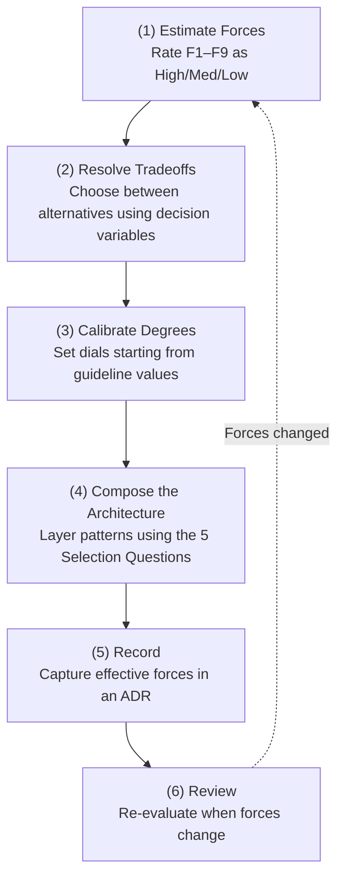

# Decision-Making Process

!!! abstract "TL;DR"
    Patterns are vocabulary, degrees and tradeoffs are grammar, forces are meaning. This page serves as the **backbone** of decision-making.

## Why "Start from Decisions"?

Have you ever felt overwhelmed staring at a catalog of 59 patterns, wondering "which one should I use?" Choosing based on what "looks good" tends to lead to adopting unnecessary patterns or, conversely, missing the ones you truly need.

The correct order is actually the reverse: **estimate your system's context (forces), resolve design tradeoffs, and calibrate the degree of each pattern** to derive the necessary and sufficient configuration.

## Step Details

### (1) Estimate Forces

Rate [Driving Variables (Forces) F1–F9](../foundations/forces.md) as "High/Medium/Low" in the context of your system. Forces serve as the input for all decisions in pattern selection.

- `[F1]` Reversibility — Can failures be undone?
- `[F2]` Failure Cost — Financial/legal/safety impact
- `[F3]` Per-Request Value — Contribution to revenue/decision-making
- `[F4]` Latency Budget — User tolerance for waiting
- `[F5]` Input Trustworthiness — Likelihood of attack/contamination
- `[F6]` Task Variability — Routine vs. exploratory
- `[F7]` Cost Sensitivity / Scale — QPS, monthly cost ceiling
- `[F8]` Accountability / Regulation — Audit and compliance requirements
- `[F9]` Provider Reliability — External LLM availability

For concrete examples of force evaluation, see [Worked Examples](worked-examples.md).

### (2) Resolve Tradeoffs

Based on force value ranges, resolve design tradeoffs using the [Tradeoff (Either-Or) Catalog](tradeoffs.md). Sixteen major either-or decisions — sync vs. async, single vs. multi-agent, Plan vs. ReAct, and so on — are organized with forces as decision variables.

Note that these either-or decisions are not independent but interlinked. For example, choosing async increases timeout flexibility, while choosing multi-agent increases budget management complexity. See [Dial x Tradeoff Interactions](interactions.md).

### (3) Calibrate Degrees

Set the [Degree (Dial)](tuning-dials.md) values for the patterns you adopt, using the guideline values derived from force ranges as starting points. Twenty dials — covering timeouts, retry counts, guardrail strictness, autonomy levels, and more — are cataloged with forces as the determining factors.

However, guideline values are merely **starting points**. Continuously adjust them based on production metrics.

### (4) Compose the Architecture

Layer individual patterns to assemble a composite architecture. Answering the "5 Selection Questions" in the [Reference Architectures](../reference-architectures/index.md) guides you to an appropriate composition.

1. What breaks when it fails? → `[F2]`
2. Can the input be trusted? → `[F5]`
3. What is the monthly cost ceiling? → `[F7]`
4. Are there audit/regulatory requirements? → `[F8]`
5. Is this still a prototype? → Start with the minimal configuration

### (5) Record

Record the rationale — which forces were decisive, how each tradeoff was resolved, and what each dial was set to — in an [Architecture Decision Record (ADR)](adr-template.md). Without documented rationale, tuning becomes impossible when problems arise, leading to knowledge silos.

### (6) Review

Forces are not fixed values. Feature additions, user base changes, regulatory amendments, and other factors can shift force ranges. When forces change, return to step (1) and re-evaluate. This review process can be disciplined through [#53 Agent Change Management](../foundations/forces/f8-accountability.md).

## Start from Forces, or from Patterns?

| Starting Point | Approach | Best For |
|------|--------|-----------|
| **From Forces** (recommended) | (1)→(2)→(3)→(4) | New designs, architecture reviews |
| **From Problems** | Characteristics→Forces→(2)→(3) | When issues arise in production and you need to add safeguards |
| **From Patterns** | Pattern→Tuning/Selection sections→Dials/Tradeoffs | When the pattern is already decided and you need to calibrate degrees |

In all cases, ultimately record the Force→Decision→Pattern causality in an [ADR](adr-template.md).

## Related Pages

- [Driving Variables (Forces) F1–F9](../foundations/forces.md) — Input for step (1)
- [Tradeoff (Either-Or) Catalog](tradeoffs.md) — Catalog for step (2)
- [Degree (Dial) Catalog](tuning-dials.md) — Catalog for step (3)
- [Reference Architectures](../reference-architectures/index.md) — Composition templates for step (4)
- [Architecture Decision Record (ADR) Template](adr-template.md) — Recording format for step (5)
- [Worked Examples](worked-examples.md) — Steps (1)–(5) demonstrated with concrete systems
- [Reverse Lookup by Force](by-force.md) — Look up dials, tradeoffs, and patterns from forces
