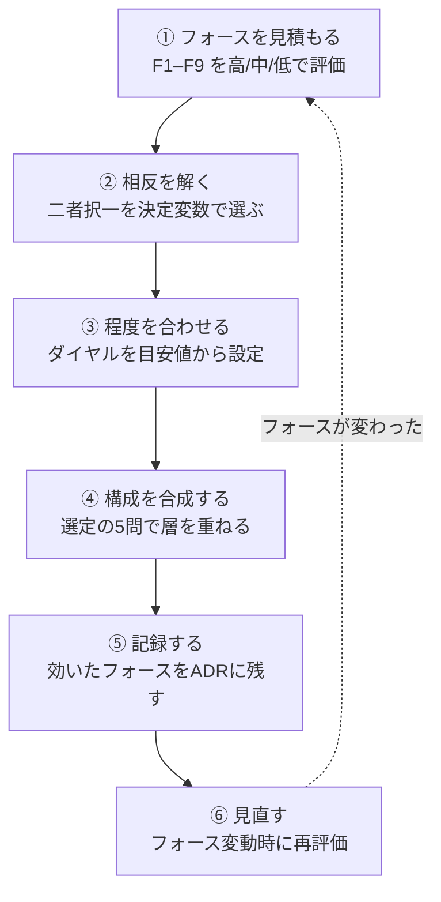

# 意思決定の進め方

!!! abstract "一言"
    パターンは語彙、程度と相反は文法、フォースは文意。このページが意思決定の**背骨**となる。

## なぜ「意思決定から入る」のか

59個ものパターンカタログを前にして「どれを使えばいいのか」と途方に暮れた経験はないだろうか。「良さそう」で選ぶと、必要ないパターンまで導入してしまったり、逆に本当に必要なものが漏れたりしがちである。

正しい順序はむしろ逆で、**自システムの文脈（フォース）を見積もり、設計上の二者択一を解き、パターンの程度を合わせる**ことによって、必要十分な構成が導かれる。

## ステップ詳細

### ① フォースを見積もる

[駆動変数（フォース）F1–F9](../foundations/forces.md) を、自システムの文脈に照らして「高/中/低」で評価する。フォースは、パターン選定におけるすべての判断の入力となる。

- `[F1]` 可逆性 — 失敗をやり直せるか
- `[F2]` 失敗コスト — 金銭/法務/安全の痛み
- `[F3]` 1リクエストの価値 — 売上/意思決定への寄与
- `[F4]` レイテンシ予算 — ユーザーの待機耐性
- `[F5]` 入力の信頼度 — 攻撃/汚染の混入可能性
- `[F6]` タスクの変動性 — 定型↔探索
- `[F7]` コスト感度・スケール — QPS・月間コスト上限
- `[F8]` 説明責任・規制 — 監査・コンプラ要件
- `[F9]` プロバイダ信頼度 — 外部LLMの可用性

具体的なフォース評価の例は [通し例](worked-examples.md) を参照。

### ② 相反を解く

フォースの値域に基づいて、直面する設計上の二者択一を [相反（二者択一）カタログ](tradeoffs.md) で解く。同期↔非同期、シングル↔マルチエージェント、Plan↔ReAct など、16の主要な二者択一がフォースを決定変数として整理されている。

なお、二者択一は独立ではなく連動する点に注意が必要である。たとえば、非同期を選ぶとタイムアウトの自由度が上がり、マルチエージェントを選ぶと予算管理の複雑さが増す。→ [ダイヤル×二者択一の相互作用](interactions.md)

### ③ 程度を合わせる

採用するパターンの [程度（ダイヤル）](tuning-dials.md) を、フォースの値域に応じた目安値を出発点として設定する。タイムアウトやリトライ回数、ガードレールの厳しさ、自律性レベルなど、20のダイヤルがフォースを決め手として一覧されている。

ただし、目安値はあくまで**出発点**にすぎない。本番のメトリクスを見ながら継続的に調整していく。

### ④ 構成を合成する

個別パターンを層として重ね、複合構成を組み立てる。[リファレンスアーキテクチャ](../reference-architectures/index.md) の「選定の5問」に答えることで、適切な構成が導かれる。

1. 失敗したとき何が壊れるか？ → `[F2]`
2. 入力は信頼できるか？ → `[F5]`
3. 月間コスト上限は？ → `[F7]`
4. 監査・規制要件はあるか？ → `[F8]`
5. まだプロトタイプか？ → 最小構成から始める

### ⑤ 記録する

選定理由——どのフォースが効いて、どの二者択一をどう解き、どのダイヤルをいくつに設定したか——を [意思決定記録（ADR）](adr-template.md) に残す。根拠のない設定のままだと、問題が起きたときにチューニングができず、属人化にもつながる。

### ⑥ 見直す

フォースは固定値ではない。機能追加やユーザー層の変化、規制改正などによってフォースの値域は変わりうる。フォースが変わったら①に戻って再評価する。この見直しプロセスは [#53 Agent Change Management](../patterns/12-governance/53-agent-change-management.md) で規律化できる。

## フォースから引くか、パターンから引くか

| 起点 | 進め方 | 適する場面 |
|------|--------|-----------|
| **フォースから**（推奨） | ①→②→③→④ | 新規設計、アーキテクチャレビュー |
| **課題から** | 特性→フォース→②→③ | 本番で問題が発生し、防波堤を追加したい |
| **パターンから** | パターン→調整/選定節→ダイヤル/二者択一 | 既にパターンが決まっていて程度を調整したい |

いずれの場合も、最終的にはフォース→決定→パターンの因果を [ADR](adr-template.md) に記録する。

## 関連ページ

- [駆動変数（フォース）F1–F9](../foundations/forces.md) — ①の入力
- [相反（二者択一）カタログ](tradeoffs.md) — ②のカタログ
- [程度（ダイヤル）カタログ](tuning-dials.md) — ③のカタログ
- [リファレンスアーキテクチャ](../reference-architectures/index.md) — ④の構成テンプレート
- [意思決定記録（ADR）テンプレート](adr-template.md) — ⑤の記録フォーマット
- [通し例](worked-examples.md) — ①〜⑤を具体システムで実演
- [フォース別逆引き](by-force.md) — フォースからダイヤル・二者択一・パターンを引く
