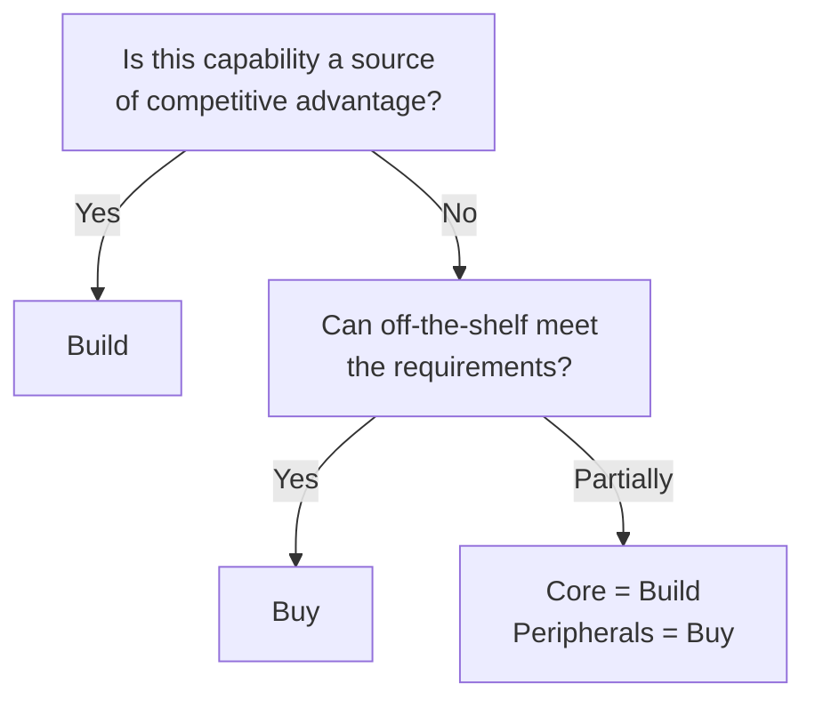

# Build (In-House Development) ↔ Buy (Off-the-Shelf)

!!! abstract "TL;DR"
    Build what is a source of competitive advantage; buy commodity functionality — the presence or absence of differentiation is the decision criterion.

## Overview

The agent framework you adopted six months ago has been abandoned — a common story in the AI space. Building in-house gives you control but consumes development resources. Off-the-shelf is fast but subject to the vendor's fate.

This tradeoff is the choice between developing agent components (runtime, orchestrator, tool integration, monitoring infrastructure, etc.) in-house or using off-the-shelf SDKs, SaaS, or frameworks. It is a tradeoff between development speed and controllability, and the rapid changes in the AI ecosystem make the decision even more difficult.

## Option Details

### Build (In-House Development)

You get an implementation that perfectly matches your requirements and fully understand and control the internals. No dependency on vendor roadmaps or pricing changes. However, it requires engineering resources for development and maintenance, and you must track ecosystem evolution on your own.

### Buy (Off-the-Shelf)

Development speed is fast, and you can leverage community knowledge and support. Best practices are often built in. However, there are risks of vendor lock-in, customization constraints, unexpected behavioral changes, and licensing costs. In the AI field, SDKs and frameworks rise and fall quickly, and the risk of your chosen product being short-lived cannot be ignored.

## Decision Variables

- `[F8]` Accountability / Regulation — If deep auditing or customization is needed, pressure to build increases
- `[F7]` Cost Sensitivity — To minimize short-term costs, buy; judge based on long-term TCO

## Default (When in Doubt)

Build differentiating elements (core agent logic, domain-specific decisions). Buy commodity functions (authentication, logging, monitoring, base runtime). When in doubt, insert an abstraction layer with [#45 Runtime Abstraction](../../patterns/10-deployment/45-agent-runtime-abstraction.md) to enable switching later.

## Hybrid Approach

Building the core logic in-house while using off-the-shelf products for peripheral functions — "build core + buy peripherals" — is the common approach. A strategy of quickly launching with off-the-shelf products and gradually replacing with in-house implementations as differentiation needs arise, as with [#48 Strangler Fig](../../patterns/10-deployment/48-strangler-fig.md), is also effective.

## Decision Flowchart

## Related Patterns

- [#45 Agent Runtime Abstraction](../../patterns/10-deployment/45-agent-runtime-abstraction.md) — Abstraction layer to facilitate build/buy switching
- [#48 Strangler Fig](../../patterns/10-deployment/48-strangler-fig.md) — Gradually replacing off-the-shelf with in-house development

## Related Dials

- [Timeout](../dials/timeout.md) — Verification is needed to ensure off-the-shelf timeout constraints match in-house requirements
