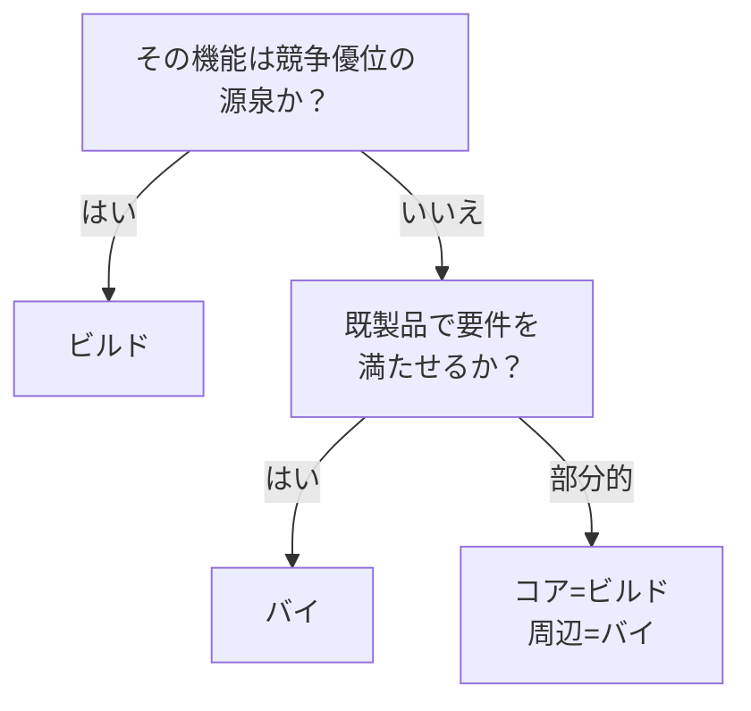

# ビルド（自社構築）↔ バイ（既製品利用）

!!! abstract "一言"
    競争優位の源泉はビルド、汎用的な機能はバイ——差別化の有無が判断基準。

## 概要

半年前に導入したエージェントフレームワークがメンテナンス停止になった——AI領域ではよくある話です。自社で作れば制御できますが開発リソースを食います。既製品なら速く立ち上がりますが、ベンダーの命運に左右されます。

この二者択一は、エージェントの各構成要素（ランタイム、オーケストレーター、ツール連携、監視基盤など）を自社で開発するか、既製のSDK・SaaS・フレームワークを利用するかの選択です。開発速度と制御可能性のトレードオフであり、AI領域ではエコシステムの急速な変化が判断をさらに難しくしています。

## 選択肢の詳細

### ビルド（自社構築）

要件に完全に合った実装が得られ、内部構造を完全に理解・制御できます。ベンダーのロードマップや価格変更にも依存しません。ただし開発・保守にエンジニアリングリソースが必要ですし、エコシステムの進化にも自力で追従しなければなりません。

### バイ（既製品利用）

開発速度が速く、コミュニティの知見やサポートを活用できます。ベストプラクティスが組み込まれていることも多いです。ただしベンダーロックイン、カスタマイズの制約、想定外の挙動変更、ライセンスコストといったリスクがあります。AI分野ではSDK・フレームワークの栄枯盛衰が速く、選定した製品が短命に終わるリスクも無視できません。

## 決定変数

- `[F8]` 説明責任・規制 — 監査やカスタマイズが深く必要ならビルドの圧力が高まる
- `[F7]` コスト感度 — 短期コストを抑えたいならバイ、長期的TCOで判断する

## デフォルト（迷ったら）

差別化要素（コアのエージェントロジック、ドメイン固有の判断）はビルド、汎用機能（認証、ロギング、モニタリング、基盤ランタイム）はバイとします。判断に迷ったら [#45 Runtime Abstraction](../../decisions/tradeoffs-catalog/build-vs-buy.md) で抽象化層を挟んでおくと、後からの切替が容易になります。

## ハイブリッドアプローチ

コアロジックを自社構築し、周辺機能は既製品を利用する「コア自前＋周辺バイ」が一般的。[#48 Strangler Fig](../../foundations/forces/f2-failure-cost.md) のように、既製品で素早く立ち上げ、差別化が必要になった部分から段階的に自社実装へ置き換える戦略も有効。

## 判断フローチャート

## 関連パターン

- [#45 Agent Runtime Abstraction](../../decisions/tradeoffs-catalog/build-vs-buy.md) — ビルド/バイの切替を容易にする抽象化層
- [#48 Strangler Fig](../../foundations/forces/f2-failure-cost.md) — 既製品から自社構築へ段階的に置き換える

## 関連ダイヤル

- [タイムアウト](../dials/timeout.md) — 既製品のタイムアウト制約が自社要件と合うかの検証が必要

<!-- BEGIN:GEN:patterns -->

## 関与する具体構造

| # | パターン | 向き | 不向き |
|---|---------|------|--------|
| #45 | **Agent Runtime Abstraction** | 複数年の本番運用、マルチフレームワーク評価、将来のベンダーリスク | PoC/短期; フレームワーク固有機能への重依存 |
<!-- END:GEN:patterns -->
