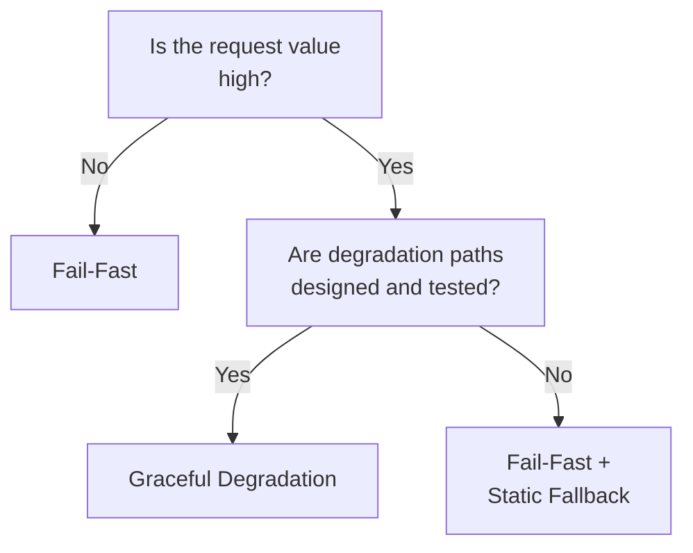

# Fail-Fast ↔ Graceful Degradation

!!! abstract "TL;DR"
    For low-value requests, fail-fast and return an error immediately; for high-value requests, return a response even at reduced quality.

## Overview

When an e-commerce site's purchase assistant goes down due to an LLM failure, do you return "currently unavailable" as an error, or get by with cached FAQ responses? For an auxiliary feature like search suggestions, an immediate error is fine, but if it stops mid-purchase, it leads to cart abandonment.

This tradeoff is the choice between returning an error immediately on failure and delegating judgment to the caller, or continuing to return some response while gradually degrading quality. It is a tradeoff between failure blast radius and response continuity.

## Option Details

### Fail-Fast

Returns an error immediately upon detecting a failure without attempting retries or fallbacks. It stops failure cascading and prevents resource waste. The caller can quickly take alternative action. Implementation is simple and debugging is easy. However, the user experience involves seeing an error screen.

### Graceful Degradation

Continues responding while gradually reducing quality during failures. Design a degradation staircase: highest quality → simpler model → cached results → static responses. Users receive "not perfect but usable responses" rather than "nothing at all." The tradeoff is the design, testing, and maintenance cost of degradation paths.

## Decision Variables

- `[F9]` Provider Reliability — If provider failures are frequent, the investment in graceful degradation pays off
- `[F3]` Per-Request Value — The higher the request value, the stronger the motivation to respond even with degradation

## Default (When in Doubt)

Low-value requests (autocomplete, suggestions, etc.) use fail-fast. High-value requests (purchase assistance, business decision support, etc.) use graceful degradation. Use `[F3]` request value as the primary criterion.

## Hybrid Approach

As shown by [#40 Fallback & Graceful Degradation](../../patterns/08-cost-scaling/40-fallback-graceful-degradation.md), set fail-fast timeouts at each level of the degradation staircase. Set time limits for each fallback destination, and ultimately fail-fast if all levels fail. The discipline of not attempting infinite degradation is important.

## Decision Flowchart

## Related Patterns

- [#40 Fallback & Graceful Degradation](../../patterns/08-cost-scaling/40-fallback-graceful-degradation.md) — Design pattern for staged fallback

## Related Dials

- [Timeout](../dials/timeout.md) — Timeouts at each degradation level serve as the switching threshold to fail-fast
- [Retry Count](../dials/retry-count.md) — When retry limits are exceeded, fail-fast or move to the next degradation level
