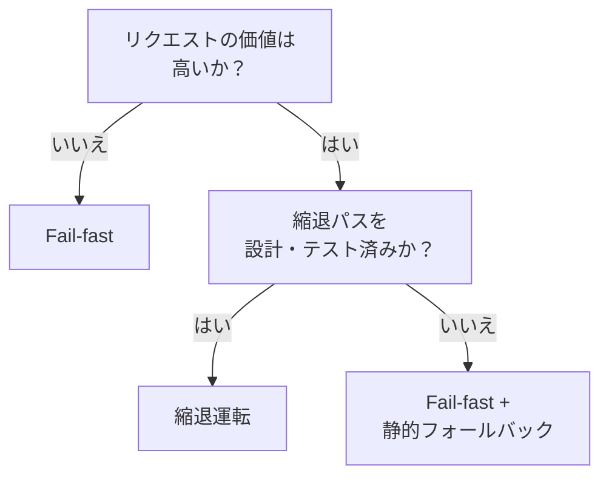

# Fail-fast（即時失敗）↔ 縮退運転（Graceful Degradation）

!!! abstract "一言"
    低価値リクエストはfail-fastで即座にエラーを返し、高価値リクエストは品質を落としてでも応答を返す。

## 概要

外部LLMやツールの障害時に、即座にエラーを返して呼び出し元に判断を委ねるか、品質を段階的に落としながらも何らかの応答を返し続けるかの選択。障害の波及範囲と応答継続性のトレードオフである。

## 選択肢の詳細

### Fail-fast（即時失敗）

障害検知時に即座にエラーを返し、リトライやフォールバックを試みない。障害の連鎖を止め、リソースの浪費を防ぐ。呼び出し元が迅速に代替策を取れる。実装がシンプルでデバッグも容易。ただしユーザー体験としてはエラー画面が表示される。

### 縮退運転（Graceful Degradation）

障害時に段階的に品質を落としながら応答を継続する。最高品質→簡易モデル→キャッシュ結果→静的応答、といった縮退階段を設計する。ユーザーは「何も返らない」より「完璧ではないが使える応答」を得られる。代償は縮退パスの設計・テスト・保守コスト。

## 決定変数

- `[F9]` プロバイダ信頼度 — プロバイダ障害が頻繁なら縮退運転の投資が回収できる
- `[F3]` 1リクエストの価値 — リクエストの価値が高いほど、縮退してでも応答を返す動機が強まる

## デフォルト（迷ったら）

低価値リクエスト（オートコンプリート、サジェスト等）はfail-fast。高価値リクエスト（購買支援、業務判断支援等）は縮退運転。判断基準は `[F3]` リクエスト価値を軸にする。

## ハイブリッドアプローチ

[#40 Fallback & Graceful Degradation](../../patterns/08-cost-scaling/40-fallback-graceful-degradation.md) が示すように、縮退階段の各段にfail-fastのタイムアウトを設ける。各フォールバック先にも制限時間を設け、全段が失敗した場合は最終的にfail-fastする。無限に縮退を試みない規律が重要。

## 判断フローチャート

## 関連パターン

- [#40 Fallback & Graceful Degradation](../../patterns/08-cost-scaling/40-fallback-graceful-degradation.md) — 段階的フォールバックの設計パターン

## 関連ダイヤル

- [タイムアウト](../dials/timeout.md) — 各縮退段のタイムアウトがfail-fastへの切替閾値になる
- [リトライ回数](../dials/retry-count.md) — リトライ上限を超えたらfail-fastまたは次の縮退段へ
