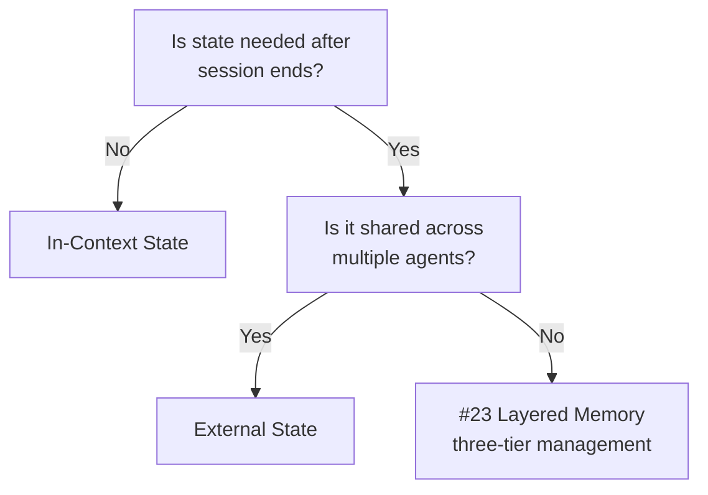

# In-Context State ↔ External State (External Store)

!!! abstract "TL;DR"
    Keep short-term working state within the context window; place state requiring persistence, auditing, or sharing in an external store.

## Overview

An agent session that spent 30 minutes researching is lost when the browser is reloaded — this is an accident that can happen when state is held only in the context window. On the other hand, writing everything to an external database adds read/write latency at every step.

This tradeoff is the choice between keeping agent state (conversation history, intermediate results, task progress) within the LLM's context window or persisting it in an external data store (database, cache, file system). It is a tradeoff between access speed and persistence/shareability.

## Option Details

### In-Context State

Conversation history and intermediate results are held within the prompt's context window. The LLM can reference them directly without additional I/O. Simple and fast for tasks that complete within a single session. However, it is constrained by the context window limit, and state is lost when the session ends. Costs also increase proportionally with token count.

### External State (External Store)

State is persisted in a database or object storage. Session resumption, state sharing across multiple agents, and storage as audit logs are all possible. Not constrained by the context window. The tradeoffs include read/write latency, store operational costs, and the logic for serialization/deserialization of state.

## Decision Variables

- `[F4]` Latency Budget — Whether the I/O latency to the external store is within acceptable range
- `[F8]` Accountability / Regulation — If audit trails are required, persistence to an external store is essential

## Default (When in Doubt)

Keep short-term working state in-context and save state that needs persistence to an external store. The criterion is "Does this information need to survive after this session ends?" A typical split is keeping the latest N conversation entries in-context while storing the full history externally.

## Hybrid Approach

As demonstrated by [#23 Layered Memory](../../decisions/tradeoffs-catalog/in-context-vs-external.md), a three-tier structure of working memory (in-context), short-term memory (session DB), and long-term memory (persistent store) is effective. Frequently accessed information is kept in-context, while information with decreasing access frequency is evicted to external storage. [#2 Durable Agent Session](../../decisions/tradeoffs-catalog/in-context-vs-external.md) enables state management that withstands interruption and resumption.

## Decision Flowchart

## Related Patterns

- [#23 Layered Memory](../../decisions/tradeoffs-catalog/in-context-vs-external.md) — Layering memory into short-term, long-term, and shared tiers
- [#2 Durable Agent Session](../../decisions/tradeoffs-catalog/in-context-vs-external.md) — Enabling interruptible and resumable sessions with external state

## Related Dials

- [Timeout](../dials/timeout.md) — External store I/O timeout design affects overall pipeline latency
