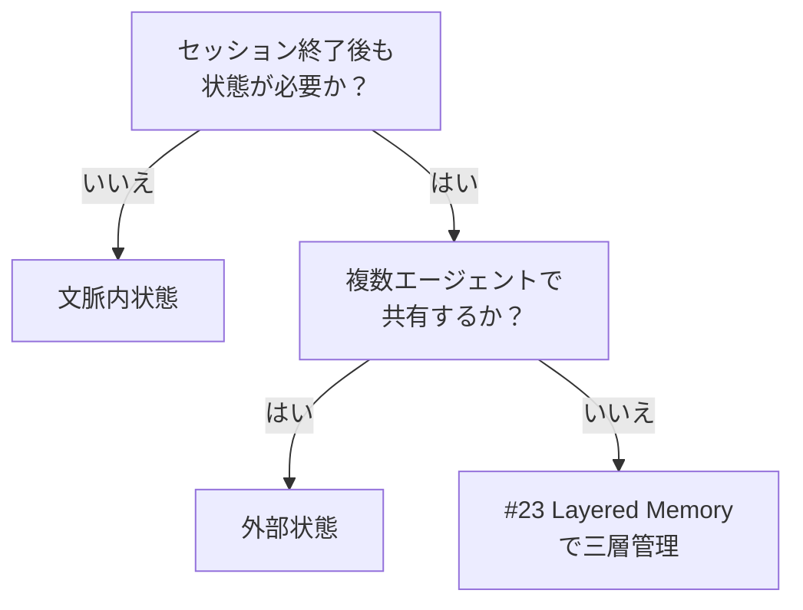

# 文脈内状態（in-context）↔ 外部状態（external store）

!!! abstract "一言"
    短期の作業状態はコンテキスト窓内に、永続化・監査・共有が必要な状態は外部ストアに置きます。

## 概要

30分かけて調査したエージェントのセッションが、ブラウザのリロードで消えてしまった——コンテキスト窓だけに状態を置いていると起こりうる事故です。一方、すべてを外部DBに書き出すと、読み書きのレイテンシが毎ステップに加算されます。

この二者択一は、エージェントの状態（会話履歴、中間結果、タスク進捗）をLLMのコンテキストウィンドウ内に保持するか、外部データストア（DB、キャッシュ、ファイルシステム）に永続化するかの選択です。アクセス速度と永続性・共有性のトレードオフになります。

## 選択肢の詳細

### 文脈内状態（in-context）

会話履歴や中間結果をプロンプトのコンテキストウィンドウ内に保持します。LLMが直接参照でき、追加のI/Oが発生しません。単一セッション内で完結するタスクではシンプルで高速。ただしコンテキスト窓の上限に制約され、セッション終了で状態が消失します。コストもトークン数に比例して増加します。

### 外部状態（external store）

状態をデータベースやオブジェクトストレージに永続化します。セッション跨ぎの再開、複数エージェント間の状態共有、監査ログとしての保存が可能。コンテキスト窓の制約を受けません。代償として読み書きのレイテンシ、ストアの運用コスト、状態の直列化・復元化のロジックが加わります。

## 決定変数

- `[F4]` レイテンシ予算 — 外部ストアへのI/Oレイテンシが許容範囲内か
- `[F8]` 説明責任・規制 — 監査証跡が必要なら外部ストアへの永続化が必須

## デフォルト（迷ったら）

短期の作業状態はin-context、永続化が必要な状態は外部ストアに保存します。「このセッションが終わっても残すべき情報か？」を判断基準にします。会話履歴の最新N件はin-context、全履歴は外部に保管するのが典型的な分割。

## ハイブリッドアプローチ

[#23 Layered Memory](../../patterns/05-memory-context/23-layered-memory.md) が示すように、作業メモリ（in-context）・短期メモリ（セッションDB）・長期メモリ（永続ストア）の三層構成が有効。頻繁にアクセスする情報はin-contextに載せ、参照頻度が下がった情報は外部へ退避します。[#2 Durable Agent Session](../../patterns/01-execution/02-durable-agent-session.md) で中断・再開に耐える状態管理を実現します。

## 判断フローチャート

## 関連パターン

- [#23 Layered Memory](../../patterns/05-memory-context/23-layered-memory.md) — 記憶を短期・長期・共有に階層化する
- [#2 Durable Agent Session](../../patterns/01-execution/02-durable-agent-session.md) — 外部状態で中断・再開可能なセッションを実現する

## 関連ダイヤル

- [タイムアウト](../dials/timeout.md) — 外部ストアI/Oのタイムアウト設計がパイプライン全体のレイテンシに影響する
