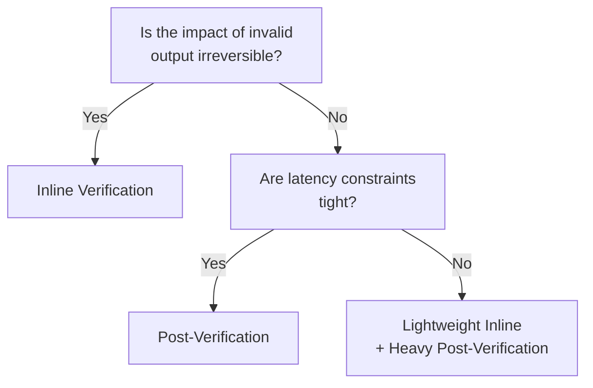

# Inline Verification ↔ Post-Verification

!!! abstract "TL;DR"
    Verify high-risk outputs inline within the pipeline; for low-risk outputs, use post-verification in batch to preserve latency.

## Overview

An agent sends a contract draft directly to a customer, and an error is discovered afterward — if you want to eliminate this risk entirely, you need to insert verification before output, but response time will suffer. For internal chat responses, it is more practical to respond first and run quality checks in the background.

This tradeoff is the choice between verifying immediately within the pipeline right after output or returning the output first and verifying asynchronously afterward. It is a tradeoff between safety and response speed.

## Option Details

### Inline Verification

Verification and correction are performed within the pipeline before the agent's output reaches the user or downstream systems. This minimizes the risk of invalid output escaping. However, the verification step adds latency, and a failure in the verifier itself can halt the entire pipeline.

### Post-Verification

Output is returned to the user first, then quality is inspected via batch or asynchronous processes. Response speed is not sacrificed. If issues are found, they are addressed through notification, correction, or retraction. Real-time responsiveness is maintained, but there is a risk of invalid output being temporarily exposed.

## Decision Variables

- `[F4]` Latency Budget — If latency is tight, lean toward post-verification
- `[F2]` Failure Cost — If the impact of invalid output is significant, inline verification is essential

## Default (When in Doubt)

High-risk (financial transactions, healthcare, legal documents, external API calls) requires inline verification. Low-risk (chat responses, internal summaries) can rely on post-verification. It is important to document the risk assessment criteria explicitly.

## Hybrid Approach

A two-stage approach: execute lightweight rule-based verification (format, prohibited phrases, length) inline, and defer heavy semantic verification (factual consistency, reasoning validity) to post-verification. [#29 Guardrail Sidecar](../../glossary.md) can be used for inline, and [#28 Verifier Agent](../../glossary.md) for post-verification-oriented checking.

## Decision Flowchart

## Related Patterns

- [#28 Verifier Agent / Critic](../../glossary.md) — Pre-shipment inspection by an independent verification agent
- [#29 Guardrail Sidecar + Self-Correction](../../glossary.md) — Sidecar-style inline verification with self-correction

## Related Dials

- [Timeout](../dials/timeout.md) — Inline verification timeout directly affects the overall pipeline latency
