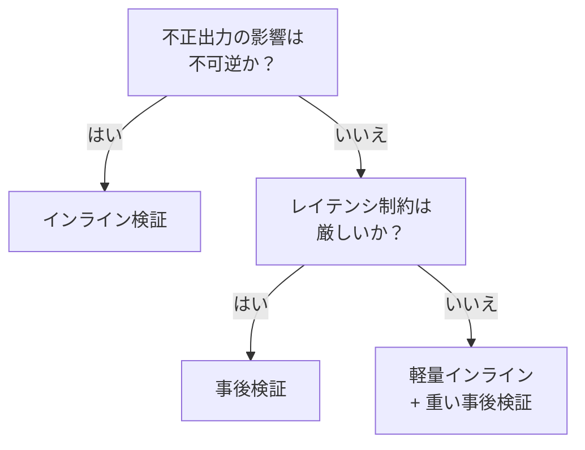

# インライン検証 ↔ 事後検証

!!! abstract "一言"
    高リスクな出力はパイプライン内でインライン検証、低リスクなら事後にバッチ検証でレイテンシを守ります。

## 概要

エージェントが生成した契約書ドラフトをそのまま顧客に送ってしまい、後から誤りに気づく——このリスクをゼロにしたいなら出力前に検証を挟む必要があるが、そのぶん応答は遅くなります。社内チャットの返答であれば、まず返してから裏で品質チェックする方が現実的です。

この二者択一は、出力直後にパイプライン内で即座に検証するか、出力をまず返してから非同期で検証するかの選択です。安全性と応答速度のトレードオフになります。

## 選択肢の詳細

### インライン検証

エージェントの出力がユーザーや下流システムに届く前に、パイプライン内で検証・修正を行います。不正な出力がエスケープするリスクを最小化できます。ただし検証ステップ分のレイテンシが加算され、検証器自体の障害がパイプライン全体を止めえます。

### 事後検証

出力をまずユーザーに返し、その後バッチや非同期プロセスで品質を検査します。応答速度を犠牲にしません。問題が見つかった場合は通知・修正・撤回で対処します。リアルタイム性は維持できるが、不正出力が一時的に露出するリスクがあります。

## 決定変数

- `[F4]` レイテンシ予算 — レイテンシが厳しいなら事後検証に傾く
- `[F2]` 失敗コスト — 不正出力の影響が大きいならインライン検証が必須

## デフォルト（迷ったら）

高リスク（金融取引、医療、法的文書、外部API呼び出し）はインライン検証。低リスク（チャット応答、社内向け要約）は事後検証で十分。リスクの判定基準を明文化しておくことが重要。

## ハイブリッドアプローチ

軽量なルールベース検証（フォーマット、禁止語句、長さ）をインラインで実行し、重い意味的検証（事実整合性、推論の妥当性）は事後に回す二段構え。[#29 Guardrail Sidecar](../../glossary.md) はインライン、[#28 Verifier Agent](../../glossary.md) は事後寄りの検証に使い分けられます。

## 判断フローチャート

## 関連パターン

- [#28 Verifier Agent / Critic](../../glossary.md) — 独立した検証エージェントによる出荷前検査
- [#29 Guardrail Sidecar + Self-Correction](../../glossary.md) — サイドカー型のインライン検証と自己修正

## 関連ダイヤル

- [タイムアウト](../dials/timeout.md) — インライン検証のタイムアウトがパイプライン全体のレイテンシに直結する

<!-- BEGIN:GEN:patterns -->

## 関与する具体構造

| # | パターン | 向き | 不向き |
|---|---------|------|--------|
| #28 | **Verifier Agent / Critic** | コード生成（テスト検証）、金融レポート、法務文書、公開コンテンツ | リアルタイムチャット; 失敗コスト低のブレインストーミング |
| #29 | **Guardrail Sidecar + Self-Correction** | 公開チャットボット、外部API入力、コンプライアンス要件、自動修正が許容 | 内部信頼入力のみ; リアルタイムゼロレイテンシ要求 |
<!-- END:GEN:patterns -->
