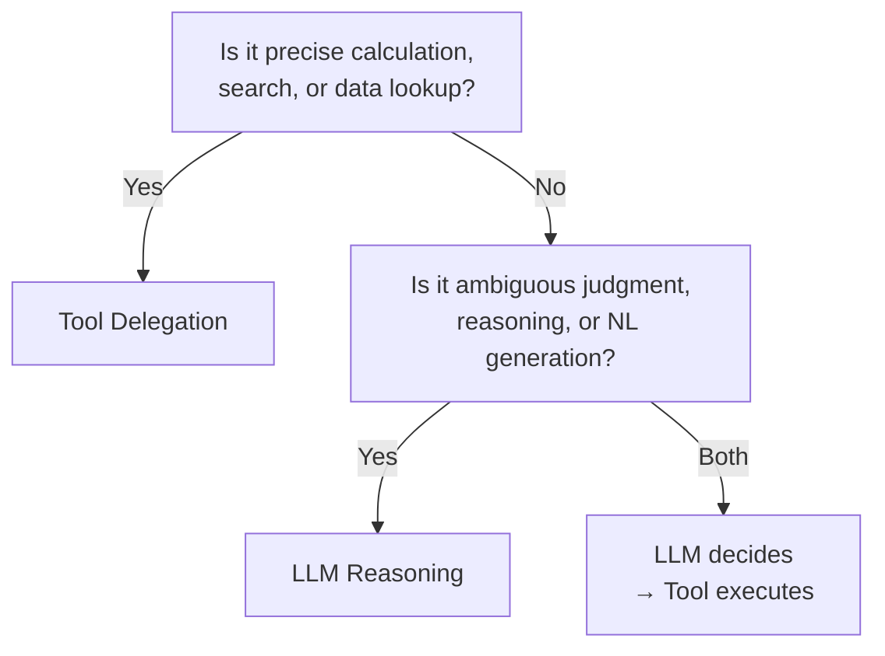

# LLM Reasoning ↔ Tool Delegation

!!! abstract "TL;DR"
    Delegate processes where accuracy can be guaranteed (arithmetic, search, API calls) to tools, and let the LLM focus on policy decisions and natural language processing.

## Overview

When you ask an agent "What was last month's total sales?", the accuracy is completely different between the LLM doing mental arithmetic and issuing SQL to a database. Deciding which processes to leave to the LLM and which to delegate to tools is a fundamental decision in agent design.

This tradeoff is the choice between processing directly with the LLM's reasoning capabilities or delegating to external tools (calculators, search engines, databases, APIs). It questions the balance between LLM versatility and tool accuracy.

## Option Details

### LLM Reasoning

The LLM answers directly using its internal knowledge and reasoning capabilities. There is no tool-call overhead, and latency is low. It excels at natural language explanations, chains of reasoning, and ambiguous judgments. However, there are risks of arithmetic errors, knowledge cutoffs, and hallucination.

### Tool Delegation

Computation, search, and data retrieval are delegated to dedicated tools. Arithmetic is accurate, search results are current, and APIs return data from authoritative sources. Auditing results is also easy. The tradeoffs include tool-call latency, error handling for tool failures, and tool definition maintenance.

## Decision Variables

- `[F2]` Failure Cost — Processes requiring accuracy (monetary calculations, legal requirement lookups, etc.) must be delegated to tools

## Default (When in Doubt)

Delegate arithmetic, date calculations, strict searches, and structured data lookups to tools. Let the LLM focus on policy decisions — "which tool to use," "how to interpret the results," and "how to explain to the user" — and natural language processing.

## Hybrid Approach

Using the approach of [#15 Inverted Structured Output](../../glossary.md), have the LLM generate the "what to do" judgment (intermediate structured output) and delegate actual execution to code or tools. This is the standard configuration combining the LLM's flexible reasoning with tools' accurate execution.

## Decision Flowchart

## Related Patterns

- [#15 Inverted Structured Output](../../glossary.md) — Have the LLM output only the judgment, execution is done by code
- [#17 Tool / MCP Gateway](../../glossary.md) — Aggregates tool connections and centralizes authorization and auditing

## Related Dials

- [Retry Count](../dials/retry-count.md) — Relates to retry strategy for tool call failures
