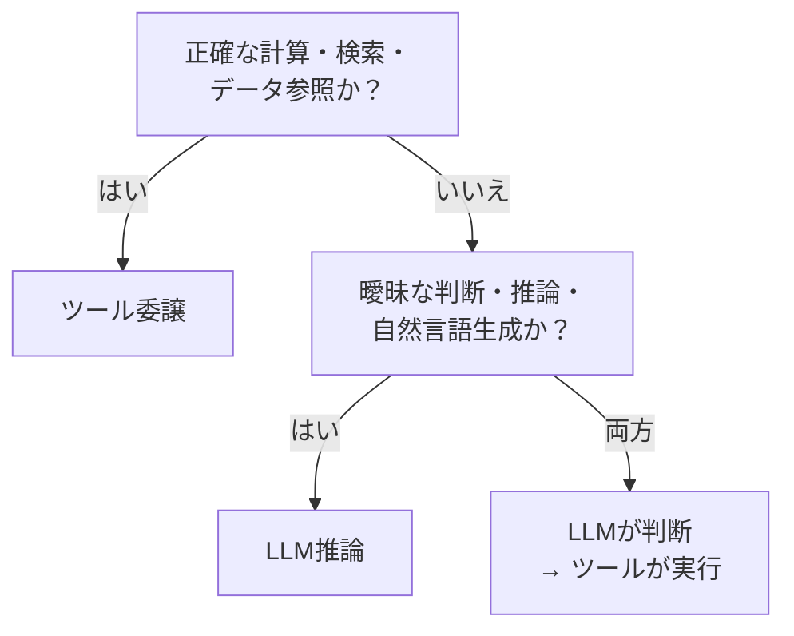

# LLM推論で判断 ↔ ツール委譲

!!! abstract "一言"
    正確さが保証できる処理（算術・検索・API呼び出し）はツールに委譲し、LLMは方針決定と自然言語処理に集中させます。

## 概要

「先月の売上合計を教えて」とエージェントに聞いたとき、LLMが頭の中で暗算するのと、データベースにSQLを投げるのでは正確性がまったく違います。どの処理をLLMに任せ、どこをツールに委ねるかは、エージェント設計の根幹に関わる判断です。

この二者択一は、LLMの推論能力で直接処理するか、外部ツール（計算機、検索エンジン、データベース、API）に委譲するかの選択です。LLMの汎用性とツールの正確性のバランスが問われます。

## 選択肢の詳細

### LLM推論で判断

LLMが内部知識と推論能力で直接回答します。ツール呼び出しのオーバーヘッドがなく、レイテンシが低いです。自然言語での説明や推論の連鎖、曖昧な判断に強いです。ただし算術ミス、知識のカットオフ、ハルシネーションのリスクがあります。

### ツール委譲

計算・検索・データ参照を専用ツールに委ねります。算術は正確、検索結果は最新、APIは権威あるデータソースを返します。結果の監査も容易。代償としてツール呼び出しのレイテンシ、ツール障害時のエラーハンドリング、ツール定義の保守が加わります。

## 決定変数

- `[F2]` 失敗コスト — 正確性が求められる処理（金額計算、法的要件の参照等）はツール委譲が必須

## デフォルト（迷ったら）

算術・日付計算・厳密な検索・構造化データの参照はツールに委譲します。LLMは「どのツールを使うか」「結果をどう解釈するか」「ユーザーにどう説明するか」という方針決定と自然言語処理に集中させます。

## ハイブリッドアプローチ

[#15 Inverted Structured Output](../../patterns/03-io-contract/15-inverted-structured-output.md) の考え方で、LLMには「何をすべきか」の判断（中間構造化出力）を生成させ、実際の実行はコードやツールに委ねります。LLMの柔軟な推論とツールの正確な実行を組み合わせる標準的な構成。

## 判断フローチャート

## 関連パターン

- [#15 Inverted Structured Output](../../patterns/03-io-contract/15-inverted-structured-output.md) — LLMに判断だけ出力させ、実行はコード側で行う
- [#17 Tool / MCP Gateway](../../patterns/04-tools-mcp/17-tool-mcp-gateway.md) — ツール接続を集約し認可・監査を一元化する

## 関連ダイヤル

- [リトライ回数](../dials/retry-count.md) — ツール呼び出し失敗時のリトライ戦略に関わる

<!-- BEGIN:GEN:patterns -->

## 関与する具体構造

| # | パターン | 向き | 不向き |
|---|---------|------|--------|
| #17 | **Tool / MCP Gateway** | 複数ツール/MCPシステム、マルチテナント、認可・監査の一元化が必要 | 1–2ツール; 認証不要 |
| #15 | **Inverted Structured Output** | 承認・分類・ルーティング判断、判断のみ（実行はコード） | LLMが最終成果物を生成する場合（コード・テキスト）; 選択肢が無限 |
<!-- END:GEN:patterns -->
