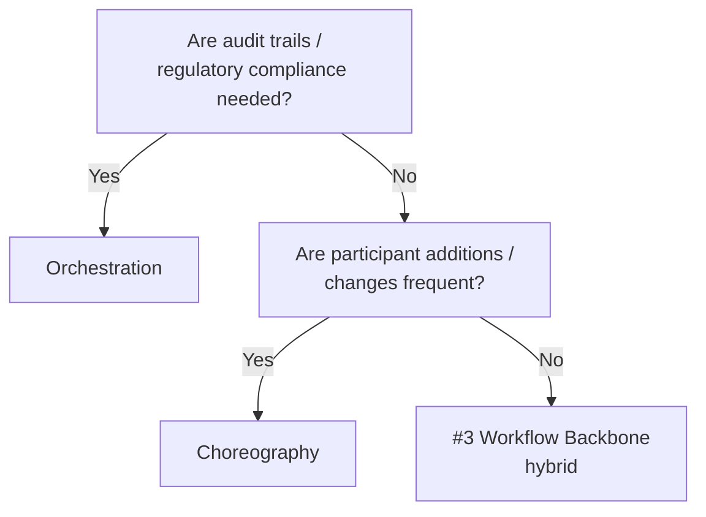

# Centralized Orchestration ↔ Choreography (Autonomous Coordination)

!!! abstract "TL;DR"
    Use orchestration when auditing and control are needed; use choreography when prioritizing participant autonomy and extensibility.

## Overview

Order processing agent, inventory check agent, notification agent — when coordinating three agents, the difficulty of failure handling is completely different between "a commander issues instructions in order" and "each one picks up events and acts independently."

This tradeoff is the choice between a central conductor holding the control flow or each participant acting autonomously in an event-driven manner. It is a tradeoff between controllability and flexibility.

## Option Details

### Centralized Orchestration

A single orchestrator defines the entire workflow and manages the call sequence, conditional branching, and error handling for each step. Since the entire flow is visible in one place, auditing and failure analysis are straightforward. However, the orchestrator can become a bottleneck and a single point of failure.

### Choreography (Autonomous Coordination)

Each participant reacts independently via an event bus or message queue. Adding new participants is easy and loose coupling is maintained. On the other hand, understanding the overall flow is difficult, and distributed tracing becomes essential for debugging and failure tracking. Implicit dependencies tend to proliferate.

## Decision Variables

- `[F8]` Accountability / Regulation — If audit trails or compliance are required, orchestration is the safer choice
- `[F6]` Task Variability — If participants or procedures change frequently, choreography's extensibility shines

## Default (When in Doubt)

Start with centralized orchestration. Being able to see the entire flow in one place keeps initial development, debugging, and operational costs low. A strategy of partially migrating to choreography as scale grows and participants diversify is practical.

## Hybrid Approach

[#3 Workflow Backbone + Agent Node](../../patterns/01-execution/03-workflow-backbone-agent-node.md) is the representative example. The skeleton (step order, conditional branching) is held by the orchestrator, while each node's internals are decided autonomously by agents. This achieves both controllability and flexibility.

## Decision Flowchart

## Related Patterns

- [#3 Workflow Backbone + Agent Node](../../patterns/01-execution/03-workflow-backbone-agent-node.md) — Hybrid: orchestration for the skeleton, autonomy for nodes
- [#12 Blackboard](../../patterns/02-composition/12-blackboard.md) — A form of loosely-coupled choreography via shared blackboard

## Related Dials

- [Timeout](../dials/timeout.md) — Timeout design between steps becomes more critical in choreography
