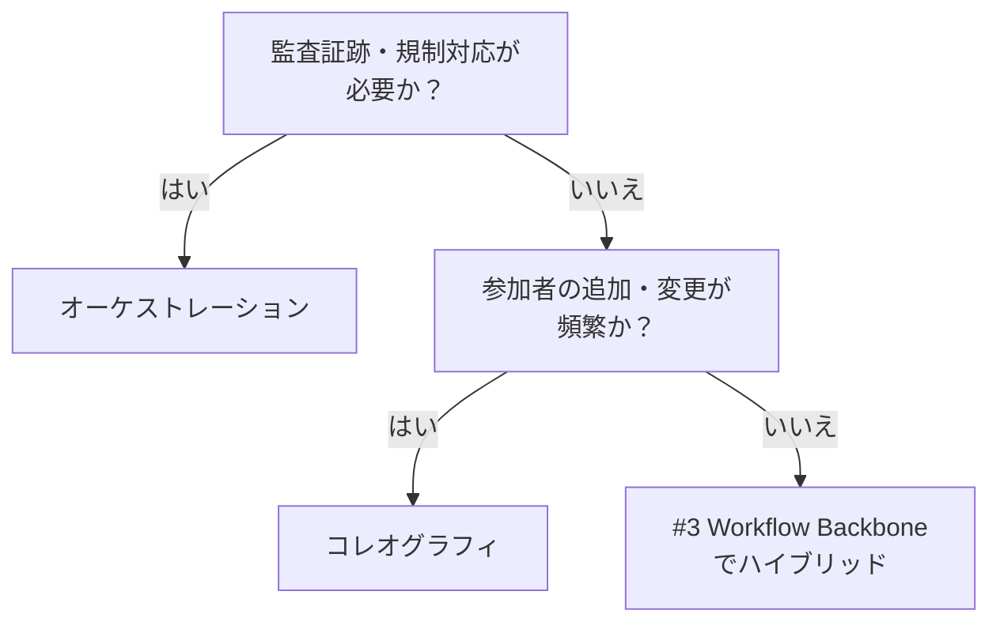

# 中央集権オーケストレーション ↔ コレオグラフィ（自律協調）

!!! abstract "一言"
    監査・制御が必要ならオーケストレーション、参加者の自律性と拡張性を優先するならコレオグラフィ。

## 概要

注文処理エージェント、在庫確認エージェント、通知エージェント——この3つを連携させるとき、「司令塔が順番に指示を出す」方式と「各自がイベントを拾って動く」方式では、障害対応の難易度がまるで違います。

この二者択一は、中央の指揮者が制御フローを握るか、各参加者がイベント駆動で自律的に動くかの選択です。制御可能性と柔軟性のトレードオフになります。

## 選択肢の詳細

### 中央集権オーケストレーション

1つのオーケストレータがワークフロー全体を定義し、各ステップの呼び出し順序・条件分岐・エラー処理を管理します。フロー全体が1箇所に可視化されるため、監査や障害分析が容易。ただしオーケストレータがボトルネックや単一障害点になりえます。

### コレオグラフィ（自律協調）

各参加者がイベントバスやメッセージキューを介して独立に反応します。新しい参加者の追加が容易で、疎結合を保てります。一方、フロー全体の把握が難しく、デバッグや障害追跡に分散トレーシングが必須になります。暗黙の依存関係が増えやすいです。

## 決定変数

- `[F8]` 説明責任・規制 — 監査証跡やコンプライアンスが求められるならオーケストレーションが安全
- `[F6]` タスクの変動性 — 参加者や手順が頻繁に変わるならコレオグラフィの拡張性が活きる

## デフォルト（迷ったら）

中央集権オーケストレーションから始めます。フロー全体を1箇所で見渡せるため、初期の開発・デバッグ・運用コストが低いです。規模拡大や参加者の多様化に伴い、部分的にコレオグラフィへ移行する戦略が現実的。

## ハイブリッドアプローチ

[#3 Workflow Backbone + Agent Node](../../glossary.md) が代表例。骨格（ステップの順序・条件分岐）はオーケストレータが握り、各ノード内部はエージェントが自律的に判断します。制御可能性と柔軟性を両立させります。

## 判断フローチャート

## 関連パターン

- [#3 Workflow Backbone + Agent Node](../../glossary.md) — 骨格はオーケストレーション、ノードは自律のハイブリッド
- [#12 Blackboard](../../glossary.md) — 共有黒板による疎結合なコレオグラフィの一形態

## 関連ダイヤル

- [タイムアウト](../dials/timeout.md) — コレオグラフィではステップ間のタイムアウト設計がより重要になる

<!-- BEGIN:GEN:patterns -->

## 関与する具体構造

| # | パターン | 向き | 不向き |
|---|---------|------|--------|
| #3 | **Workflow Backbone + Agent Node** | 固定手順にAI判断を組み込む場面、規制業種で再現性が必要 | F6=高（探索的タスク）; 手順が動的に変化する場合 |
| #12 | **Blackboard** | 複雑なマルチエージェント分析、動的なエージェント参加、探索的問題解決 | 固定順序ワークフロー（#3を使用）; 高競合の並行書き込み |
<!-- END:GEN:patterns -->
