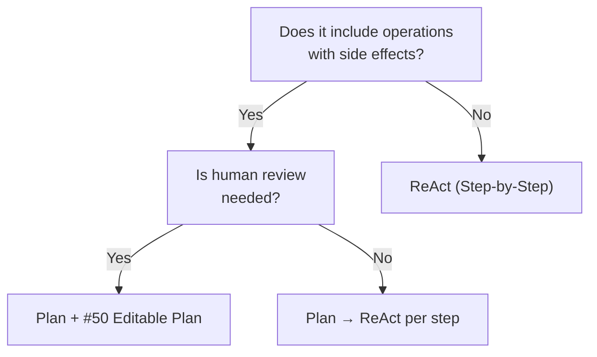

# Plan (Plan-First) ↔ ReAct (Step-by-Step Action)

!!! abstract "TL;DR"
    If side effects are significant, plan before executing; if the task is exploratory with small side effects, use step-by-step action (ReAct).

## Overview

Imagine having an agent handle a production database migration. If it starts acting immediately, the consequences could be irreversible. On the other hand, for searching an internal wiki, it is more efficient to dig deeper step by step while observing results.

This tradeoff is the choice between creating an overall plan before execution or cycling through observe-think-act one step at a time. It questions the balance between plan quality and execution adaptability.

## Option Details

### Plan (Plan-First)

Decomposes the task and generates a step list with dependencies before execution. Human review and editing are possible, and operations with side effects can be identified in advance. Global optimization (parallelization, dependency resolution) is also possible. However, the plan's accuracy depends on the LLM's reasoning ability, and if assumptions break during execution, re-planning is needed.

### ReAct (Step-by-Step Action)

Repeats "observe → reason → act" at each step. Since the next action is decided based on the previous step's results, it adapts well to unexpected intermediate results. Implementation is also simple. However, global optimization is difficult, and the risk is high when actions with side effects cannot be undone.

## Decision Variables

- `[F2]` Failure Cost — If side effects are irreversible and high-cost, plan-first is safer
- `[F6]` Task Variability — If you want to flexibly change direction based on intermediate results, use ReAct

## Default (When in Doubt)

Choose plan-first for tasks with significant side effects (external API calls, data modifications, billing operations, etc.). For read-only research or tasks where failures can be cheaply retried, ReAct's responsiveness shines.

## Hybrid Approach

A two-stage approach: create a plan, then execute each step with ReAct. [#8 Planner-Executor-Reviewer](../../glossary.md) is a typical example of this hybrid. An operational model where humans edit the plan via [#50 Editable Plan](../../glossary.md) before transitioning to ReAct execution is also effective.

## Decision Flowchart

## Related Patterns

- [#8 Planner-Executor-Reviewer](../../glossary.md) — Configuration separating planning, execution, and verification
- [#50 Editable Plan](../../glossary.md) — UX pattern allowing humans to edit the plan before execution

## Related Dials

- [Timeout](../dials/timeout.md) — Set timeouts for the planning phase as well to prevent over-elaboration of plans
