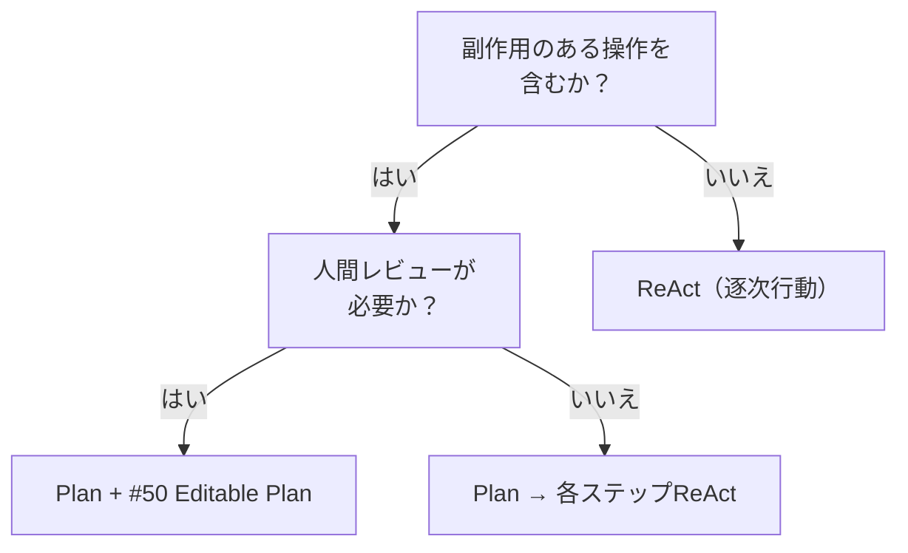

# Plan（計画先行）↔ ReAct（逐次行動）

!!! abstract "一言"
    副作用が大きいなら計画を立ててから実行、探索的で副作用が小さいなら逐次行動（ReAct）。

## 概要

エージェントがタスクに取り組む際、まず全体計画を立ててから実行するか、観察→思考→行動のサイクルを1ステップずつ回すかの選択。計画の質と実行の適応性のバランスが問われる。

## 選択肢の詳細

### Plan（計画先行）

実行前にタスクを分解し、ステップ一覧と依存関係を生成する。人間によるレビューや編集が可能で、副作用のある操作を事前に把握できる。全体を見渡した最適化（並列化・依存の解決）も可能。ただし計画の精度はLLMの推論力に依存し、実行中に前提が崩れると再計画が必要になる。

### ReAct（逐次行動）

各ステップで「観察→推論→行動」を繰り返す。前のステップの結果を踏まえて次のアクションを決めるため、予期しない中間結果に適応しやすい。実装もシンプル。ただし全体最適化が難しく、副作用のあるアクションを戻せない場合にリスクが高い。

## 決定変数

- `[F2]` 失敗コスト — 副作用が不可逆で高コストなら計画先行が安全
- `[F6]` タスクの変動性 — 中間結果に応じて柔軟に方針を変えたいならReAct

## デフォルト（迷ったら）

副作用が大きいタスク（外部API呼び出し、データ変更、課金操作など）では計画先行を選ぶ。読み取り専用の調査や、失敗を安価にリトライできるタスクではReActの即応性が活きる。

## ハイブリッドアプローチ

計画を立てた上で、各ステップの実行はReActで行う二段構え。[#8 Planner-Executor-Reviewer](../../patterns/02-composition/08-planner-executor-reviewer.md) はこのハイブリッドの典型。[#50 Editable Plan](../../patterns/11-ux/50-editable-plan.md) で人間が計画を編集してからReAct実行に移る運用も有効。

## 判断フローチャート

## 関連パターン

- [#8 Planner-Executor-Reviewer](../../patterns/02-composition/08-planner-executor-reviewer.md) — 計画・実行・検証を分離した構成
- [#50 Editable Plan](../../patterns/11-ux/50-editable-plan.md) — 実行前に人間が計画を編集できるUXパターン

## 関連ダイヤル

- [タイムアウト](../dials/timeout.md) — 計画フェーズにもタイムアウトを設け、計画の過剰精緻化を防ぐ
