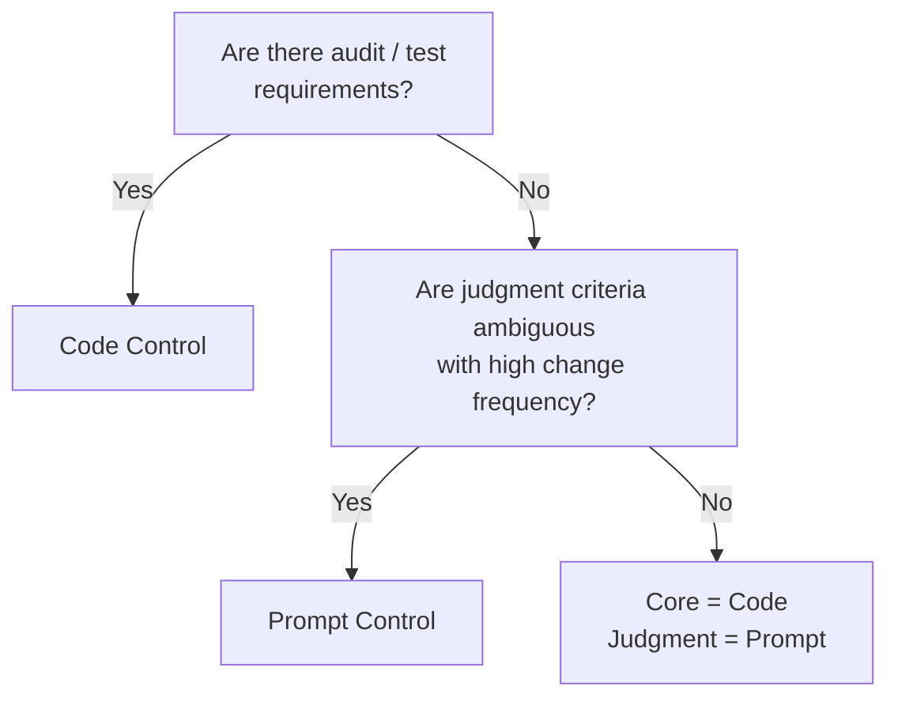

# Prompt Control ↔ Code Control

!!! abstract "TL;DR"
    If testing, version control, and auditing are required, use code control; for flexible judgments and natural language instructions, use prompt control.

## Overview

"If the refund amount exceeds 50,000 yen, route it to the approval flow" — whether this rule is written in natural language in a prompt or as an `if` statement in code significantly changes testability and modification speed. With prompts, even non-engineers can make adjustments, but it is hard to notice when rules have changed unintentionally.

This tradeoff is the choice between controlling agent behavior through prompts (natural language instructions) or through code (conditional branching, rule engines, policy files). It is a tradeoff between agility of change and rigor.

## Option Details

### Prompt Control

Instructs the agent's behavioral policies, judgment criteria, and output formats in natural language. Deployment of changes is fast, and non-engineers can make adjustments. Well-suited for instructions with subtle nuances. However, behavioral reproducibility is low, testing which outputs are affected by prompt changes is difficult, and tracking differences between versions is challenging.

### Code Control

Writes conditional branching, validation, and policy rules as programs. Can be targeted by unit tests and CI/CD, and the impact scope of changes can be understood through static analysis. Git history also functions as an audit trail. On the other hand, changes require engineers, and it is not well-suited for expressing ambiguous judgments.

## Decision Variables

- `[F8]` Accountability / Regulation — If auditing or compliance is required, use code control
- `[F6]` Task Variability — If judgment criteria are ambiguous and change frequently, prompt control's flexibility shines

## Default (When in Doubt)

Default to code control. Testability and version control are ensured from the early stages. Use prompts only for "ambiguous judgments that are difficult to express in code."

## Hybrid Approach

A common configuration fixes flow control, validation, and permission management in code while delegating judgment and text generation at each node to prompts. [#30 Policy-as-Code Guardrail](../../patterns/06-reliability/30-policy-as-code-guardrail.md) is a practical example of codifying constraints while post-inspecting LLM output. [#11 Deterministic Core](../../patterns/02-composition/11-deterministic-core-probabilistic-edge.md) follows the same philosophy.

## Decision Flowchart

## Related Patterns

- [#30 Policy-as-Code Guardrail](../../patterns/06-reliability/30-policy-as-code-guardrail.md) — Codifying constraints for judgment
- [#11 Deterministic Core, Probabilistic Edge](../../patterns/02-composition/11-deterministic-core-probabilistic-edge.md) — Design principle controlling the core with code and the edges with prompts

## Related Dials

- [Timeout](../dials/timeout.md) — Prompt control involves LLM calls, so it has a significant impact on timeout design
