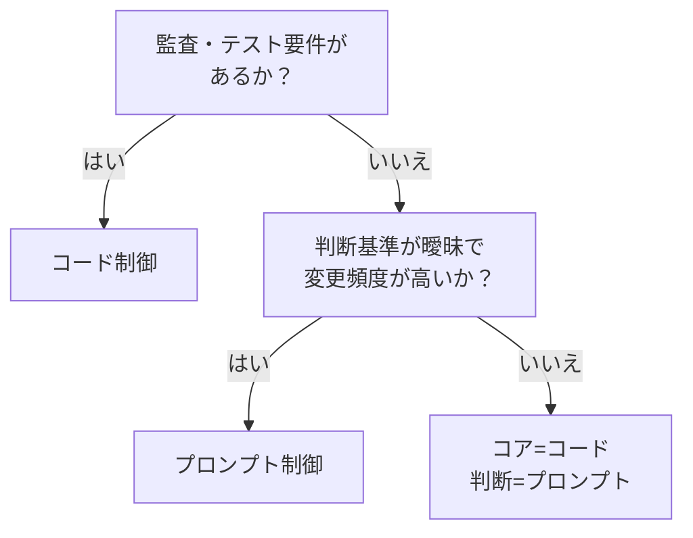

# プロンプト制御 ↔ コード制御

!!! abstract "一言"
    テスト・バージョン管理・監査が求められるならコード制御、柔軟な判断や自然言語的な指示にはプロンプト制御。

## 概要

「返金額が5万円を超えたら承認フローに回す」——このルールをプロンプトに自然言語で書くか、コードの `if` 文で書くかで、テスト可能性と変更速度が大きく変わります。プロンプトなら非エンジニアでも調整できるが、いつの間にかルールが変わっていても気づきにくいです。

この二者択一は、エージェントの振る舞いをプロンプト（自然言語指示）で制御するか、コード（条件分岐・ルールエンジン・ポリシーファイル）で制御するかの選択です。変更の俊敏性と厳密性のトレードオフになります。

## 選択肢の詳細

### プロンプト制御

自然言語でエージェントの行動方針・判断基準・出力フォーマットを指示します。変更のデプロイが速く、非エンジニアでも調整可能。微妙なニュアンスの指示に向きます。ただし挙動の再現性が低く、プロンプトの変更がどの出力に影響するかのテストが困難。バージョン間の差分も追いにくいです。

### コード制御

条件分岐、バリデーション、ポリシールールをプログラムとして記述します。ユニットテスト・CI/CDの対象にでき、変更の影響範囲を静的解析で把握できます。監査証跡としてもGit履歴が機能します。反面、変更にはエンジニアが必要で、曖昧な判断の表現には不向き。

## 決定変数

- `[F8]` 説明責任・規制 — 監査やコンプライアンスが求められるならコード制御
- `[F6]` タスクの変動性 — 判断基準が曖昧で頻繁に変わるならプロンプト制御の柔軟性が活きる

## デフォルト（迷ったら）

コード制御をデフォルトにします。テスト可能性とバージョン管理が初期段階から確保できます。プロンプトは「コードでは表現しにくい曖昧な判断」に限定して使います。

## ハイブリッドアプローチ

フロー制御・バリデーション・権限管理はコードで固め、各ノードでの判断や文章生成はプロンプトに委ねる構成が一般的。[#30 Policy-as-Code Guardrail](../../glossary.md) は制約をコード化しつつ、LLMの出力を事後検査する実例。[#11 Deterministic Core](../../glossary.md) も同じ思想。

## 判断フローチャート

## 関連パターン

- [#30 Policy-as-Code Guardrail](../../glossary.md) — 制約をコード化して判定する
- [#11 Deterministic Core, Probabilistic Edge](../../glossary.md) — 中核をコード、周辺をプロンプトで制御する設計原則

## 関連ダイヤル

- [タイムアウト](../dials/timeout.md) — プロンプト制御はLLM呼び出しを伴うため、タイムアウト設計への影響が大きい

<!-- BEGIN:GEN:patterns -->

## 関与する具体構造

| # | パターン | 向き | 不向き |
|---|---------|------|--------|
| #11 | **Deterministic Core, Probabilistic Edge** | 金融・保険・医療プロトコル、正確な金額・ロジックが必須 | 探索的リサーチ; クリエイティブ生成 |
| #30 | **Policy-as-Code Guardrail** | 金融・医療・法務の高失敗コスト操作、監査証跡が必要、決定論的ルールが可能 | 曖昧なルール（トーン判断）; 形式が曖昧なドメイン |
<!-- END:GEN:patterns -->
