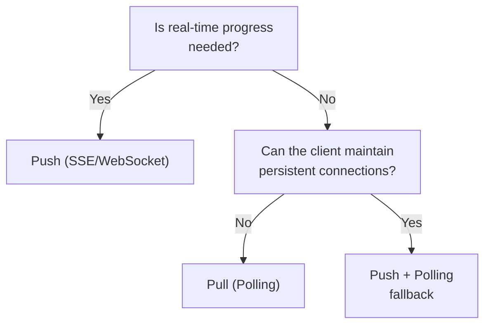

# Push (SSE/Webhook) ↔ Pull (Polling)

!!! abstract "TL;DR"
    If real-time delivery is required, use push; if client constraints or infrastructure simplicity are priorities, use pull.

## Overview

While an agent is generating a report, the user is waiting in front of the browser wondering "how far along is it?" Streaming progress in real-time improves the experience, but maintaining persistent connections and dealing with load balancer compatibility increases the infrastructure burden.

This tradeoff is the choice between push, where the server proactively sends notifications, and pull, where the client periodically queries for updates. It is a tradeoff between real-time responsiveness and infrastructure complexity.

## Option Details

### Push (SSE/Webhook)

The server immediately notifies the client when an event occurs. SSE (Server-Sent Events) is a unidirectional stream over HTTP, WebSocket is bidirectional, and Webhook is a server-to-server callback. Real-time responsiveness is high, and no unnecessary requests are generated. However, maintaining persistent connections, handling reconnection, load balancer compatibility, and ensuring Webhook receiver availability are required.

### Pull (Polling)

The client queries for status at fixed intervals. Implementation is simple and completes within stateless HTTP. It is less affected by firewall or proxy constraints. However, there is delay proportional to the polling interval, and unnecessary requests are generated during periods with no changes.

## Decision Variables

- `[F4]` Latency Budget — If millisecond-to-second level real-time responsiveness is needed, use push
- `[F7]` Cost Sensitivity — Wasted request cost of polling vs. infrastructure cost of push

## Default (When in Doubt)

Default to push. AI agent processing often takes seconds to minutes, and users want to see progress in real-time. SSE is relatively easy to implement and is supported by many frameworks.

## Hybrid Approach

Use push as the primary mechanism while providing a polling endpoint as a fallback for when connections drop or Webhook delivery fails. [#7 Streaming Progress](../../patterns/01-execution/07-streaming-progress.md) is the implementation pattern for push-based progress delivery, and it is common to co-locate a polling status API.

## Decision Flowchart

## Related Patterns

- [#7 Streaming Progress](../../patterns/01-execution/07-streaming-progress.md) — Design pattern for push-based progress streaming

## Related Dials

- [Timeout](../dials/timeout.md) — Related to polling interval and SSE connection keep-alive interval design
