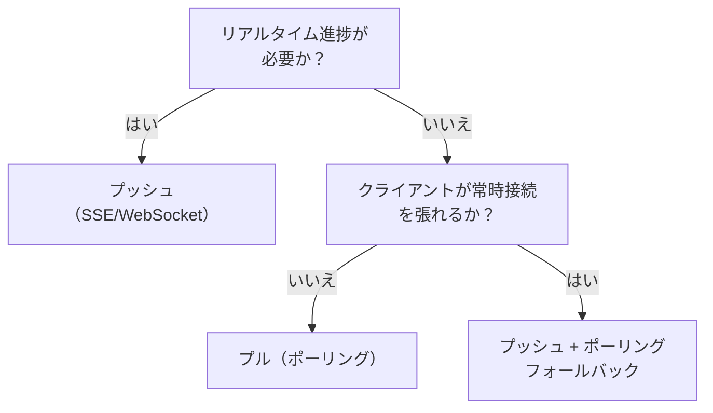

# プッシュ（SSE/Webhook）↔ プル（ポーリング）

!!! abstract "一言"
    リアルタイム性が求められるならプッシュ、クライアントの制約やインフラの簡素さを優先するならプル。

## 概要

エージェントの処理進捗や結果をクライアントに伝える方法として、サーバーから能動的に通知するプッシュと、クライアントが定期的に問い合わせるプルの選択。リアルタイム性とインフラ複雑性のトレードオフになる。

## 選択肢の詳細

### プッシュ（SSE/Webhook）

サーバーがイベント発生時にクライアントへ即座に通知する。SSE（Server-Sent Events）はHTTP上の単方向ストリーム、WebSocketは双方向、Webhookはサーバー間コールバック。リアルタイム性が高く、無駄なリクエストが発生しない。ただし常時接続の維持、再接続処理、ロードバランサとの相性、Webhook受信側の可用性確保が必要。

### プル（ポーリング）

クライアントが一定間隔でステータスを問い合わせる。実装がシンプルで、ステートレスなHTTPで完結する。ファイアウォールやプロキシの制約を受けにくい。ただしポーリング間隔分の遅延があり、変更がない期間も無駄なリクエストが発生する。

## 決定変数

- `[F4]` レイテンシ予算 — ミリ秒〜秒単位のリアルタイム性が必要ならプッシュ
- `[F7]` コスト感度 — ポーリングの無駄なリクエストコスト vs プッシュのインフラコスト

## デフォルト（迷ったら）

プッシュをデフォルトにする。AIエージェントの処理は数秒〜数分かかることが多く、ユーザーは進捗をリアルタイムに見たい。SSEは実装が比較的容易で、多くのフレームワークがサポートしている。

## ハイブリッドアプローチ

プッシュをメインに据えつつ、接続が切れた場合やWebhook配信失敗時のフォールバックとしてポーリングエンドポイントを用意する。[#7 Streaming Progress](../../patterns/01-execution/07-streaming-progress.md) はプッシュによる進捗配信の実装パターンで、ポーリング用のステータスAPIを併設するのが一般的。

## 判断フローチャート

## 関連パターン

- [#7 Streaming Progress](../../patterns/01-execution/07-streaming-progress.md) — プッシュによる進捗ストリーミングの設計パターン

## 関連ダイヤル

- [タイムアウト](../dials/timeout.md) — ポーリング間隔やSSE接続のキープアライブ間隔の設計に関わる
