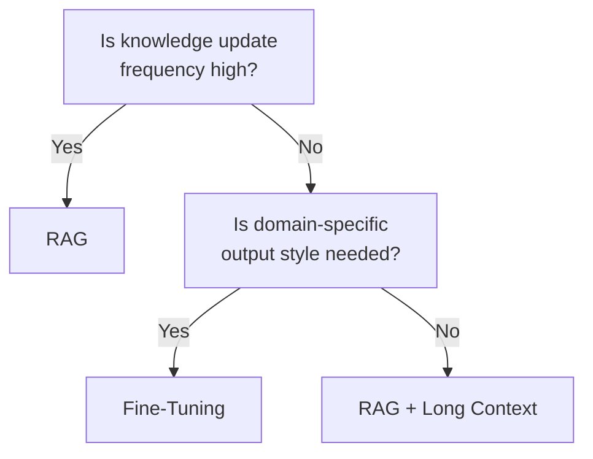

# RAG ↔ Fine-Tuning / Long Context

!!! abstract "TL;DR"
    If information freshness and ease of updates are priorities, use RAG; if internalizing domain knowledge and reducing latency are priorities, use Fine-Tuning.

## Overview

An environment where internal product manuals are updated weekly and one where you need the model to learn specialized medical terminology require fundamentally different approaches to providing knowledge. The former can simply retrieve the latest version via search, while the latter needs to change the model's "vocabulary" itself.

This tradeoff is the choice between RAG — which injects retrieved documents into the prompt — and Fine-Tuning — which trains the model itself with knowledge. With the expansion of long context windows, directly injecting large volumes of documents has also emerged as a third option.

## Option Details

### RAG (Retrieval-Augmented Generation)

Retrieves documents relevant to the query and embeds them in the prompt to generate answers. Updating the knowledge base requires only index rebuilding, and citing sources is easy. Costs are predictable as per-query token consumption. However, it depends on search quality, and if retriever accuracy is low, responses may be based on incorrect context.

### Fine-Tuning / Long Context

Fine-Tuning internalizes domain knowledge into the model's weights. No search is needed at inference time, resulting in low latency. Consistency of output style and format is also high. However, it requires training data preparation, training costs, and model management, and knowledge updates are slow. Long context is an approach that directly injects documents, bypassing RAG's search step, but token costs are high.

## Decision Variables

- `[F7]` Cost Sensitivity — With high query volumes, RAG's token costs can balloon. Fine-Tuning has high upfront costs but can reduce inference costs
- `[F4]` Latency Budget — RAG adds latency due to the search step

## Default (When in Doubt)

Start with RAG. Knowledge updates are easy, and it is easier to keep up with model version upgrades. Consider Fine-Tuning when domain-specific output style or format is needed, or when RAG's search accuracy cannot be sufficiently improved.

## Hybrid Approach

A combination where foundational domain knowledge is internalized through Fine-Tuning and the latest information or case-specific data is supplemented via RAG is effective. When the model already "knows" the fundamentals, it interprets search results better, reducing sensitivity to search quality.

## Decision Flowchart

## Related Patterns

- [#24 Context Pack / Assembly](../../decisions/tradeoffs-catalog/rag-vs-finetuning.md) — Design pattern for context assembly in RAG
- [#27 Evidence-First Answer](../../decisions/tradeoffs-catalog/rag-vs-finetuning.md) — Making evidence explicit in combination with RAG

## Related Dials

- [Timeout](../dials/timeout.md) — RAG's search step affects timeout design
