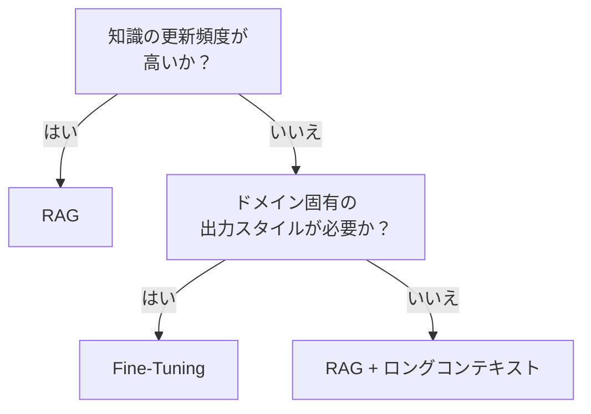

# RAG ↔ Fine-Tuning / ロングコンテキスト

!!! abstract "一言"
    情報の鮮度と更新容易性を重視するならRAG、ドメイン知識の内在化とレイテンシ削減を重視するならFine-Tuning。

## 概要

社内の製品マニュアルが毎週更新される環境と、医療用語の専門的な言い回しを覚えさせたい環境では、知識の与え方が根本的に異なります。前者は検索で最新版を引けばよいが、後者はモデルの「語彙」そのものを変える必要があります。

この二者択一は、検索で取得した文書をプロンプトに注入するRAGと、モデル自体に知識を学習させるFine-Tuningの選択です。ロングコンテキストウィンドウの拡大により、大量文書の直接投入という第三の選択肢も加わっています。

## 選択肢の詳細

### RAG（検索拡張生成）

クエリに関連する文書を検索し、プロンプトに埋め込んで回答を生成します。知識ベースの更新がインデックス再構築だけで済み、ソースの引用も容易。コストはクエリ単位のトークン消費で予測できます。ただし検索品質に依存し、リトリーバの精度が低いと誤った文脈で回答します。

### Fine-Tuning / ロングコンテキスト

Fine-Tuningはドメイン知識をモデルの重みに内在化させります。推論時に検索が不要でレイテンシが低いです。出力のスタイルやフォーマットの一貫性も高いです。ただし学習データの準備・学習コスト・モデル管理が必要で、知識の更新が遅いです。ロングコンテキストは文書を直接投入する手法で、RAGの検索ステップを省略できるが、トークンコストが高いです。

## 決定変数

- `[F7]` コスト感度 — クエリ数が多い場合RAGのトークンコストが膨らみます。Fine-Tuningは初期コスト高だが推論コストを下げうる
- `[F4]` レイテンシ予算 — 検索ステップを挟むRAGはレイテンシが加算される

## デフォルト（迷ったら）

RAGから始めます。知識の更新が容易で、モデルのバージョンアップに追従しやすいです。Fine-Tuningはドメイン固有の出力スタイルやフォーマットが必要な場合、またはRAGの検索精度が十分に上がらない場合に検討します。

## ハイブリッドアプローチ

ドメインの基礎知識はFine-Tuningで内在化し、最新情報や個別案件のデータはRAGで補完する組み合わせが有効。モデルが基礎を「知っている」状態で検索結果を解釈するため、検索品質への感度が下がります。

## 判断フローチャート

## 関連パターン

- [#24 Context Pack / Assembly](../../glossary.md) — RAGにおけるコンテキスト組立の設計パターン
- [#27 Evidence-First Answer](../../glossary.md) — RAGと組み合わせて根拠を明示する

## 関連ダイヤル

- [タイムアウト](../dials/timeout.md) — RAGの検索ステップがタイムアウト設計に影響する

<!-- BEGIN:GEN:patterns -->

## 関与する具体構造

| # | パターン | 向き | 不向き |
|---|---------|------|--------|
| #24 | **Context Pack / Assembly** | 社内ナレッジ、サポート、法務・医療の最新情報依存 | モデルの汎用知識で十分; 極端なリアルタイムストリーム要求 |
| #27 | **Evidence-First Answer** | 法務・医療・金融Q&A、社内ナレッジ検索、監査証跡が必要なサポート | クリエイティブ・ブレインストーミング（正解ソースなし）; 根拠ソースが存在しない |
<!-- END:GEN:patterns -->
