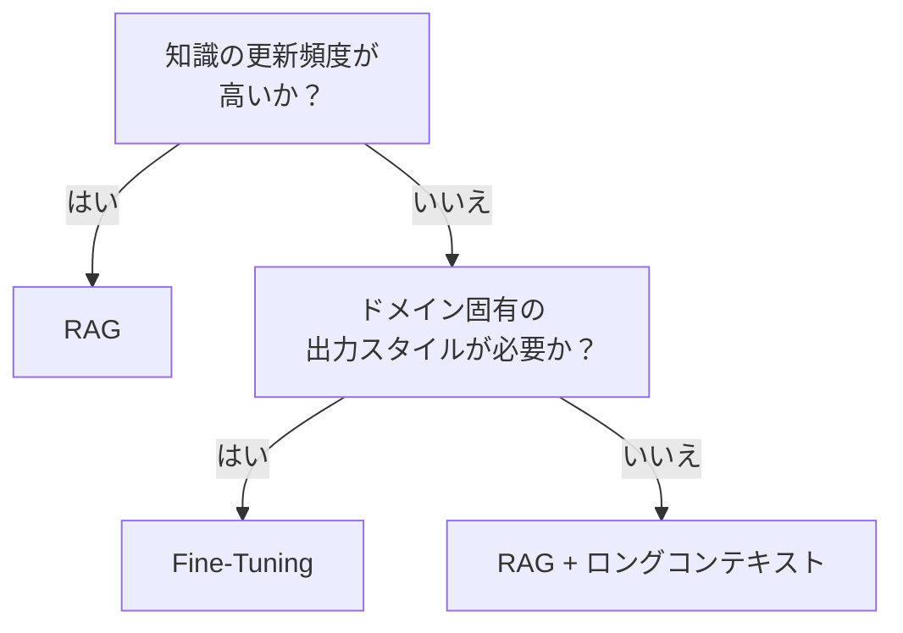

# RAG ↔ Fine-Tuning / ロングコンテキスト

!!! abstract "一言"
    情報の鮮度と更新容易性を重視するならRAG、ドメイン知識の内在化とレイテンシ削減を重視するならFine-Tuning。

## 概要

外部知識をエージェントに与える方法として、検索で取得した文書をプロンプトに注入するRAGと、モデル自体に知識を学習させるFine-Tuningの選択。ロングコンテキストウィンドウの拡大により、大量文書の直接投入という第三の選択肢も加わっている。

## 選択肢の詳細

### RAG（検索拡張生成）

クエリに関連する文書を検索し、プロンプトに埋め込んで回答を生成する。知識ベースの更新がインデックス再構築だけで済み、ソースの引用も容易。コストはクエリ単位のトークン消費で予測できる。ただし検索品質に依存し、リトリーバの精度が低いと誤った文脈で回答する。

### Fine-Tuning / ロングコンテキスト

Fine-Tuningはドメイン知識をモデルの重みに内在化させる。推論時に検索が不要でレイテンシが低い。出力のスタイルやフォーマットの一貫性も高い。ただし学習データの準備・学習コスト・モデル管理が必要で、知識の更新が遅い。ロングコンテキストは文書を直接投入する手法で、RAGの検索ステップを省略できるが、トークンコストが高い。

## 決定変数

- `[F7]` コスト感度 — クエリ数が多い場合RAGのトークンコストが膨らむ。Fine-Tuningは初期コスト高だが推論コストを下げうる
- `[F4]` レイテンシ予算 — 検索ステップを挟むRAGはレイテンシが加算される

## デフォルト（迷ったら）

RAGから始める。知識の更新が容易で、モデルのバージョンアップに追従しやすい。Fine-Tuningはドメイン固有の出力スタイルやフォーマットが必要な場合、またはRAGの検索精度が十分に上がらない場合に検討する。

## ハイブリッドアプローチ

ドメインの基礎知識はFine-Tuningで内在化し、最新情報や個別案件のデータはRAGで補完する組み合わせが有効。モデルが基礎を「知っている」状態で検索結果を解釈するため、検索品質への感度が下がる。

## 判断フローチャート

## 関連パターン

- [#24 Context Pack / Assembly](../../patterns/05-memory-context/24-context-pack-assembly.md) — RAGにおけるコンテキスト組立の設計パターン
- [#27 Evidence-First Answer](../../patterns/06-reliability/27-evidence-first-answer.md) — RAGと組み合わせて根拠を明示する

## 関連ダイヤル

- [タイムアウト](../dials/timeout.md) — RAGの検索ステップがタイムアウト設計に影響する
