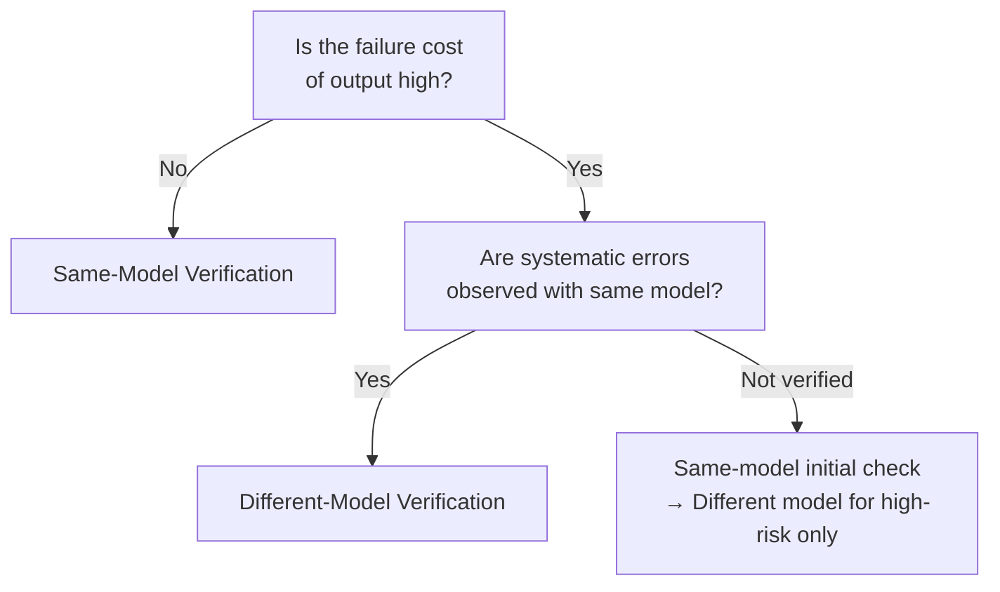

# Same-Model Verification ↔ Different-Model Verification

!!! abstract "TL;DR"
    For cost priority, use same-model self-verification; for high-risk scenarios, use a different model for independent verification to counteract systematic bias.

## Overview

If you ask the author of a report to "check if there are any mistakes," they are unlikely to catch their own errors. LLMs behave the same way — when verifying with the same model that generated the output, oversights tend to occur because they share the same systematic biases.

This tradeoff is the choice between verifying with the same model used for generation or with a different model (different provider or architecture). It is a tradeoff between cost efficiency and verification independence.

## Option Details

### Same-Model Verification

Generation and verification are performed by the same model. No additional model deployment or API contracts are needed, keeping costs low. Simply changing the prompt can separate the "generator" and "verifier" roles. However, since they share the same systematic biases, there is a possibility that errors made during generation are also overlooked during verification.

### Different-Model Verification

Verification is performed with a model different from the one used for generation. If the architecture or training data differs, systematic biases differ, enabling one to detect errors the other misses. This is particularly important in security contexts (resistance to prompt injection varies by model). The tradeoffs are additional API call costs and the cost of absorbing output format differences between models.

## Decision Variables

- `[F2]` Failure Cost — If the impact of failure is significant, independent different-model verification is needed
- `[F7]` Cost Sensitivity — To keep verification costs down, use the same model

## Default (When in Doubt)

Start with same-model self-verification. In many cases, prompt engineering techniques (CoT verification, checklist matching) provide sufficient effectiveness. Transition to different-model verification for high-risk domains (finance, healthcare, security) or when recurring errors from the same model are observed.

## Hybrid Approach

A two-stage approach: perform initial verification with the same model (format, basic consistency), and only route outputs assessed as high-risk to a different model for final verification. This avoids the cost of applying a different model to all outputs while ensuring quality for critical outputs.

## Decision Flowchart

## Related Patterns

- [#28 Verifier Agent / Critic](../../glossary.md) — Design pattern for an independent verification agent
- [#44 Dual-LLM Privilege Separation](../../glossary.md) — Using different LLMs from a security perspective

## Related Dials

- [Retry Count](../dials/retry-count.md) — Affects retry count design when verification fails
