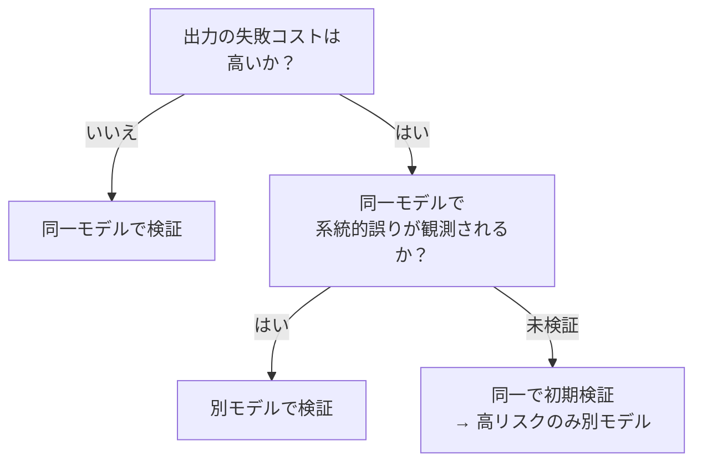

# 同一モデルで検証 ↔ 別モデルで検証

!!! abstract "一言"
    コスト重視なら同一モデルで自己検証、高リスクなら別モデルで独立検証して系統的バイアスを打ち消します。

## 概要

レポートを書いた本人に「間違いがないか確認して」と頼んでも、自分の誤りには気づきにくいです。LLMも同じで、生成したモデルと同じモデルで検証すると、同じ系統的バイアスを共有しているぶん見逃しが起きやすいです。

この二者択一は、生成に使ったモデルと同じモデルで検証するか、異なるモデル（別プロバイダ・別アーキテクチャ）で検証するかの選択です。コスト効率と検証の独立性のトレードオフになります。

## 選択肢の詳細

### 同一モデルで検証

生成と検証を同じモデルで行います。追加のモデルデプロイやAPI契約が不要で、コストが抑えられます。プロンプトを変えるだけで「生成者」と「検証者」の役割を分離できます。ただし同じ系統的バイアスを共有するため、生成時の誤りを検証でも見逃す可能性があります。

### 別モデルで検証

生成と異なるモデルで検証します。アーキテクチャや学習データが異なれば、系統的バイアスが異なるため、片方が見逃す誤りをもう片方が検出できます。セキュリティ文脈では特に重要（プロンプトインジェクションへの耐性がモデルにより異なる）。代償は追加のAPI呼び出しコストと、モデル間の出力形式差の吸収コスト。

## 決定変数

- `[F2]` 失敗コスト — 失敗の影響が大きいなら独立した別モデル検証が必要
- `[F7]` コスト感度 — 検証コストを抑えたいなら同一モデル

## デフォルト（迷ったら）

同一モデルでの自己検証から始めます。多くのケースでプロンプトの工夫（CoT検証、チェックリスト照合）で十分な効果が得られます。高リスク領域（金融、医療、セキュリティ）や、同一モデルでの誤り再発が観測された場合に別モデル検証へ移行します。

## ハイブリッドアプローチ

同一モデルで初期検証（フォーマット、基本的な整合性）を行い、高リスクと判定された出力のみ別モデルで最終検証する二段構え。これにより全出力に別モデルを適用するコストを回避しつつ、重要な出力の品質を担保できます。

## 判断フローチャート

## 関連パターン

- [#28 Verifier Agent / Critic](../../glossary.md) — 独立した検証エージェントの設計パターン
- [#44 Dual-LLM Privilege Separation](../../glossary.md) — セキュリティ観点で異なるLLMを使い分ける

## 関連ダイヤル

- [リトライ回数](../dials/retry-count.md) — 検証失敗時のリトライ回数設計に影響する

<!-- BEGIN:GEN:patterns -->

## 関与する具体構造

| # | パターン | 向き | 不向き |
|---|---------|------|--------|
| #10 | **Agent Ensemble & Debate** | 高リスク判断（医療・金融）、正確性検証、不一致検出が高価値 | 大量低コストリクエスト（N倍コスト）; 主観的クリエイティブ |
| #28 | **Verifier Agent / Critic** | コード生成（テスト検証）、金融レポート、法務文書、公開コンテンツ | リアルタイムチャット; 失敗コスト低のブレインストーミング |
<!-- END:GEN:patterns -->
