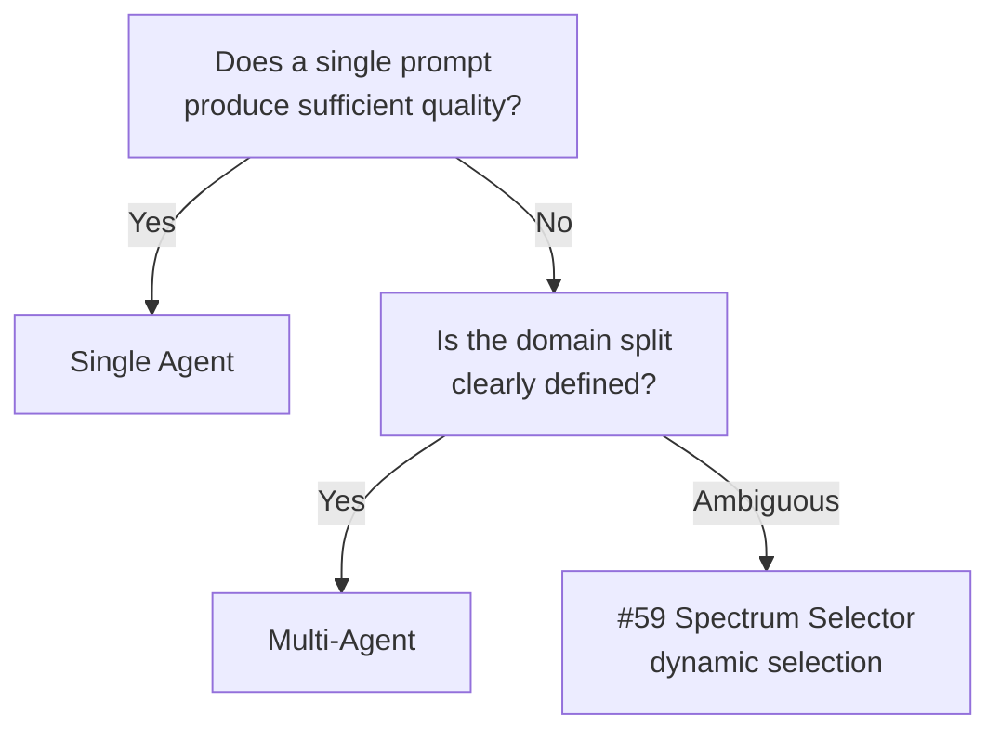

# Single Agent ↔ Multi-Agent

!!! abstract "TL;DR"
    Use a single agent if one suffices. Split into multi-agent when the task's specialization, parallelism, or context window exceeds limits.

## Overview

"Write the code, create tests, and update the documentation too" — if you entrust everything to a single agent, the context balloons and accuracy drops. On the other hand, splitting into specialized agents drives up coordination costs.

This tradeoff is the choice between having a single agent process the entire task or distributing it among multiple agents by role. Splitting can alleviate context window constraints and improve specialization, but it increases communication overhead and debugging difficulty.

## Option Details

### Single Agent

One agent consistently handles tool calls, reasoning, and output. No context handoff is needed, and latency is low. Prompt management is centralized, making testing and debugging easy. This is sufficient when the task scope is narrow and fits within the context window.

### Multi-Agent

Multiple agents with different roles — such as planning, execution, and verification — collaborate. Each agent can have specialized prompts and dedicated tool sets, improving accuracy. Speed-up through parallel execution is also possible. However, the tradeoffs include designing inter-agent communication, handling partial failures, and increased costs.

## Decision Variables

- `[F6]` Task Variability — If the task spans multiple domains and a single prompt cannot produce quality results, lean toward multi-agent
- `[F7]` Cost Sensitivity — Multi-agent increases token consumption. Tight cost constraints create pressure to maintain a single agent

## Default (When in Doubt)

Do not split if a single agent is sufficient. Multi-agent should be considered only when one of the following is clear: a single prompt cannot produce quality results, the context window overflows, or parallelization can significantly speed things up.

## Hybrid Approach

As with [#59 Spectrum Selector](../../glossary.md), there is an approach that dynamically selects single/multi on a per-subtask basis. At the routing or triage stage, difficulty is assessed, and simple tasks are handled by a single agent while only complex ones are routed to multi-agent.

## Decision Flowchart

## Related Patterns

- [#9 Supervisor & Specialist Agents](../../glossary.md) — Multi-agent configuration with a supervisor and specialist roles
- [#59 Workflow-Agent Spectrum Selector](../../glossary.md) — A meta-pattern that selects single/multi per subtask

## Related Dials

- [Timeout](../dials/timeout.md) — Communication overhead from multi-agent affects timeout design
