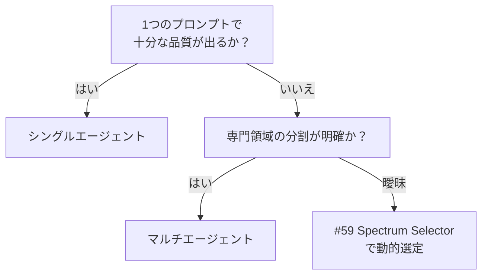

# シングルエージェント ↔ マルチエージェント

!!! abstract "一言"
    1体で済むならシングル。タスクの専門性・並列性・コンテキスト窓が限界を超えたときにマルチへ分割します。

## 概要

「コードを書いて、テストを作って、ドキュメントも更新して」——1体のエージェントにすべて任せると、コンテキストが膨張して精度が落ちます。かといって専門エージェントに分けると、連携コストが跳ね上がります。

この二者択一は、タスク全体を1つのエージェントに処理させるか、役割ごとに複数エージェントへ分担させるかの選択です。分割はコンテキスト窓の制約緩和や専門性の向上に効くが、通信オーバーヘッドとデバッグ難度を引き上げります。

## 選択肢の詳細

### シングルエージェント

1つのエージェントがツール呼び出し・推論・出力を一貫して担います。コンテキストの受け渡しが不要で、レイテンシも低いです。プロンプトの管理が1箇所で済み、テスト・デバッグが容易。タスクの幅が狭く、コンテキスト窓に収まる場合はこれで十分です。

### マルチエージェント

計画・実行・検証など異なる役割を持つ複数エージェントが協調します。各エージェントが専門プロンプトと専用ツールセットを持てるため、精度が上がります。並列実行による高速化も期待できます。ただしエージェント間通信の設計、部分障害の処理、コスト増が代償となります。

## 決定変数

- `[F6]` タスクの変動性 — タスクが多領域にまたがり1つのプロンプトでは品質が出ないならマルチに傾く
- `[F7]` コスト感度 — マルチはトークン消費が増えます。コスト制約が厳しいならシングルを維持する圧力が働く

## デフォルト（迷ったら）

シングルで十分なら分割しません。マルチエージェント化は、単一プロンプトでは品質が出ない、コンテキスト窓が溢れる、並列化で大幅に高速化できる、のいずれかが明確なときに検討します。

## ハイブリッドアプローチ

[#59 Spectrum Selector](../../patterns/01-execution/59-workflow-agent-spectrum-selector.md) のように、サブタスク単位でシングル/マルチを動的に選定する方法があります。ルーティングやトリアージの段階で難易度を判定し、簡単なタスクはシングル、複雑なものだけマルチへ振ります。

## 判断フローチャート

## 関連パターン

- [#9 Supervisor & Specialist Agents](../../patterns/02-composition/09-supervisor-specialist-agents.md) — 統括役と専門役によるマルチエージェント構成
- [#59 Workflow-Agent Spectrum Selector](../../patterns/01-execution/59-workflow-agent-spectrum-selector.md) — サブタスク毎にシングル/マルチを選定するメタパターン

## 関連ダイヤル

- [タイムアウト](../dials/timeout.md) — マルチ化による通信オーバーヘッドがタイムアウト設計に影響する
