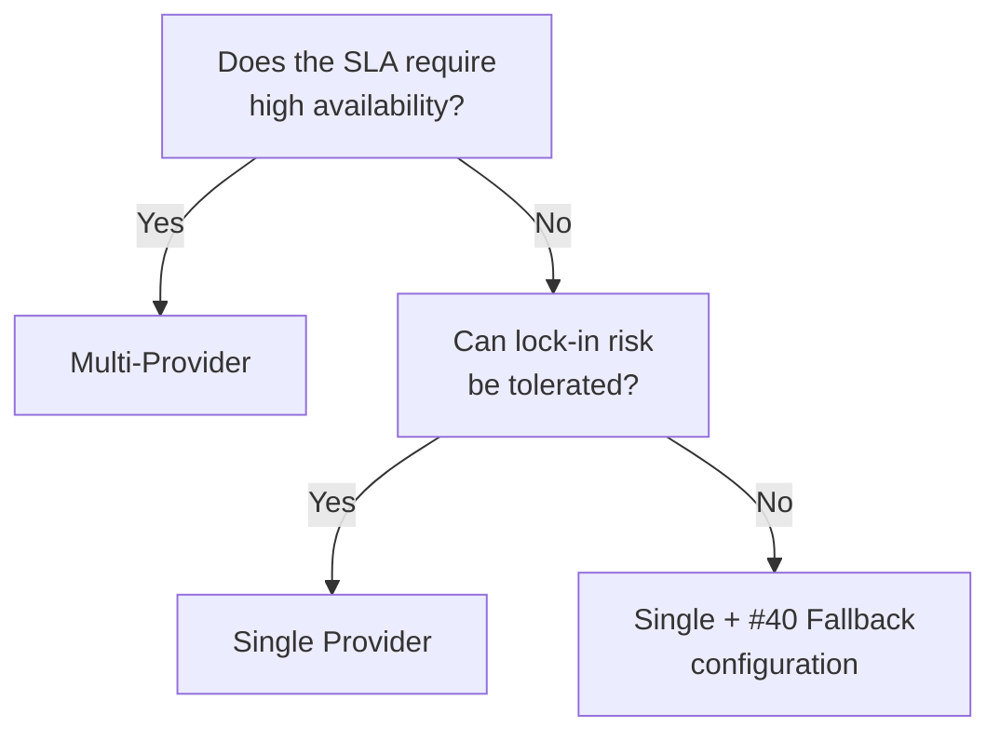

# Single Provider ↔ Multi-Provider

!!! abstract "TL;DR"
    For operational simplicity, choose single provider; for availability and cost optimization, pursue multi-provider.

## Overview

The primary LLM provider went down for 4 hours overnight — can you tolerate the service being stopped until morning, or do you want to switch to another provider immediately? This decision directly impacts architectural complexity and cost.

This tradeoff is the choice between limiting LLM calls to one provider or combining multiple providers. The focus is on balancing lock-in risk with operational complexity.

## Option Details

### Single Provider

Concentrating on one provider's API provides SDK unification, fee structure clarity, and a single support channel. Prompt optimization can also be focused on one model family. However, it is vulnerable to provider outages, price increases, and feature deprecations, and negotiating power is weakened.

### Multi-Provider

Multiple LLM providers are used according to purpose or cost. Having a fallback destination when the primary fails improves availability. Cost optimization through comparison and use-case-based selection (provider A for code generation, provider B for summarization) are also possible. The tradeoffs include building an abstraction layer, optimizing prompts for each model, and absorbing behavioral differences.

## Decision Variables

- `[F9]` Provider Reliability — If there are concerns about provider availability, lean toward multi-provider
- `[F7]` Cost Sensitivity — Multi-provider if you expect competitive pricing benefits

## Default (When in Doubt)

Start with a single provider and move to multi-provider based on outage history or scaling requirements. Investing in a multi-provider abstraction layer at the early stage tends to be over-engineering. However, introducing just the abstraction layer early with [#45 Runtime Abstraction](../../decisions/tradeoffs-catalog/build-vs-buy.md) makes migration easier later.

## Hybrid Approach

Using the approach from [#40 Fallback & Graceful Degradation](../../decisions/tradeoffs-catalog/fail-fast-vs-degradation.md), set up a two-tier configuration of primary + fallback. Rather than always running multi-provider, switch to the secondary only when failure is detected. This maintains availability while keeping operational complexity low.

## Decision Flowchart

## Related Patterns

- [#40 Fallback & Graceful Degradation](../../decisions/tradeoffs-catalog/fail-fast-vs-degradation.md) — Fallback strategy for primary failures
- [#45 Agent Runtime Abstraction](../../decisions/tradeoffs-catalog/build-vs-buy.md) — Abstraction layer to facilitate provider switching

## Related Dials

- [Timeout](../dials/timeout.md) — Timeout value serves as the threshold for fallback switching
