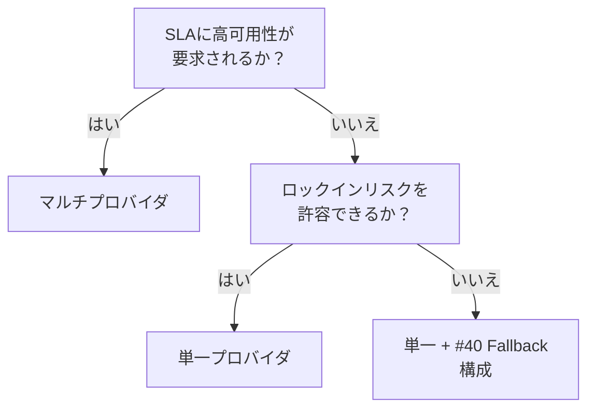

# 単一プロバイダ ↔ マルチプロバイダ

!!! abstract "一言"
    運用の単純さを取るなら単一プロバイダ、可用性とコスト最適化を追求するならマルチプロバイダ。

## 概要

メインで使っているLLMプロバイダが深夜に4時間ダウンした——翌朝までサービスが止まるのを許容できるか、それとも別プロバイダへ即座に切り替えたいか。この判断が、アーキテクチャの複雑さとコストに直結します。

この二者択一は、LLMの呼び出し先を1社に絞るか、複数プロバイダを組み合わせるかの選択です。ロックインリスクと運用複雑性のバランスが焦点になります。

## 選択肢の詳細

### 単一プロバイダ

1社のAPIに集中することで、SDKの統一、料金体系の把握、サポート窓口の一本化が得られます。プロンプトの最適化も1モデル系列に集中できます。ただしプロバイダの障害・値上げ・機能廃止に対して脆弱で、交渉力も弱くなります。

### マルチプロバイダ

複数のLLMプロバイダを用途やコストに応じて使い分けます。プライマリ障害時にフォールバック先があり、可用性が上がります。コスト比較による最適化や、モデル特性に応じた使い分け（コード生成はA社、要約はB社）も可能。代償として、抽象化層の構築・各モデルへのプロンプト最適化・挙動差の吸収が必要になります。

## 決定変数

- `[F9]` プロバイダ信頼度 — プロバイダの可用性に不安があるならマルチへ
- `[F7]` コスト感度 — 競争による値下げ効果を期待するならマルチ

## デフォルト（迷ったら）

単一プロバイダで始め、障害実績やスケール要件に応じてマルチ化します。初期段階でマルチプロバイダの抽象化層に投資するのはオーバーエンジニアリングになりやすいです。ただし [#45 Runtime Abstraction](../../glossary.md) で抽象化層だけは早期に入れておくと移行が楽になります。

## ハイブリッドアプローチ

[#40 Fallback & Graceful Degradation](../../glossary.md) の考え方で、プライマリ＋フォールバックの2層構成にします。常時マルチではなく、障害検知時のみセカンダリへ切り替えます。これにより運用の複雑さを抑えつつ可用性を確保できます。

## 判断フローチャート

## 関連パターン

- [#40 Fallback & Graceful Degradation](../../glossary.md) — プライマリ障害時のフォールバック戦略
- [#45 Agent Runtime Abstraction](../../glossary.md) — プロバイダ切替を容易にする抽象化層

## 関連ダイヤル

- [タイムアウト](../dials/timeout.md) — フォールバック切替の閾値としてタイムアウト値が機能する

<!-- BEGIN:GEN:patterns -->

## 関与する具体構造

| # | パターン | 向き | 不向き |
|---|---------|------|--------|
| #45 | **Agent Runtime Abstraction** | 複数年の本番運用、マルチフレームワーク評価、将来のベンダーリスク | PoC/短期; フレームワーク固有機能への重依存 |
| #46 | **Model Behavior Compatibility Layer** | マルチモデル運用/比較、プロバイダフォールバック、コスト動的ルーティング | 単一ベンダーロックイン許容; ベンダー固有API最大活用 |
| #40 | **Fallback & Graceful Degradation** | 厳格なSLA、マルチプロバイダ利用可能、24/7運用（サポート・ワークフロー自動化） | 単一プロバイダ固定; 専門モデルのみ成功可能（特化モデル依存） |
<!-- END:GEN:patterns -->
