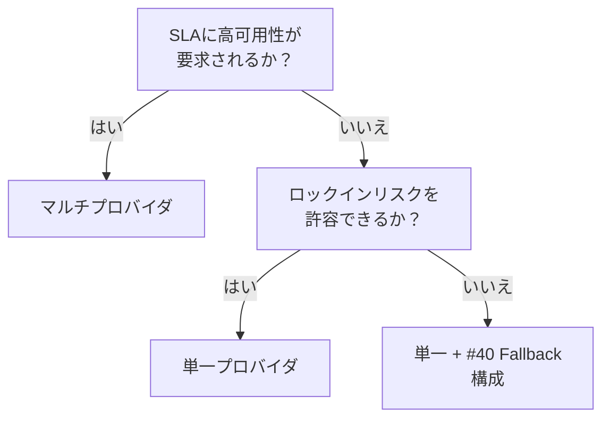

# 単一プロバイダ ↔ マルチプロバイダ

!!! abstract "一言"
    運用の単純さを取るなら単一プロバイダ、可用性とコスト最適化を追求するならマルチプロバイダ。

## 概要

メインで使っているLLMプロバイダが深夜に4時間ダウンした——翌朝までサービスが止まるのを許容できるか、それとも別プロバイダへ即座に切り替えたいか。この判断が、アーキテクチャの複雑さとコストに直結する。

この二者択一は、LLMの呼び出し先を1社に絞るか、複数プロバイダを組み合わせるかの選択である。ロックインリスクと運用複雑性のバランスが焦点になる。

## 選択肢の詳細

### 単一プロバイダ

1社のAPIに集中することで、SDKの統一、料金体系の把握、サポート窓口の一本化が得られる。プロンプトの最適化も1モデル系列に集中できる。ただしプロバイダの障害・値上げ・機能廃止に対して脆弱で、交渉力も弱くなる。

### マルチプロバイダ

複数のLLMプロバイダを用途やコストに応じて使い分ける。プライマリ障害時にフォールバック先があり、可用性が上がる。コスト比較による最適化や、モデル特性に応じた使い分け（コード生成はA社、要約はB社）も可能。代償として、抽象化層の構築・各モデルへのプロンプト最適化・挙動差の吸収が必要になる。

## 決定変数

- `[F9]` プロバイダ信頼度 — プロバイダの可用性に不安があるならマルチへ
- `[F7]` コスト感度 — 競争による値下げ効果を期待するならマルチ

## デフォルト（迷ったら）

単一プロバイダで始め、障害実績やスケール要件に応じてマルチ化する。初期段階でマルチプロバイダの抽象化層に投資するのはオーバーエンジニアリングになりやすい。ただし [#45 Runtime Abstraction](../../patterns/10-deployment/45-agent-runtime-abstraction.md) で抽象化層だけは早期に入れておくと移行が楽になる。

## ハイブリッドアプローチ

[#40 Fallback & Graceful Degradation](../../patterns/08-cost-scaling/40-fallback-graceful-degradation.md) の考え方で、プライマリ＋フォールバックの2層構成にする。常時マルチではなく、障害検知時のみセカンダリへ切り替える。これにより運用の複雑さを抑えつつ可用性を確保できる。

## 判断フローチャート

## 関連パターン

- [#40 Fallback & Graceful Degradation](../../patterns/08-cost-scaling/40-fallback-graceful-degradation.md) — プライマリ障害時のフォールバック戦略
- [#45 Agent Runtime Abstraction](../../patterns/10-deployment/45-agent-runtime-abstraction.md) — プロバイダ切替を容易にする抽象化層

## 関連ダイヤル

- [タイムアウト](../dials/timeout.md) — フォールバック切替の閾値としてタイムアウト値が機能する
