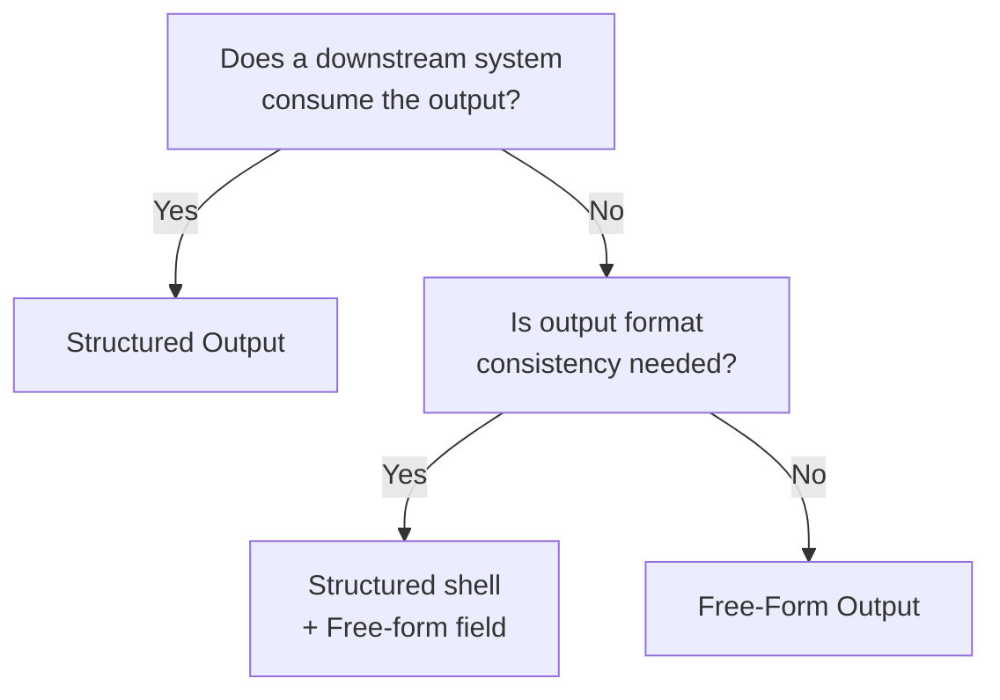

# Enforced Structured Output ↔ Free-Form Output

!!! abstract "TL;DR"
    Use structured output for integration with downstream systems; use free-form for human-facing explanations and creative generation.

## Overview

You want to pass the agent's output to the next API but the JSON format breaks and causes a parse error — enforcing structured output would prevent this, but squeezing a polite explanation for the user into a schema feels restrictive. The optimal level of constraint depends on whether the output "consumer" is a machine or a human.

This tradeoff is the choice between strictly constraining output with JSON Schema or similar formats versus letting it generate freely in natural language. It is a tradeoff between parsability/type safety and richness/flexibility of expression.

## Option Details

### Enforced Structured Output

Output is defined with JSON Schema, Pydantic models, XML, etc., forcing the LLM to produce schema-compliant output. Downstream code can safely parse it, and validation can be automated. Essential for integration with APIs and workflows. However, forcing subtle natural language nuances into a structure can cause information loss. Schema design and maintenance costs also arise.

### Free-Form Output

The LLM responds freely in natural language. Suited for use cases where humans read the output directly, such as explanations, summaries, creative writing, and dialogue. Output diversity and expressiveness are leveraged. However, parsing output is difficult, and parsers or post-processing are needed for downstream integration. Output format consistency is also not guaranteed.

## Decision Variables

- `[F8]` Accountability / Regulation — If each output field needs to be tracked for auditing, use structured output
- `[F6]` Task Variability — For tasks where output shape is unpredictable, free-form is pragmatic

## Default (When in Doubt)

Use structured output when there is a downstream system (API, database, another agent). Use free-form when the final reader is a human. When in doubt, start with structured — it is safer than loosening from structured to free-form later.

## Hybrid Approach

A versatile pattern is "structured shell + free-form content": output judgments, actions, and metadata as structured fields while placing user-facing explanation text in a free-form field. Define the schema with [#14 Structured Output Contract](../../decisions/tradeoffs-catalog/structured-vs-freeform.md) and include a free-text field like `explanation: str` within it — this is the typical pattern.

## Decision Flowchart

## Related Patterns

- [#14 Structured Output Contract](../../decisions/tradeoffs-catalog/structured-vs-freeform.md) — Design pattern for contracting output via schema
- [#15 Inverted Structured Output](../../decisions/tradeoffs-catalog/llm-vs-tool.md) — Structuring intermediate judgments rather than final output

## Related Dials

- [Retry Count](../dials/retry-count.md) — Relates to retry strategy for structured output parse failures
