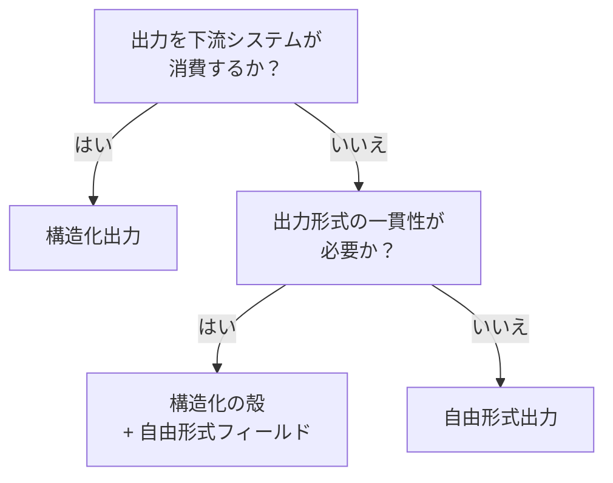

# 構造化出力の強制 ↔ 自由形式出力

!!! abstract "一言"
    下流システムとの連携には構造化出力、人間向けの説明や創造的生成には自由形式。

## 概要

エージェントの出力を次のAPIに渡したいのにJSON形式が崩れてパースエラーになる——構造化出力を強制すれば防げるが、ユーザー向けの丁寧な説明文までスキーマに押し込めると窮屈になります。出力の「消費者」が機械なのか人間なのかで、最適な制約レベルは変わります。

この二者択一は、出力をJSONスキーマ等で厳密に制約するか、自然言語のまま自由に生成させるかの選択です。パース可能性・型安全性と、表現の豊かさ・柔軟性のトレードオフになります。

## 選択肢の詳細

### 構造化出力の強制

出力をJSON Schema、Pydanticモデル、XML等で定義し、LLMにスキーマ準拠の出力を強制します。下流のコードが安全にパースでき、バリデーションも自動化できます。APIやワークフローとの連携で必須。ただし自然言語の微妙なニュアンスを構造に押し込めると情報が欠落します。スキーマの設計・保守コストも発生します。

### 自由形式出力

LLMが自然言語で自由に回答します。説明、要約、創作、対話など人間が直接読むユースケースに適します。出力の多様性や表現力が活きます。ただし出力のパースが困難で、下流処理との連携にはパーサーや後処理が必要。出力形式の一貫性も保証されません。

## 決定変数

- `[F8]` 説明責任・規制 — 監査で出力の各フィールドを追跡する必要があるなら構造化
- `[F6]` タスクの変動性 — 出力の形が予測できないタスクでは自由形式が現実的

## デフォルト（迷ったら）

下流にシステム（API、データベース、別エージェント）がある場合は構造化出力。最終的に人間が読む場合は自由形式。迷ったら構造化にしておくと、後から自由形式に緩めるより安全。

## ハイブリッドアプローチ

判断・アクション・メタデータは構造化フィールドで出力し、ユーザー向けの説明文は自由形式フィールドに収める「構造化の殻＋自由形式の中身」が汎用的。[#14 Structured Output Contract](../../glossary.md) でスキーマを定義し、その中に `explanation: str` のような自由テキスト欄を設けるパターンが典型。

## 判断フローチャート

## 関連パターン

- [#14 Structured Output Contract](../../glossary.md) — 出力をスキーマで契約化する設計パターン
- [#15 Inverted Structured Output](../../glossary.md) — 最終出力でなく中間判断を構造化する

## 関連ダイヤル

- [リトライ回数](../dials/retry-count.md) — 構造化出力のパース失敗時のリトライ戦略に関わる

<!-- BEGIN:GEN:patterns -->

## 関与する具体構造

| # | パターン | 向き | 不向き |
|---|---------|------|--------|
| #14 | **Structured Output Contract** | APIレスポンス生成、フォーム入力、データ抽出、ワークフロールーティング | 自由テキスト（レポート・メール）; フォーマットが表現力を潰す場合 |
<!-- END:GEN:patterns -->
