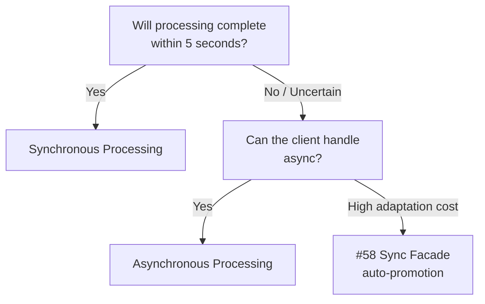

# Synchronous Processing ↔ Asynchronous Processing

!!! abstract "TL;DR"
    If processing completes within seconds, use synchronous; if it exceeds that, switch to asynchronous — the deciding criterion is the user's waiting tolerance `[F4]`.

## Overview

When you ask an agent to summarize a document, it might return in 10 seconds or take 3 minutes. In this situation where "processing time is unpredictable," how should you respond to the user?

This tradeoff is the choice between returning the request immediately as an HTTP response or issuing a job ID and delivering results later. The focus is on balancing processing time predictability with UX responsiveness.

## Option Details

### Synchronous Processing

The client sends a request and maintains the connection until results are returned. Implementation is simple and debugging is straightforward. Suited for tasks where response time is predictable and short (hundreds of milliseconds to a few seconds). However, it is constrained by load balancer and proxy timeouts and cannot handle long-running processes.

### Asynchronous Processing

Returns `202 Accepted` with a job ID upon receiving the request and submits the processing to a queue. The web tier and worker tier can be scaled independently, and retry on failure, interruption, and resumption are handled naturally. On the other hand, the client side needs to implement polling or SSE reception, increasing development and operational costs.

## Decision Variables

- `[F4]` Latency Budget — If processing time exceeds the user's waiting tolerance (typically 5–10 seconds), lean toward asynchronous
- `[F1]` Reversibility — If retry or compensation on failure is needed, asynchronous is advantageous as it can manage state as a job

## Default (When in Doubt)

Start with synchronous if completion within a few seconds is expected. Synchronous has lower implementation, testing, and debugging costs, and most clients can use it without additional implementation. If processing time is uncertain or may run long, choose asynchronous from the start.

## Hybrid Approach

[#58 Sync Facade over Async Core](../../glossary.md) is the representative hybrid strategy. Internally, processing is always asynchronous, and if it completes within the threshold time, it is returned as a synchronous response. If it exceeds the threshold, it switches to a job ID. Clients enjoy the simplicity of synchronous for short tasks while ensuring long-running tasks are not interrupted.

## Decision Flowchart

## Related Patterns

- [#1 Request-to-Job Gateway](../../glossary.md) — The basic implementation pattern for asynchronous request acceptance
- [#58 Sync Facade over Async Core](../../glossary.md) — A hybrid that automatically switches between synchronous and asynchronous

## Related Dials

- [Timeout](../dials/timeout.md) — The threshold for synchronous waiting (in seconds) defines the boundary of this tradeoff
