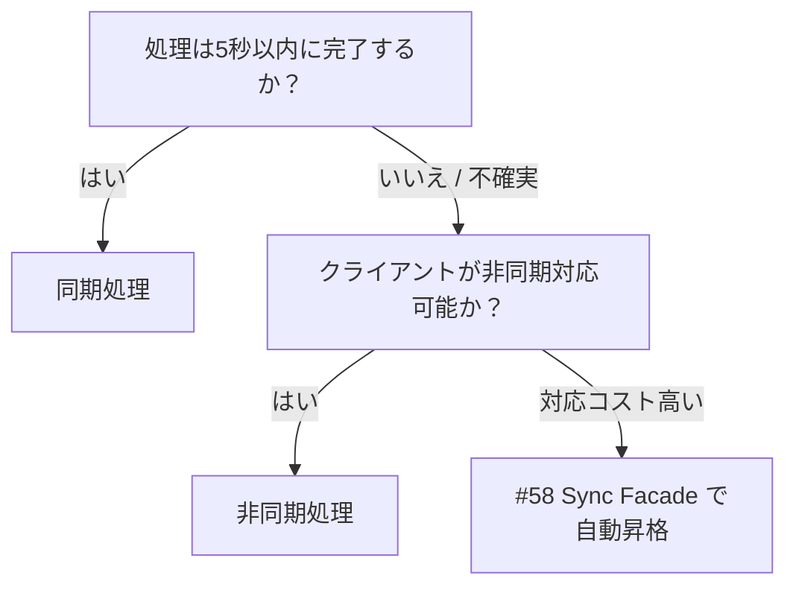

# 同期処理 ↔ 非同期処理

!!! abstract "一言"
    処理が数秒で終わるなら同期、超えるなら非同期に切り替える——判断基準はユーザーの待機耐性 `[F4]` である。

## 概要

AIエージェントへのリクエストを、HTTPレスポンスとして即座に返すか、ジョブIDを発行して後から結果を受け取るかの選択。処理時間の予測可能性とUXの即応性のバランスが焦点になる。

## 選択肢の詳細

### 同期処理

クライアントがリクエストを送り、結果が返るまで接続を維持する。実装がシンプルでデバッグも容易。レスポンスタイムが予測可能で短い（数百ms〜数秒）タスクに適する。ただしロードバランサやプロキシのタイムアウトに縛られ、長時間処理には耐えられない。

### 非同期処理

リクエスト受付時に `202 Accepted` とジョブIDを返し、処理をキューへ投入する。Web層とワーカー層を独立にスケールでき、失敗時のリトライや中断・再開も自然に扱える。一方、クライアント側にポーリングやSSE受信の実装が必要になり、開発・運用コストが増す。

## 決定変数

- `[F4]` レイテンシ予算 — 処理時間がユーザーの待機耐性（通常5〜10秒）を超えるなら非同期に傾く
- `[F1]` 可逆性 — 失敗時にリトライ・補償が必要なら、ジョブとして状態管理できる非同期が有利

## デフォルト（迷ったら）

数秒以内に完了する見込みがあれば同期で始める。同期は実装・テスト・デバッグのコストが低く、ほとんどのクライアントが追加実装なしで利用できる。処理時間が不確実または長時間化する可能性があるなら、最初から非同期を選ぶ。

## ハイブリッドアプローチ

[#58 Sync Facade over Async Core](../../patterns/01-execution/58-sync-facade-over-async-core.md) が代表的なハイブリッド戦略。内部は常に非同期で処理し、閾値時間内に完了すれば同期レスポンスとして返す。超えた場合はジョブIDに切り替える。クライアントは短いタスクでは同期の簡潔さを享受しつつ、長時間タスクでも途切れない。

## 判断フローチャート

## 関連パターン

- [#1 Request-to-Job Gateway](../../patterns/01-execution/01-request-to-job-gateway.md) — 非同期受付の基本実装パターン
- [#58 Sync Facade over Async Core](../../patterns/01-execution/58-sync-facade-over-async-core.md) — 同期と非同期を自動切替するハイブリッド

## 関連ダイヤル

- [タイムアウト](../dials/timeout.md) — 同期待機の閾値を何秒に設定するかがこの択一の境界線になる
