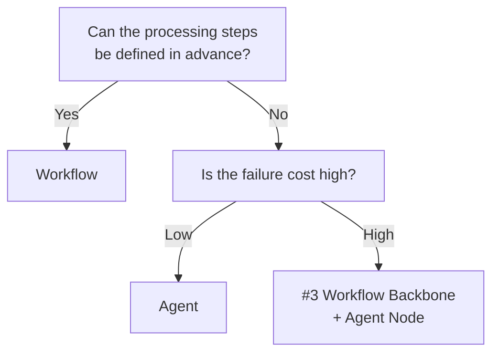

# Workflow (Deterministic) ↔ Agent (Autonomous)

!!! abstract "TL;DR"
    If the procedure is predetermined, use a workflow; if it is exploratory and cannot be defined in advance, use an agent.

## Overview

Monthly invoice processing where procedures are fixed and a research task that investigates and answers a user's ambiguous question require fundamentally different execution methods. The former is more stable with fixed steps, while the latter needs the flexibility to adapt based on the situation.

This tradeoff is the choice between a deterministic workflow where the processing flow is defined in code in advance and an agent where the LLM autonomously decides the next action based on the situation. It is a tradeoff between predictability and flexibility.

## Option Details

### Workflow (Deterministic)

The step order, branching, and loops are explicitly defined in code or a DAG. Since the same input follows the same path, reproducibility is high, and testing and debugging are easy. Cost prediction is also straightforward. However, it is weak against unexpected input patterns, and maintenance becomes difficult as branches increase.

### Agent (Autonomous)

The LLM dynamically determines tool selection, execution order, and termination conditions. It can adapt to unknown tasks and diverse inputs, covering a wide range with minimal code. The tradeoffs are that execution paths become non-deterministic, cost and time upper bounds are hard to predict, and there are risks of hallucination and infinite loops.

## Decision Variables

- `[F6]` Task Variability — Routine tasks favor workflows; exploratory tasks favor agents
- `[F2]` Failure Cost — If failure is high-cost, deterministic control is safer

## Default (When in Doubt)

Start with workflows for routine tasks. Workflows have advantages in reproducibility, testability, and cost prediction. A gradual approach that delegates only the high-variability parts to agents is sound.

## Hybrid Approach

[#59 Spectrum Selector](../../decisions/tradeoffs-catalog/workflow-vs-agent.md) dynamically selects workflow or agent per subtask. [#3 Workflow Backbone](../../decisions/tradeoffs-catalog/workflow-vs-agent.md) fixes the skeleton as a workflow and delegates only the nodes requiring judgment to agents. Both adopt the strategy of "maximizing the scope covered by determinism and minimizing autonomy."

## Decision Flowchart

## Related Patterns

- [#3 Workflow Backbone + Agent Node](../../decisions/tradeoffs-catalog/workflow-vs-agent.md) — Hybrid incorporating agent nodes into a deterministic skeleton
- [#11 Deterministic Core, Probabilistic Edge](../../decisions/tradeoffs-catalog/prompt-vs-code.md) — Design principle of fixing the core with determinism and using AI only at the edges
- [#59 Workflow-Agent Spectrum Selector](../../decisions/tradeoffs-catalog/workflow-vs-agent.md) — Meta-pattern for per-subtask selection

## Related Dials

- [Timeout](../dials/timeout.md) — Timeout control is essential for autonomous agent execution
