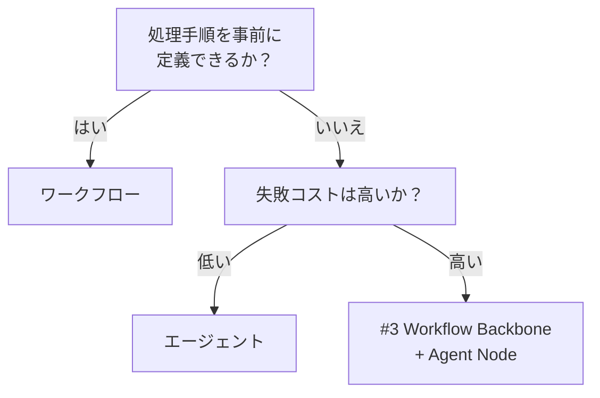

# ワークフロー（決定論的）↔ エージェント（自律的）

!!! abstract "一言"
    手順が決まっているならワークフロー、探索的で事前に手順を定義できないならエージェント。

## 概要

毎月の請求書処理のように手順が決まった業務と、ユーザーの曖昧な質問を調べて回答する調査業務では、最適な実行方式が根本的に異なります。前者はステップを固定した方が安定し、後者は状況に応じて動きを変える柔軟さが要ります。

この二者択一は、処理フローを事前にコードで定義する決定論的ワークフローと、LLMが状況に応じて次のアクションを自律的に決めるエージェントの選択です。予測可能性と柔軟性のトレードオフになります。

## 選択肢の詳細

### ワークフロー（決定論的）

ステップの順序・分岐・ループをコードやDAGで明示的に定義します。同じ入力に対して同じ経路を通るため再現性が高く、テスト・デバッグが容易。コスト予測も立てやすいです。ただし想定外の入力パターンに弱く、分岐が増えると保守が困難になります。

### エージェント（自律的）

LLMがツールの選択・実行順序・終了条件を動的に判断します。未知のタスクや多様な入力に適応でき、少ないコードで広い範囲をカバーできます。代償として、実行経路が非決定的になり、コスト・時間の上限が読みにくく、ハルシネーションや無限ループのリスクがあります。

## 決定変数

- `[F6]` タスクの変動性 — 定型タスクならワークフロー、探索的タスクならエージェント
- `[F2]` 失敗コスト — 失敗が高コストなら決定論的な制御が安全

## デフォルト（迷ったら）

定型タスクはワークフローで始めます。ワークフローは再現性・テスト容易性・コスト予測で優位。タスクの変動性が高い部分だけをエージェントに委譲する段階的アプローチが堅実。

## ハイブリッドアプローチ

[#59 Spectrum Selector](../../patterns/01-execution/59-workflow-agent-spectrum-selector.md) はサブタスク毎にワークフローかエージェントかを動的に選定します。[#3 Workflow Backbone](../../patterns/01-execution/03-workflow-backbone-agent-node.md) は骨格をワークフローで固め、判断が必要なノードだけをエージェントに委ねります。両者とも「決定論でカバーできる範囲を最大化し、自律は必要最小限に」という戦略を取ります。

## 判断フローチャート

## 関連パターン

- [#3 Workflow Backbone + Agent Node](../../patterns/01-execution/03-workflow-backbone-agent-node.md) — 決定論骨格にエージェントノードを組み込むハイブリッド
- [#11 Deterministic Core, Probabilistic Edge](../../patterns/02-composition/11-deterministic-core-probabilistic-edge.md) — 中核を決定論で固め周辺だけAIにする設計原則
- [#59 Workflow-Agent Spectrum Selector](../../patterns/01-execution/59-workflow-agent-spectrum-selector.md) — サブタスク単位で選定するメタパターン

## 関連ダイヤル

- [タイムアウト](../dials/timeout.md) — エージェントの自律実行にはタイムアウト制御が不可欠

<!-- BEGIN:GEN:patterns -->

## 関与する具体構造

| # | パターン | 向き | 不向き |
|---|---------|------|--------|
| #3 | **Workflow Backbone + Agent Node** | 固定手順にAI判断を組み込む場面、規制業種で再現性が必要 | F6=高（探索的タスク）; 手順が動的に変化する場合 |
| #59 | **Workflow–Agent Spectrum Selector** | 複数サブタスクのシステム設計、定型と探索が混在するタスク | 単一タスクの自明なケース; 全て明確に定型または探索 |
<!-- END:GEN:patterns -->
