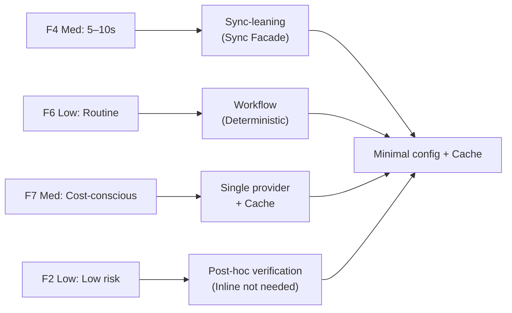
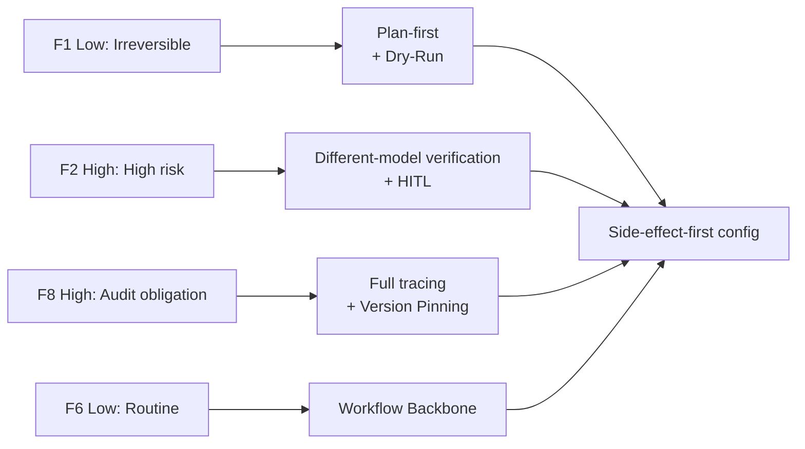
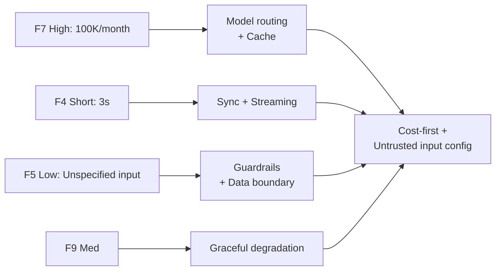

# Worked Examples

!!! abstract "TL;DR"
    Demonstrates "Force Evaluation → Either-Or → Dials → Composite Architecture → ADR" end-to-end with 3 concrete systems.

## Purpose of This Chapter

Theory alone makes it hard to understand "how do I actually use this?" Here we demonstrate steps (1)–(5) of the [Decision-Making Process](decision-flow.md) using concrete systems as subjects. The causal flow of "forces drive pattern selection through either-or decisions and dials" is presented in a traceable, arrow-following format.

---

## Example 1: Internal Document RAG Chatbot

### Context

A chatbot that searches internal documents (Confluence/Notion) and answers employee questions. Approximately 500 internal users, several thousand queries per month.

### Force Evaluation

| Force | Rating | Rationale |
|---------|------|------|
| F1 Reversibility | **High** | Read-only. No side effects |
| F2 Failure Cost | **Low** | Incorrect answers are not critical to operations |
| F3 Request Value | **Low** | Large volume of lightweight questions |
| F4 Latency Budget | **Medium** | Want to respond within 5–10 seconds |
| F5 Input Trustworthiness | **High** | Internal users only |
| F6 Task Variability | **Low** | Fixed pattern of search + summarization |
| F7 Cost Sensitivity | **Medium** | Monthly budget exists |
| F8 Accountability | **Low** | Internal tool |
| F9 Provider Reliability | **Medium** | Starting with a single provider |

### Decision-Making

| Either-Or | Selection | Decisive Force |
|---------|------|--------------|
| Sync vs. Async | **Sync** (with Sync Facade promoting to async on overflow) | F4 Med |
| Workflow vs. Agent | **Workflow** | F6 Low |
| RAG vs. FT | **RAG** | High document update frequency |
| Single vs. Multi-Provider | **Single** | F9 Med (no issues yet) |
| Inline vs. Post-hoc Verification | **Post-hoc** | F2 Low |

| Dial | Setting | Rationale |
|---------|--------|------|
| Timeout | Sync 8s / Async 2min | F4 Med |
| Retrieval top-k | 10 | Balance of accuracy and latency |
| Cache similarity threshold | 0.95 | F7 Med for cost reduction |
| Trace sampling rate | 10% | F8 Low |

### Adopted Patterns

[Minimal Configuration](../reference-architectures/01-mvp.md) + Cache layer:

- [#58 Sync Facade](../decisions/tradeoffs-catalog/sync-vs-async.md) — Sync/async hybrid
- [#24 Context Pack / Assembly](../decisions/tradeoffs-catalog/rag-vs-finetuning.md) — RAG
- [#14 Structured Output Contract](../decisions/tradeoffs-catalog/structured-vs-freeform.md) — Output structuring
- [#38 Semantic Result Cache](../decisions/dials/cache-similarity.md) — Similar query reuse
- [#32 Agent Trace](../decisions/dials/trace-sampling-rate.md) — Minimal observability

### Re-evaluation Conditions

- If F7 becomes High (QPS exceeds 10x) → Add model routing [#37]
- If F8 becomes High (audit requirements added) → Switch to 100% tracing, add Version Pinning [#33]

---

## Example 2: Payment Assistance Agent

### Context

An agent that assists with payment processing for an e-commerce site. Performs order confirmation, inventory lookup, payment API calls, and confirmation email dispatch.

### Force Evaluation

| Force | Rating | Rationale |
|---------|------|------|
| F1 Reversibility | **Low** | Payments and email dispatch are irreversible |
| F2 Failure Cost | **High** | Incorrect charges require refunds and damage trust |
| F3 Request Value | **High** | Each transaction is worth hundreds to thousands of dollars |
| F4 Latency Budget | **Medium** | ~30 seconds is acceptable |
| F5 Input Trustworthiness | **Medium** | Authenticated users but natural language input |
| F6 Task Variability | **Low** | Fixed flow: order → confirm → pay → notify |
| F7 Cost Sensitivity | **Low** | LLM cost is negligible relative to transaction amount |
| F8 Accountability | **High** | Payment record retention obligations |
| F9 Provider Reliability | **Medium** | Availability matters, but human fallback on failure |

### Decision-Making

| Either-Or | Selection | Decisive Force |
|---------|------|--------------|
| Sync vs. Async | **Async** | F4 Med (may exceed 30s) |
| Plan vs. ReAct | **Plan-first** | F1 Low, F2 High |
| Workflow vs. Agent | **Workflow** | F6 Low |
| Inline vs. Post-hoc Verification | **Inline** | F2 High |
| Same vs. Different-Model Verification | **Different model** | F2 High |

| Dial | Setting | Rationale |
|---------|--------|------|
| Checkpoint frequency | Every step | F1 Low |
| Autonomy level | Low (mandatory human approval before payment) | F2 High |
| Trace sampling rate | 100% | F8 High |
| Guardrail strictness | High (amount anomaly detection) | F2 High |

### Adopted Patterns

[Side-Effect-First Configuration](../reference-architectures/02-side-effect-first.md):

- [#1 Request-to-Job Gateway](../decisions/tradeoffs-catalog/sync-vs-async.md) — Async reception
- [#3 Workflow Backbone](../decisions/tradeoffs-catalog/workflow-vs-agent.md) — Deterministic flow
- [#4 Agent Saga](../decisions/dials/checkpoint-frequency.md) — Compensating transactions
- [#15 Inverted Structured Output](../decisions/tradeoffs-catalog/llm-vs-tool.md) — LLM handles judgment only
- [#19 Dry-Run First](../foundations/forces/f1-reversibility.md) — Simulated execution
- [#28 Verifier Agent](../decisions/tradeoffs-catalog/inline-vs-post-verification.md) — Different-model verification
- [#31 Human Approval](../decisions/dials/autonomy-level.md) — Pre-payment approval
- [#32 Agent Trace](../decisions/dials/trace-sampling-rate.md) + [#33 Version Pinning](../decisions/dials/prompt-storage.md) — Audit trail

### Re-evaluation Conditions

- If F7 becomes High (sudden transaction volume increase) → Add routing [#37] and cache [#38]
- If F9 becomes Low → Add fallback [#40]

---

## Example 3: High-Volume Customer Support Bot

### Context

A customer support chatbot handling 100,000 inquiries per month. Provides FAQ answers, order status lookups, and return procedure guidance. Used directly by end users.

### Force Evaluation

| Force | Rating | Rationale |
|---------|------|------|
| F1 Reversibility | **Medium** | FAQ answers are reversible; return procedures are partially irreversible |
| F2 Failure Cost | **Medium** | Incorrect guidance leads to complaints but is not critical |
| F3 Request Value | **Low** | Large volume of routine inquiries |
| F4 Latency Budget | **Short** | First response within 3 seconds |
| F5 Input Trustworthiness | **Low** | Natural language from unspecified end users |
| F6 Task Variability | **Medium** | Mix of routine FAQs and non-routine consultations |
| F7 Cost Sensitivity | **High** | Scale of 100K/month |
| F8 Accountability | **Medium** | Customer interaction record retention |
| F9 Provider Reliability | **Medium** | Downtime directly impacts customer experience |

### Decision-Making

| Either-Or | Selection | Decisive Force |
|---------|------|--------------|
| Sync vs. Async | **Sync** (with streaming) | F4 Short |
| Single vs. Multi-Agent | **Single** + routing | F7 High |
| RAG vs. FT | **RAG** | FAQ update frequency |
| Fail-fast vs. Degradation | **Degradation** | F9 Med |
| Structured vs. Free-form Output | **Hybrid** (structured internally, free-form for users) | F5 Low |

| Dial | Setting | Rationale |
|---------|--------|------|
| Timeout | Sync 5s | F4 Short |
| Model tier threshold | Smaller model when confidence ≥ 0.85 | F7 High |
| Cache similarity threshold | 0.93 | F7 High (hit rate priority) |
| Guardrail strictness | Medium–High | F5 Low |
| Trace sampling rate | 5% | F7 High + F8 Med |
| Retrieval top-k | 5 | F4 Short (speed priority) |

### Adopted Patterns

[Cost-First Configuration](../reference-architectures/05-cost-first.md) + [Untrusted Input Configuration](../reference-architectures/03-untrusted-input.md):

- [#37 Semantic Gateway](../decisions/dials/model-tier-routing.md) — Difficulty-based routing
- [#38 Semantic Result Cache](../decisions/dials/cache-similarity.md) — FAQ similar query reuse
- [#56 Adaptive Effort](../foundations/forces/f7-cost-sensitivity.md) — Computation adjustment
- [#40 Fallback](../decisions/tradeoffs-catalog/fail-fast-vs-degradation.md) — Degradation on failure
- [#13 NL Boundary Adapter](../foundations/forces/f5-input-trust.md) — Input structuring
- [#42 Data Boundary Firewall](../foundations/forces/f5-input-trust.md) — PII inspection
- [#29 Guardrail Sidecar](../decisions/tradeoffs-catalog/inline-vs-post-verification.md) — Output inspection
- [#7 Streaming Progress](../decisions/tradeoffs-catalog/push-vs-pull.md) — Incremental response

### Re-evaluation Conditions

- If F2 becomes High (adding automated return processing) → Add Agent Saga [#4], Human Approval [#31]
- If F8 becomes High (regulatory compliance) → Switch to 100% tracing, add Policy-as-Code [#30]

---

## Summary

The flow common to all 3 examples is:

1. First **evaluate forces** and identify which are "high"
2. High forces **determine the either-or selections** (e.g., F2 High → plan-first, F7 High → routing, etc.)
3. Either-or selections **constrain dial value ranges** (e.g., sync → short timeout, multi-agent → N-times budget, etc. → [Interactions](interactions.md))
4. Patterns are **vocabulary selected as a result of decisions**, not the starting point

Causality always flows in the direction **Forces → Decisions → Patterns**. Record this flow in an [ADR](adr-template.md) and re-evaluate when forces change.

!!! info "For Coding Agents"
    The 3 examples above also function as worked examples for the [Architecture Proposal Template](../agent-proposal-template.md). Agents should map this page's structure (Force Evaluation → Either-Or → Dials → Adopted Patterns → Re-evaluation Conditions) to sections 1–9 of the template for output. See the [Coding Agent Guide](../agent-guide.md) for details.

## Related Pages

- [Decision-Making Process](decision-flow.md) — The workflow demonstrated in this page
- [Reverse Lookup by Force](by-force.md) — Dictionary for looking up by force
- [Reference Architectures](../reference-architectures/index.md) — Composite configuration templates
- [Architecture Decision Record (ADR)](adr-template.md) — Recording format
- [Architecture Proposal Template](../agent-proposal-template.md) — Proposal output format
- [Coding Agent Guide](../agent-guide.md) — Agent design procedure
